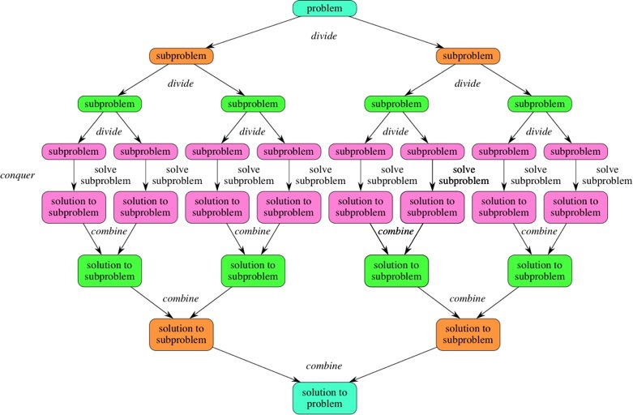
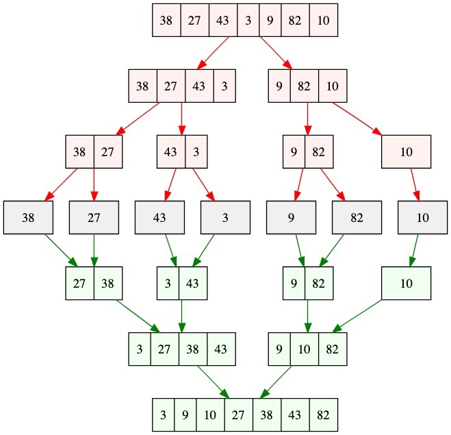
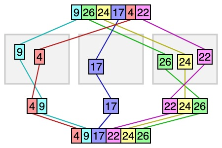

## 分而治之（D&C）

分而治之（Divider and Conquer）是一种算法设计思想。其基本思想是：对于一个给定的问题，如果这个问题可以被分解为与原问题类似的子问题。那么我们就可以通过递归解决子问题，然后将子问题的结果汇集得到原问题的答案。

解决问题步骤：
+ 分解：将原问题分解为多个子问题
+ 解决子问题：逐渐分解子问题，直到最后子问题可以直接解出，并递归返回子问题结果。



## 算法举例

### 合并排序
[合并排序](https://en.wikipedia.org/wiki/Merge_sort)：通过不断将数组分解为子数组，直到最后子数组为一个元素组成。然后，递归返回合并子数组得到排序后数组。

#### 算法图解



#### [算法源代码](https://github.com/loiane/javascript-datastructures-algorithms/blob/master/src/js/algorithms/sorting/merge-sort.js)

#### 算法演示

[https://algorithm-visualizer.org/divide-and-conquer/merge-sort](https://algorithm-visualizer.org/divide-and-conquer/merge-sort)


### 桶排序

[桶排序](https://en.wikipedia.org/wiki/Bucket_sort)：通过将原数组按照数值大小分割到几个“桶”里，然后在每个桶内用其他算法进行排序，最后将结果汇总。因为，该算法可以将一个大数据分割为互不相关的子集合进行独立处理适合分布式计算，因此是一种分布式排序算法。


#### 算法图解



#### [算法源代码](https://github.com/loiane/javascript-datastructures-algorithms/blob/master/src/js/algorithms/sorting/bucket-sort.js)

#### 算法演示
[https://algorithm-visualizer.org/divide-and-conquer/bucket-sort](https://algorithm-visualizer.org/divide-and-conquer/bucket-sort)，另外一个[https://www.cs.usfca.edu/~galles/visualization/BucketSort.html](https://www.cs.usfca.edu/~galles/visualization/BucketSort.html)。

### 其他算法
[FFT 变换](https://en.wikipedia.org/wiki/Cooley%E2%80%93Tukey_FFT_algorithm), [基数排序](https://en.wikipedia.org/wiki/Radix_sort),[计数排序](https://en.wikipedia.org/wiki/Counting_sort) 等。


## 解决一个实际问题

计算最大连续子数组和问题：
输入： A = [1,-4,1,9,-6,7,-3]

问题分解：
1. 将数组分为左右两个子数组
2. 计算左子数组的最大和
3. 计算右子数组的最大和
4. 计算从数组中间分隔位置外左右两侧延伸最大和
5. 比较上面三个值取最大值

代码：

```
// let input = [1,-4,1,9,-6,7,-3];
let input = [-1,-4,1,-9,-6,7,-3];

function max(left, right) {
    return (left > right) ? left: right;
}

function maxSub(arr, leftIdx, rightIdx) {
    // if arr contains only one item.
    if (leftIdx === rightIdx) {
        return arr[leftIdx];
    }

    // Find middle element of the arr.
    const mid = Math.floor((leftIdx + rightIdx)/2);

    // Find maximum subarray sum for the left subarray
    let leftMax = Number.MIN_SAFE_INTEGER;
    let leftSum = 0;
    let leftMostIdx = 0;
    for (let i = mid; i >= leftIdx; i--) {
        leftSum += arr[i];
        if (leftSum > leftMax) {
            leftMax = leftSum;
            leftMostIdx = i;
        }
    }

    // Find maxium subarray sum for the right subarray
    let rightMax = Number.MIN_SAFE_INTEGER;
    let rightSum = 0;
    let rightMostIdx = 0;
    for (let j = mid + 1; j <= rightIdx; j++) {
        rightSum += arr[j];
        if (rightSum > rightMax) {
            rightMax = rightSum;
            leftMostIdx = j;
        }
    }

    // Recursively find the maxium subarray for both left and right subarrays
    const maxLeftRight = max(maxSub(arr, leftIdx, mid), maxSub(arr, mid + 1, rightIdx));
    return max(maxLeftRight, leftMax + rightMax);
}


const { length } = input;

const maxSubSum = maxSub(input, 0, length - 1);

console.log(`max sum of subarrays is : ${maxSubSum}`);
```


## Refs
+ [wikipedia](https://en.wikipedia.org/wiki/Divide-and-conquer_algorithm)
+ [FFT](https://en.wikipedia.org/wiki/Cooley%E2%80%93Tukey_FFT_algorithm)
+ [Merge Sort](https://en.wikipedia.org/wiki/Merge_sort)
+ [Visualizer](https://algorithm-visualizer.org/dynamic-programming/catalan-number)
+ https://medium.com/@codingfreak/divide-and-conquer-interview-questions-and-practice-problems-8855e45f4200
+ https://www.techiedelight.com/maximum-sum-subarray-using-divide-conquer/