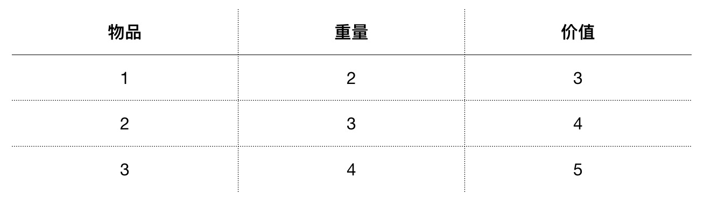
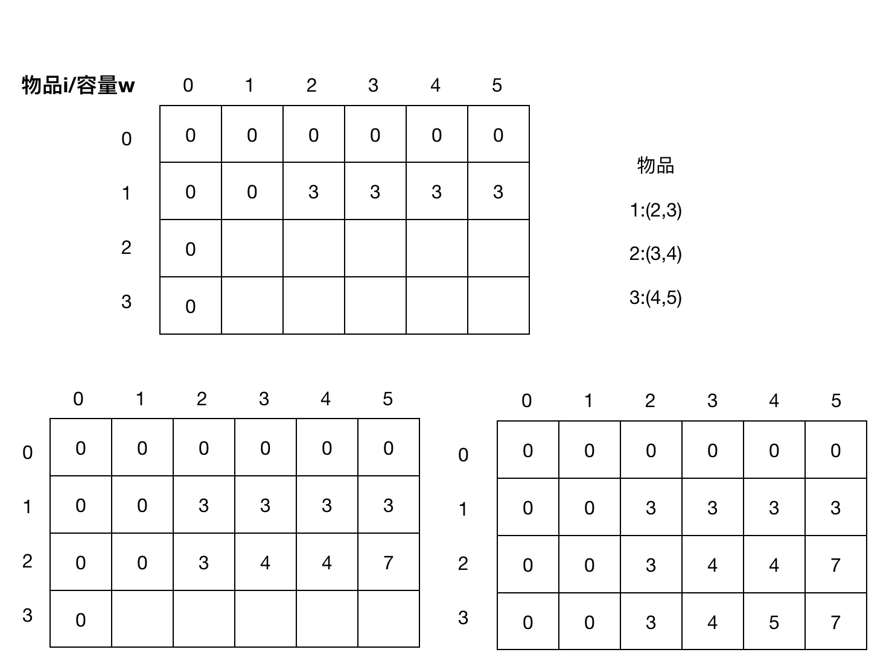

## 动态规划 （DP）

动态规划（Dynamic Programming）：对一个复杂的问题的求最优解，转为对一系列子问题求最优解的递归过程。

动态规划算法由[理查德·贝尔曼](https://zh.wikipedia.org/wiki/%E7%90%86%E6%9F%A5%E5%BE%B7%C2%B7%E8%B2%9D%E7%88%BE%E6%9B%BC) 于 1950s 提出。

解决问题的思路：
+ 定义子问题
+ 计算子问题的最优解，通常需要计算可能的情况然后选出最优解
+ 基于下一级子问题的最优解，求解上一级子问题的最优解
+ 最后得出原问题最优解

> 分而治之与动态规划：两者都有分解子问题的过程，但动态规划是将问题分解为相互依赖的子问题，而分而治之是将问题分解为相互独立的子问题。

## 算法举例

### 背包问题 （0-1 版本）

考虑一个问题，假设一个背包最大能够携带重量 W 的物品，可以携带物品每件物品的重量和对应的价值都不一样。找出一种组合（每件物品只能用一次）使得整个背包所携带物品价值总和最大。


物品的种类，重量和价值如下表：




#### 问题分解

步骤
    1. 计算只有一种物品时，从 0 到 W 重量的最大价值
    2. 基于一种物品的结果，计算只有两种物品时 从 0 到 W 重量的最大价值
    3. 重复1、2步骤直到所有物品都考了进去得到 从 0 到 W 重量的最大价值



#### 源代码
[循环遍历版本](https://github.com/loiane/javascript-datastructures-algorithms/blob/master/src/js/algorithms/dynamic-programing/knapsack.js)
```
function findValues(n, capacity, kS) {
  let i = n;
  let k = capacity;
  // console.log('Items that are part of the solution:');
  while (i > 0 && k > 0) {
    if (kS[i][k] !== kS[i - 1][k]) {
      // console.log(
      //  item ' + i + ' can be part of solution w,v: ' + weights[i - 1] + ',' + values[i - 1]
      //  );
      i--;
      k -= kS[i][k];
    } else {
      i--;
    }
  }
}

function knapSack(capacity, weights, values, n) {
  const kS = [];
  for (let i = 0; i <= n; i++) {
    kS[i] = [];
  }
  for (let i = 0; i <= n; i++) {
    for (let w = 0; w <= capacity; w++) {
      if (i === 0 || w === 0) {
        kS[i][w] = 0;
      } else if (weights[i - 1] <= w) {
        const a = values[i - 1] + kS[i - 1][w - weights[i - 1]];
        const b = kS[i - 1][w];
        kS[i][w] = a > b ? a : b; // max(a,b)
        // console.log(a + ' can be part of the solution');
      } else {
        kS[i][w] = kS[i - 1][w];
      }
    }
    // console.log(kS[i].join());
  }
  // extra algorithm to find the items that are part of the solution
  findValues(n, capacity, kS);
  return kS[n][capacity];
}
```

[递归版本](https://github.com/loiane/javascript-datastructures-algorithms/blob/master/src/js/algorithms/dynamic-programing/knapsack-recursive.js)
```
function knapSack(capacity, weights, values, n) {
  if (n === 0 || capacity === 0) {
    return 0;
  }
  if (weights[n - 1] > capacity) {
    return knapSack(capacity, weights, values, n - 1);
  }
  const a = values[n - 1] + knapSack(capacity - weights[n - 1], weights, values, n - 1);
  const b = knapSack(capacity, weights, values, n - 1);
  return a > b ? a : b;
}
```

#### 算法演示
[https://algorithm-visualizer.org/dynamic-programming/knapsack-problem](https://algorithm-visualizer.org/dynamic-programming/knapsack-problem)

## 解决一个实际问题


## Refs
+ [Dynamic Programming Wikipedia](https://en.wikipedia.org/wiki/Dynamic_programming)
+ [Knapsack problem](https://en.wikipedia.org/wiki/Knapsack_problem)
+ [DP 相关算法](https://www.geeksforgeeks.org/dynamic-programming/)
