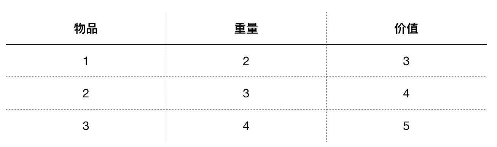

## 动态规划 （DP）

动态规划（Dynamic Programming）：对一个复杂的问题的求最优解，转为对一系列子问题求最优解的递归过程。

动态规划算法由[理查德·贝尔曼](https://zh.wikipedia.org/wiki/%E7%90%86%E6%9F%A5%E5%BE%B7%C2%B7%E8%B2%9D%E7%88%BE%E6%9B%BC) 于 1950s 提出。

解决问题的思路：
+ 定义子问题
+ 计算子问题的最优解，通常需要计算可能的情况然后选出最优解
+ 基于下一级子问题的最优解，求解上一级子问题的最优解
+ 最后得出原问题最优解

> 分而治之与动态规划：两者都有分解子问题的过程，但动态规划是将问题分解为相互依赖的子问题，而分而治之是将问题分解为相互独立的子问题。

## 算法举例

### 背包问题 （0-1 版本）

考虑一个问题，假设一个背包最大能够携带重量 W 的物品，可以携带物品每件物品的重量和对应的价值都不一样。找出一种组合（每件物品只能用一次）使得整个背包所携带物品价值总和最大。


物品的种类，重量和价值如下表：




#### 问题分解

步骤(自底向上)
    1. 计算只有一种物品时，从 0 到 W 重量的最大价值
    2. 基于一种物品的结果，计算只有两种物品时 从 0 到 W 重量的最大价值
    3. 重复1、2步骤直到所有物品都考了进去得到 从 0 到 W 重量的最大价值


#### 源代码
[循环遍历版本](https://github.com/loiane/javascript-datastructures-algorithms/blob/master/src/js/algorithms/dynamic-programing/knapsack.js)
```
function knapSack(capacity, weights, values, n) {
  const kS = [];
  for (let i = 0; i <= n; i++) {
    kS[i] = [];
  }
  for (let i = 0; i <= n; i++) {
    for (let w = 0; w <= capacity; w++) {
      if (i === 0 || w === 0) {
        kS[i][w] = 0;
      } else if (weights[i - 1] <= w) {
        const a = values[i - 1] + kS[i - 1][w - weights[i - 1]];
        const b = kS[i - 1][w];
        kS[i][w] = a > b ? a : b; // max(a,b)
        // console.log(a + ' can be part of the solution');
      } else {
        kS[i][w] = kS[i - 1][w];
      }
    }
    // console.log(kS[i].join());
  }
  return kS[n][capacity];
}
```

[递归版本](https://github.com/loiane/javascript-datastructures-algorithms/blob/master/src/js/algorithms/dynamic-programing/knapsack-recursive.js)
```
function knapSack(capacity, weights, values, n) {
  if (n === 0 || capacity === 0) {
    return 0;
  }
  if (weights[n - 1] > capacity) {
    return knapSack(capacity, weights, values, n - 1);
  }
  const a = values[n - 1] + knapSack(capacity - weights[n - 1], weights, values, n - 1);
  const b = knapSack(capacity, weights, values, n - 1);
  return a > b ? a : b;
}
```

#### 算法演示
[https://algorithm-visualizer.org/dynamic-programming/knapsack-problem](https://algorithm-visualizer.org/dynamic-programming/knapsack-problem)

## 解决一个实际问题

问题：给出一个非负整数集合set和一个指定的和sum，判断这个数组中是否存在两个不同的子集使得两个自己的和都为sum。

举例：

+ 输入一个集合 [3, 34, 4, 12, 5, 2]
+ 和是 9
+ 那么 3+2+5 = 9， 4+5 = 9 结果为 true

问题分解(自顶向下)：
1. 考虑找出所有的组合使得和为 sum，如果这种组合数大于1则结果为存在即true。
2. 子问题：
    + 考虑从原集合中最后拿出的一个元素是 set[i] 
    + 那么最终结果为 sum 的情况是：
        1. 不包含 set[i] 时已存在存在和为sum 的子集合
        2. 子集合包括 set[i] 时，存在子集合使得和为 sum-set[i] 为真

代码递归版（自顶向下）：

```
function isSubsetSumRecursive(set = [], len, sum) {
    if (sum === 0) {
        return true;
    }
    if (len === 0 && sum != 0) {
        return false;
    }

    if (set[len-1] > sum) {
        return isSubsetSumRecursive(set, len-1, sum);
    }

    return isSubsetSumRecursive(set, len-1, sum) || isSubsetSumRecursive(set, len-1, sum-set[len-1]);
}

let set = [3, 34, 4, 12, 5, 2], sum = 9;
let result = isSubsetSumRecursive(set, set.length, sum);

console.log(`result is :`, result);
```

代码遍历版（自底向上）：

```
//Input:  set[] = [3, 34, 4, 12, 5, 2], sum = 9
//Output:  True  
//There is a subset (4, 5) with sum 9.
/**
 * set  集合
 * len   集合元素个数
 * sum  和
 */
function isSubsetSum(set = [], len, sum) {
    let subset = [];

    // If sum is 0, then answer is true 
    for (let i = 0; i <= len; i++) {
        subset[i] = [];
        subset[i][0] = true;
    }

    // If sum is not 0 and set is empty, then answer is false 
    for (let i = 0; i <= sum; i++) {
        subset[0][i] = false;
    }

    for (let i = 1; i <= len; i++) {
        for (let j = 1; j <= sum; j++) {
            if (j < set[i-1]) {
                subset[i][j] = subset[i-1][j];
            } else {
                subset[i][j] = subset[i-1][j] || subset[i-1][j-set[i-1]];
            }
        }
    }

    let equalSubCount = 0;

    for (let n = 0; n <= len; n++) {
        if (subset[n][sum]) {
            equalSubCount++;
        }
    }

    return equalSubCount > 1;
}

let set = [3, 34, 4, 12, 5, 2], sum = 9;
let result = isSubsetSum(set, set.length, sum);

console.log(`result is :`, result);
```

## Refs
+ [Dynamic Programming Wikipedia](https://en.wikipedia.org/wiki/Dynamic_programming)
+ [Knapsack problem](https://en.wikipedia.org/wiki/Knapsack_problem)
+ [DP 相关算法](https://www.geeksforgeeks.org/dynamic-programming/)
