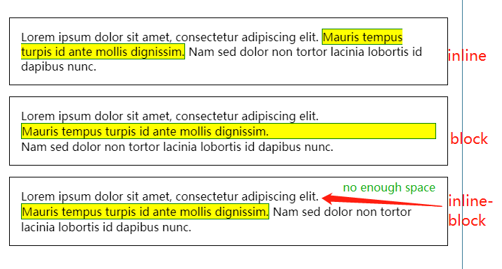
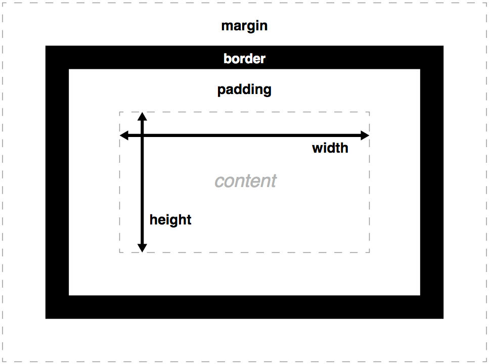
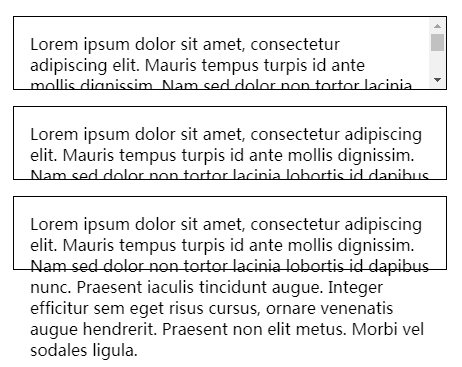
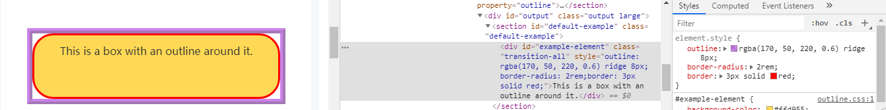

[TOC]

# Layout
[REFERENCE OF MDN](
https://developer.mozilla.org/en-US/docs/Learn/CSS/CSS_layout)
## Formatting Context
### All 
* BFC(Block Formatting Context | 块级格式化上下文)
* IFC(Inline Formatting Context | 行内格式化上下文)
* GFC(GridLayout Formatting Context | 网格布局格式化上下文)
* FFC(Flex Formatting Context | 自适应格式化上下文)
### Normal flow = BFC + IFC
[REFERENCE OF MDN](https://developer.mozilla.org/en-US/docs/Learn/CSS/Introduction_to_CSS/Box_model)

There are many different values available for [display](
https://developer.mozilla.org/en-US/docs/Web/CSS/display), but in this article we will focus on the three most common ones; block, inline, and inline-block.
* ***block*** 
* ***inline***：Width and height settings have no effect on inline boxes; any padding, margin and border set on inline boxes will update the position of surrounding text, but will not affect the position of surrounding block boxes.
* ***inline-block***: 
An inline-block box is something in between the first two: It flows with surrounding text and other inline elements without creating line breaks before and after it unlike a block box, but it can be sized using width and height and maintains its block integritylike a block box. It won't be broken across paragraph lines like an inline box. In the below example the inline-block box goes onto the 2nd line of text while keeping the shape of a box as there is not enough space for it on the first line, whereas inline box does break on multiple lines **if there is not enough space — it loses the shape of a box.**



## BFC
[REFERENCE OF MDN - BFC](https://developer.mozilla.org/en-US/docs/Web/Guide/CSS/Block_formatting_context)
[REFERENCE OF MDN - Box_model](https://developer.mozilla.org/en-US/docs/Learn/CSS/Introduction_to_CSS/Box_model)
### summarize


### margin/padding/border syntax
* margin: top right bottom left
* margin-left/margin-right/margin-bottom/margin-top

* border: top right bottom left
* border: 1px
* border: border-width, border-style, border-color
* border-left/border-right/border-bottom/border-top
* border-width, border-style, border-color
* border-top-width, border-top-style, border-top-color

* padding: top right bottom left
* padding: 1px
* padding-left/padding-right/padding-bottom/padding-top


### need to remeber
* **Box heights**: (KN-30score). Box heights don't observe percentage lengths; box height always adopts the height of the box content, unless a specific absolute height is set (e.g. pixels or ems.) This is more convenient than the height of every box on your page defaulting to 100% of the viewport height.
* **Borders ignore percentage width settings too**.
* **Margin collapsing**: Margins have a specific behavior called margin collapsing: When two boxes touch against one another, the distance between them is the value of the largest of the two touching margins, and not their sum. **See more in this article below**
* **Percentage value of padding and margin**: 5% means "5% of the containing element's width." *Talk about project experience.*
```css
.parent{
    width: 500px;
    padding-bottom: 60%;
    height: 0px;
    // child height is 300px, width is 500px
    .child{
        width: 100%;
        height: 100%;
    }
}
```
* **Margins can accept negative values**, which can be used to cause element boxes to overlap. *Talk about project experience.*
* **The total width of a box by default**:  width + padding-right + padding-left + border-right + border-left. 
[test link](https://codepen.io/FlyingElephant/pen/GLzYmm?&editable=true)


### Advanced box manipulation
#### overflow

* auto: If there is too much content, the overflowing content is hidden and scroll bars are shown to let the user scroll to see all the content.
* hidden: If there is too much content, the overflowing content is hidden.
* visible: If there is too much content, the overflowing content is shown outside of the box (this is usually the default behavior.)

#### background-clip
[MDN](https://developer.mozilla.org/en-US/docs/Learn/CSS/Introduction_to_CSS/Box_model#Background_clip)
[can i use](https://caniuse.com/#search=background-clip)
* background-clip: border-box;
* background-clip: padding-box;
* background-clip: content-box;


#### outline
[MDN](https://developer.mozilla.org/en-US/docs/Web/CSS/outline)


**Borders vs. outlines**
Outlines: never take up space
Borders and outlines are very similar. However, outlines differ from borders in the following ways:Outlines never take up space, as they are drawn outside of an element's content.According to the spec, outlines don't have to be rectangular, although they usually are.

**Values**
* outline-color
* outline-style
* outline-width

#### Mastering margin collapsing
to see more. haven't read.
[Mastering margin collapsing](https://developer.mozilla.org/en-US/docs/Web/CSS/CSS_Box_Model/Mastering_margin_collapsing)

#### box-sizing
* content-box
* border-box

## Inline box
### todo baseline?

## FFC
* flex-direction: if we set to the value 'row', it will use the language direction. The Middle East country's language direction is right-to-left. How to set?

### flex-grow
* [`flex-grow` is weird. Or is it?](https://css-tricks.com/flex-grow-is-weird/)

# CSS Positioning
[REFERENCE OF MDN](https://developer.mozilla.org/en-US/docs/Web/CSS/CSS_Positioning)
* z-index
* postion: relative & absolute & fixed & sticky
* position - left/top/bottom/right
## float & clear
[REFERENCE OF MDN - FLOAT1](https://developer.mozilla.org/en-US/docs/Web/CSS/float)
[REFERENCE OF MDN - FLOAT2](https://developer.mozilla.org/en-US/docs/Learn/CSS/CSS_layout/Floats)

# Animation
* transform
* trasation
* animation

# 

# others todo
* review the current document and practice.
## Value Spec
[|| what's this syntax](https://developer.mozilla.org/en-US/docs/Web/CSS/outline#Formal_syntax)
## Vertical center
todo
## Visual formatting model
[REFERENCE OF MDN](https://developer.mozilla.org/en-US/docs/Web/CSS/Visual_formatting_model#See_also)

## From Andy
2. CSS
    * 基本概念
        + CSS Units
        + BFC/IFC/GFC/FFC
    * 布局
        + 常用布局
            + div 布局
            + Flex
            + Grid
        + 移动端布局
    * CSS3
        + Animation
    * CSS Custom Properties
    * Scope in CSS
    * Less/Sass
    * PostCSS
        + CSS Modules
    * BEM/SUITCSS
    * Houdini
    * CSS in JavaScript
        + Styled Components
    * Chrome Performance Dev Tools 
3. Web Fonts

## other marks
* article: nth-of-type(3){ color: red; }
* css vh unit
