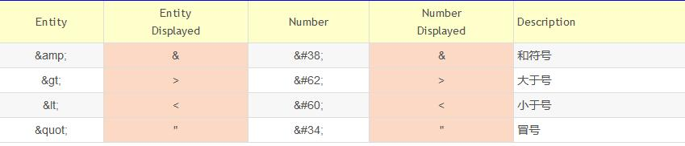

## HTML语法

常用的语法, 不再赘述，以下关注容易被忽略的点

## HTML有效性检查器

如XML概述中所述，之前的HTML 文档由DTD来检查其有效性。那么新一代的HTML技术呢？

```注意
XML DTD 无法表达新一代HTML的所有有效性要求。因此 XML 校验器加 DTD 不能代替有效性检查器。
换句话说，有三种符合性规则：
DTD 可表达的规则。
DTD 不可表达但仍然可以由机器检查的规则。
只能由人工检查的规则。
有效性检查器可以检查前面两种。简单的基于 DTD 的校验器只能检查第一类错误

```
whatwg 维护了一个检查器工具的列表： https://validator.whatwg.org/

### HTML 实体

HTML实体常用于生成那些键盘上没有的印刷字符，比如€、∞、≠、©等等。
HTML实体以和号（&）开头，分号（;）结尾，两者之间表示实体的字符串（或数字）。
**在 HTML 中，某些字符是预留的。**
在HTML中规定只能出现文本的地方(不包含子元素的元素的内容),不能使用小于号（<）和大于号（>），这是因为浏览器会误认为它们是标签.(这里涉及到浏览器如何解析HTML文档)
如果希望正确地显示预留字符，我们必须在 HTML 源代码中使用字符实体
字符实体类似这样：
```
&entity_name;

或者

&#entity_number;

```
如需显示小于号，我们必须这样写：```&lt;``` 或 ```&#60;```
使用实体名而不是数字的好处是，名称易于记忆。不过坏处是，浏览器也许并不支持所有实体名称（对实体数字的支持却很好）。



### CDATA(Character Data)，PCDATA(Parsed Character Data)和RCDATA(Replaceable Character Data)

在XML中，不包含子元素的元素的内容默认必须是PCDATA(Parsed Character Data)
```
<data>
&lt;p&gt;some text&lt;/p&gt;
</data>
```
“Parsed”是指<和&字符要转换成&lt;和&amp;实体字符形式。如果不想写一大堆&xx;，可以直接标记为CDATA:
```
<data>
<![CDATA[<p>some text</p>]]>
</data>
```
RCDATA 表示里面可以有&xx;等实体字符，也可以包含<字符而不会被当作tag open来解析。 比如:
```
<textarea>
<p>
&lt;
</p>
</textarea>
```

在RCDATA里，&lt;会替换为<（Replaceable的含义），拿到值（比如textarea.value）后，是无从得知源码里是否有&lt;等实体字符的。

### 元素分类


以下分类是从语法层面的分类，不同于从css角度(内联元素或块状元素) 或从元素本身的特点(可替换元素与不可替换元素)。

- Void elements(空元素), 如下:

  area, base, br, col, embed, hr, img, input, link, meta, param, source, track, wbr
  
  对于空元素来说 只允许start tag，不允许end tag。此处的start tag中的末尾的斜杠是可有可无的（允许有，但无意义）只是为了那些之前习惯了XML的人，处理起来方便而已
  比如：```<hr />，<br />```。 不能写成 ```<hr></hr>```。  因为空元素不能有任何的内容，所以不能有结束标签(Tag)
  
- template element(模板元素，PCDATA)

  此元素的内容不会被页面渲染。详情见HTML元素的结束(todo:Link)，内容可以包含 文本，引用字符，元素， 注释等，但不能文本里不能包括 ```<``` ```&```

- Raw text elements(纯文本元素，CDATA)，如下:
  script, style.  
  这两个元素里面的内容是raw text，里面出现的```>```就表示```>```字符本身，不会被当作tag open来解析；&gt;也不会根据实体字符来转义，就表示&gt;字串自身。这就是CDATA.**有一个限制**  里面的内容不能有自身的ETAGO标记，也就是说，script里的内容不能含有```</script(\s|\\|>)```，否则就会导致script提前结束：

- escapable raw text elements(RCDATA)， 如下：
  textarea, title
  这两个元素的解析会遵守 RCDATA 规则，遇到&时，会尽可能得到实体字符。遇到```</textarea(\s|\\|>)```时，会结束解析。其他都直接作为textarea的内容。
  ** 至于为什么要遇到&时，尽可能的得到实体字符**  
  是因为，textarea的语义：让用户输入大文本字符，对于一起键盘上没有的字符，只能用html实体表示，所是为了还原用户真实的输入。
  
- Foreign elements(PCDATA)
  来自MATHML和SVG的元素。
  对于一些自闭的元素，因为没有结束标签，不能包含任何内容
  对于不是自闭的元素，内容遵守PCDATA规则解析
  
- Normal elements(PCDATA)
  除了以上元素之外的所有元素，div img span 等等
  内容可以包含 文本，引用字符，元素， 注释等，但不能文本里不能包括 ```<``` ```&```
  除了以上的限制之外，一些 normal Element 还有额外的内容限制。这些限制涉称为：**内容模型限制**
  
  
###  内容模型限制

由于历史原因，某些元素在其内容模型之外还有额外的限制。
比如:
   table 元素不得包含 tr 元素（如果代码中在 table 里放一个 tr 元素， 实际上暗示着在它前面加一个 tbody 开始标签。）
具体的限制，将在各个Element中说明

