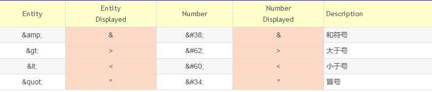

## HTML语法

常用的语法, 不再赘述，以下关注容易被忽略的点

### HTML 实体

HTML实体常用于生成那些键盘上没有的印刷字符，比如€、∞、≠、©等等。
HTML实体以和号（&）开头，分号（;）结尾，两者之间表示实体的字符串（或数字）。
**在 HTML 中，某些字符是预留的。**
在HTML中规定只能出现文本的地方(不包含子元素的元素的内容),不能使用小于号（<）和大于号（>），这是因为浏览器会误认为它们是标签.(这里涉及到浏览器如何解析HTML文档)
如果希望正确地显示预留字符，我们必须在 HTML 源代码中使用字符实体
字符实体类似这样：
```
&entity_name;

或者

&#entity_number;

```
如需显示小于号，我们必须这样写：```&lt;``` 或 ```&#60;```
使用实体名而不是数字的好处是，名称易于记忆。不过坏处是，浏览器也许并不支持所有实体名称（对实体数字的支持却很好）。



### CDATA(Character Data)

在XML中，不包含子元素的元素的内容默认必须是PCDATA(Parsed Character Data)
```
<data>
&lt;p&gt;some text&lt;/p&gt;
</data>
```
“Parsed”是指<和&字符要转换成&lt;和&amp;实体字符形式。如果不想写一大堆&xx;，可以直接标记为CDATA:
```
<data>
<![CDATA[<p>some text</p>]]>
</data>
```


### 元素分类


以下分类是从语法层面的分类，不同于从css角度(内联元素或块状元素) 或从元素本身的特点(可替换元素与不可替换元素)。

- Void elements(空元素), 如下:

  area, base, br, col, embed, hr, img, input, link, meta, param, source, track, wbr
  
  对于空元素来说 只允许start tag，不允许end tag。此处的start tag中的末尾的斜杠是可有可无的（允许有，但无意义）只是为了那些之前习惯了XML的人，处理起来方便而已
  比如：```<hr />，<br />```。 不能写成 ```<hr></hr>```。  因为空元素不能有任何的内容，所以不能有结束标签(Tag)
  
- template element(模板元素)

  此元素的内容不会被页面渲染。详情见HTML元素的结束(todo:Link)，内容可以包含 文本，引用字符，元素， 注释等，但不能文本里不能包括 ```<``` ```&```

- Raw text elements(纯文本元素)
  
