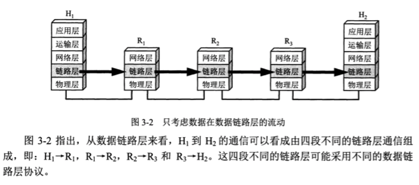
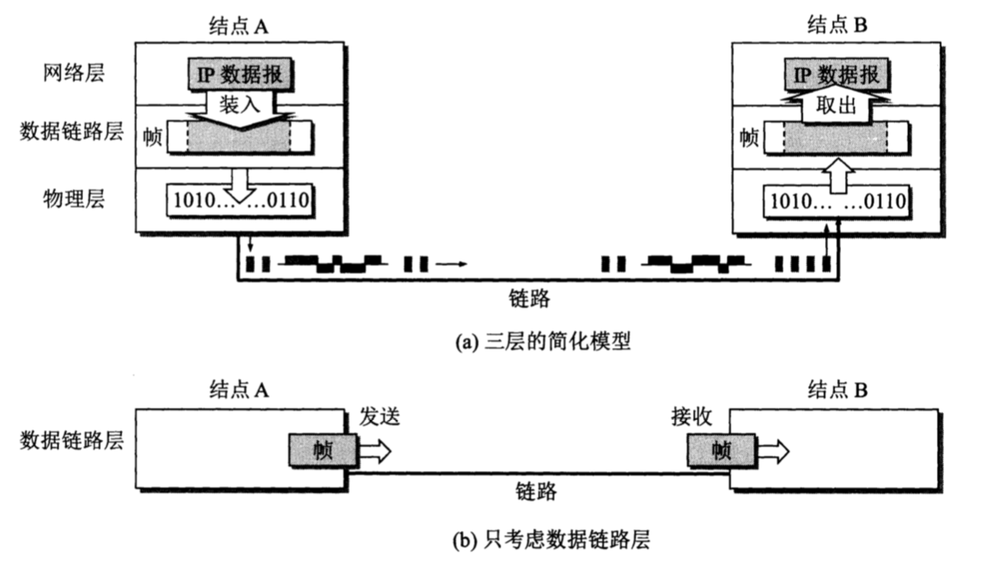
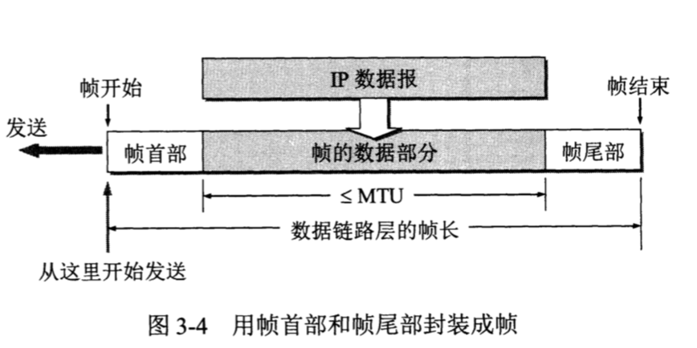
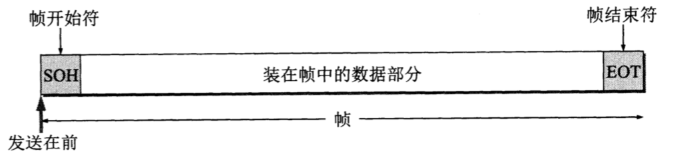
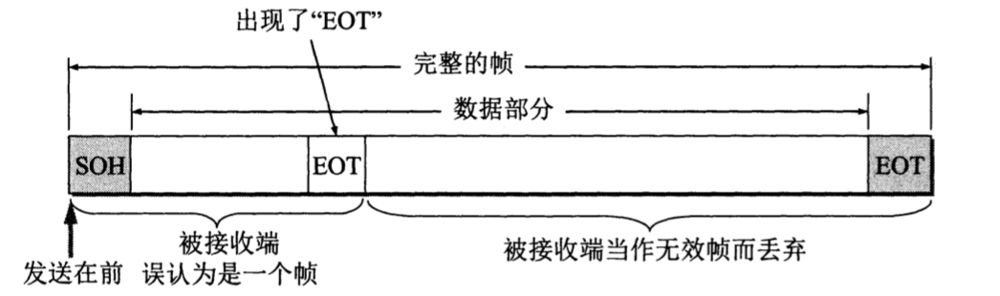
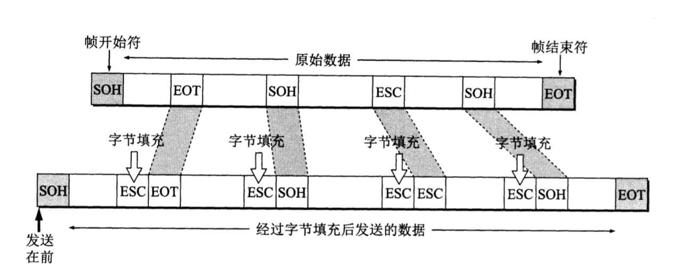
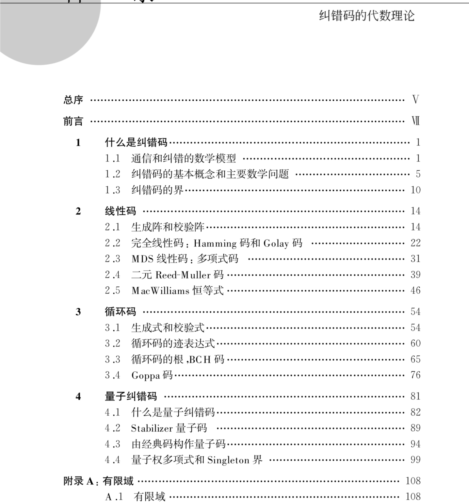
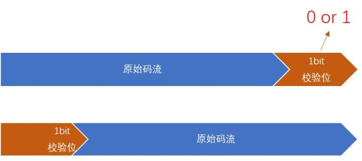
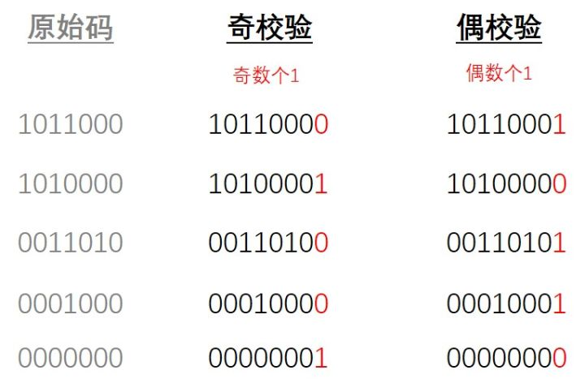
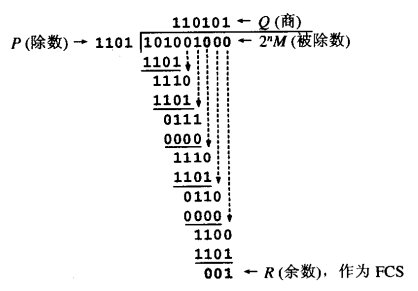

## 数据链路层

**链路**是从一个结点到相邻结点的一段物理线路
**数据链路**则是在链路的基础上增加了一些必要的硬件（如网络适配器）和软件（如协议的实现）


### 主要任务

物理层的主要任务是解决计算机之间信号的传输，模拟信号与数字数字的转化等。而在物理媒体上传输的数据难免受到各种不可靠因素的影响而产生差错。数据链路层的主要任务是要保证两个主机物理层之间通信是**无差错的数据传输**。

如何来完成这个任务呢？ 这需要数据的发送方和接受方共同来完成。

数据链路层使用的信道主要有两种类型
- 点对点信道。这种信道使用一对一的点对点通信
- 广播信道。


这里谈广播信道是因为: 局域网虽然是一个网络，但是我们并不把局域网放在网络层中讨论。这是因为网络层要讨论的问题是多个网络互连的问题，是讨论分组怎么样从一个网络，通过路由器，转发到另一个网络。在数据链路层的讨论中，我们研究的是在同一个局域网中，分组怎样从一台主机传送到另一台主机，并不经过路由器转发。从整个互联网来看，局域网仍属于数据链路层的范围。


保证两个主机物理层之间通信是**无比特差错的数据传输**， 根据主机之间使用的信道不同，数据的发送方和接受方之间约定的协议也有不同。 就是这些协议来保障 **无比特差错的数据传输**。




### 帧

数据链路层的协议数据单元为**帧**。数据链路层把网络层交下来的数据构成帧发送到链路上，以及把接受到的**帧**中的数据取出并上传到网络层。



通信时的主要步骤如下：
1. 结点A的数据链路层把网络层交给的IP数据报文添加首部和尾部封装成帧
2. 结点A把封装好的帧发送给结点B的数据链路层
3. 若结点B的数据链路层收到的帧无差错，则从收到的帧中提取IP数据报交给上面的网络层；否则丢弃这个帧。

数据链路层不必考虑物理层如何实现比特传输的细节。我们甚至可以简单我认为两个数据链路层之间水平方向把帧直接给对方。

### 三个基本问题

尽管对于不同的信道，有着不同的链路层协议，但有三个基本问题则是相同的。

- 封装成帧
- 透明传输
- 差错检测

#### 封装成帧

**封装成帧**是指在一段数据的前后分别添加首部和尾部，这样就构成了一个帧。接收端在收到物理层上交的比特流后，就能根据首部和尾部的标记，从比特流中识别帧的开始和结束。

首部和尾部的一个重要作用就是进行帧定界（即确定帧的界限）。



为什么要封装成帧？
数据在网络在传输基本原则是**分组交换**，帧定界是分组交换的必然要求；每一层基本都要对数据进行封装。那么链路层对IP数据报的封装是为了什么了呢？
我们知道链路层主要的任务是确保数据的**无比特差错的传输**。因此链路层要对错误进行处理，封装成帧可以很容易地检查这些区块是否被破坏。传输过程中的故障会破坏某些帧。在出现错误时，只需要将错误的帧重新传输（或者链路层自己纠错）而不是整组数据需要重新传输。

**帧定界符**

我们知道数据是以字节进行传输的，单个字节长度是8位，一个英文字母（不分大小写）占一个字节的空间。首位是符号位。ASCLL码是7位编码，可以表示 128个不同的编码。 其中可打印的字符95个，不可打印的字符33个。
```可打印字符

    就是键盘上可以输入的字符，我们使用的标准键盘有47个键，可输入94个字符包括 shift键，加上空格键。一共95个。
```

帧定界



这里的SOH（start of header）放在一个帧的最前面，表示帧的开始。另一个控制字符 EOT（end of transmission）表示帧的结束。 请注意，SOH和EOT 都是控制字符的名称。16进制编码 01，二进制位00000001，和04，二进制为 00000100，不是说S，O，H，E，O，T 这几个字符。

#### 透明传输

由于帧的开始和结束标记使用专门的指明的控制字符，因此，所传输的数据中的任何8比特组合一定不允许出现和用作帧定界的控制字符的比特编码一样，否则就会出现帧定界的错误。

对于一些数据部分是一些图像文件的时候，数据部分能容易出现与控制字符相同的字符。如下图：



上图的EOT并非是控制字符，而仅仅是二进制数据 00000100。

所谓的**透明** 是指某一个实际存在的事物看起来却好像不存在医一样。“在数据链路层透明传输数据” 表示无论什么样的比特组合的数据，都能按照原样没有差错地通过这个数据链路层。

为了达到透明传输，就必须设法使数据中可能出现的“SOH”，“EOT”在接收端不能被解释成控制字符。具体的方法是：字节填充。 如下图：




#### 差错检测

现实的通路链路都不是理想的。这就是说，比特在传输过程中可能会产生差错： 1 可能变成0，0也可能变成1。这就叫**比特**差错。
比特差错 与 **信噪比** 有很大关系。如果设法提高信噪比 误码率就会下降，但不可能达到 下降到0. 因此必须交进行差错控制。

关于纠错码有比较多的代数理论蕴含在其中。



下面简单介绍几个简单的纠错原理：

##### 奇偶校验

**原理**

奇校验：原始码流+校验位 总共有奇数个1

偶校验：原始码流+校验位 总共有偶数个1



如上图，是在原始码流后面，加上校验位。它的校验位只有一位，要么是0，要么是1。

实例：


通过验证1的个数 和 校验位进行比较，就能知道数据是否错误。

**纠错能力**

```奇校验
奇校验 正确码流 11000001

错1位 11000011 变成了偶数个1，能检测出错误

错2位 11000010 变成了奇数个1，检测不出错误

错3位 11001010 变成了偶数个1，能检测出错误

```

```偶校验
偶校验 正确码流 01000001

错1位 01000011 变成了奇数个1，能检测出错误

错2位 01000010 变成了偶数个1，检测不出错误

错3位 01001010 变成了奇数个1，能检测出错误
```


##### CRC校验

CRC即循环冗余校验码（Cyclic Redundancy Check）

说来惭愧，一开始是考虑写关于CRC检错技术更深层次数学原理的，然后搞不懂。暂时先放过它吧。
在计算机网络发展过程中，数学起到了至关重要的作用。正当通信专家对差错检测措施一筹莫展的时候，团队中的数学家将抽象代数中的二元素伽罗瓦域（GF(2)）引入，告诉我们可以通过数学手段解决数据的比特差错检测问题。

##### 原理

在发送端，先把数据划分为组，假定每组k个比特。现假定待传送的数据M=101001（k=6）。CRC运算就是在数据M的后面添加供差错检测用的n位冗余码，然后构成一个帧发送出去，一共发送（k+n）位。在所要发送的数据后面增加n位的冗余码，虽然增大了数据传输的开销，但却可以进行差错检测。当传输可能出现错误时，付出这种代价往往是很值得的。

这n位冗余码可用以下方法得出。用二进制的模2运算进行乘M的运算，这相当于在M后面添加n个0。得到的（k+n）位的数除以收发双方事先商定的长度为（n+1）位除数P，得出的商是Q而余数是R（n位，比P少一位）。关于除数P下面还要介绍。在图1所示的例子中，M=101001（即k=6）。假定除数P=1103（即n=3）。经模2除法运算后的结果是：商Q=110101（这个商并没有什么用处），而余数R=001。这个余数R就作为冗余码拼接在数据M的后面发送出去。这种为了进行检错而添加的冗余码常称为帧检验序列FCS（Frame Check Sequence）。因此加上FCS后发送的帧是101001001（即），共有（k+n）位。



在接受端把接收到的数据以帧为单位进行CRC检验：把收到的每一个帧都除以同样的除数P（模2运算），然后检查得到的余数R。

如果在传输过程中无差错，那么经过CRC检验后得出的余数R肯定是0。但如果出现误码，那么余数R仍等于零的概率是非常非常小的

总之，在接收端对收到的每一帧经过CRC检验后，有以下两种情况：

1）若得出的余数R=0，则判定这个帧没有差错，即接受（accept）；

2）若余数R!=0，则判定这个帧有差错，即丢弃（discard）。　

在数据链路层，发送端帧检验序列FCS的生成和接收端的CRC检验都是用硬件完成的，处理很迅速，因此并不会延误数据的传输。


**模2运算**

通过一个例子的话我想能够在你脑子里形成清晰的概念。假如一个数k被任意的数除，那么它产生的余数必定是在[0,n)区间中。即x mod n  ∈ [0, n)。模2运算也是符合这种理论的，即模2运算就是指结果只能是在[0,2)区间中取整数值的运算，显然"模2运算"就是指结果只能为0、1的特殊二进制运算。

为什么"模2运算"属于特殊二进制运算，必须突出"特殊"二字？

第一点，"模2运算"和"二进制运算"名字本身就不同，因此类比的时候使用"特殊"二字；第二点，两者的运算其实是有区别，"模2运算"既不进位也不退位，而"二进制运算"和"十进制运算"均需要进、退位。


**纠错能力**

CRC32 实际是上一种 摘要算法：通过不同的内容，生成固定长度的摘要来表示内容。 CRC32 就是指 32位，类似的还有CRC16，CRC64， CRC128.
CRC32 是目前应用比较广泛的， 可以想象， 2的32次方，大约 40亿个 不同的校验组合。 然后实际的数据是无穷无尽的，校验码却是有限的，这样的话， 这样的话就出现 2个不同的内容 生成了 相同的摘要。 这就叫做 **CRC碰撞**，或者 散列冲突
循环冗余检验并不能保证100%正确，只能说接近100%。

所以说CRC32 校验失败的概率非常低，但也不是没有发生过：
[校验失败链接](http://conferences.sigcomm.org/sigcomm/2000/conf/paper/sigcomm2000-9-1.pdf)

既然数据链路层向上层无法保证100% 的**无比特差错** ，那怎么办？

**TCP层添加校验**， https， sha1 校验
