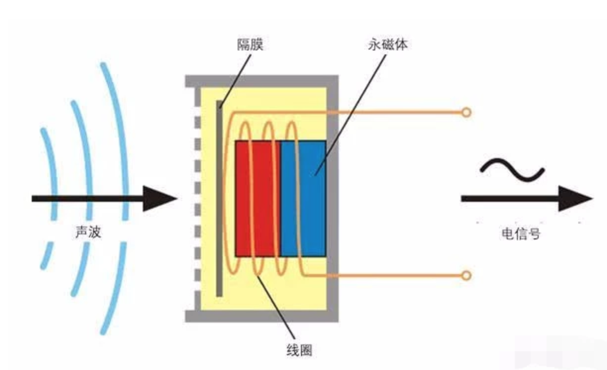
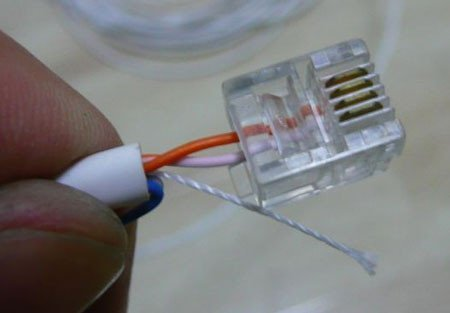
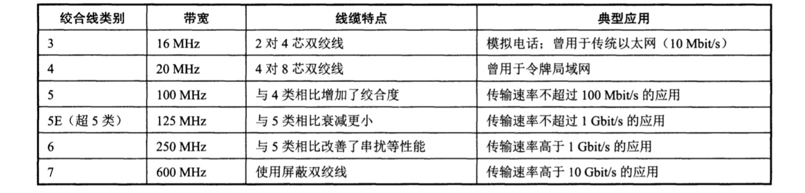
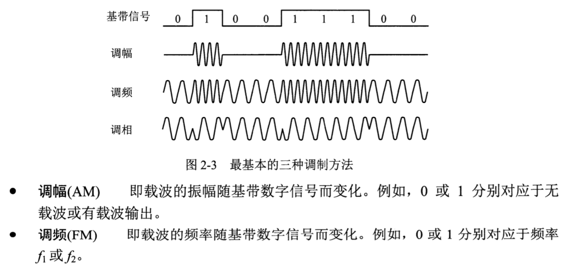
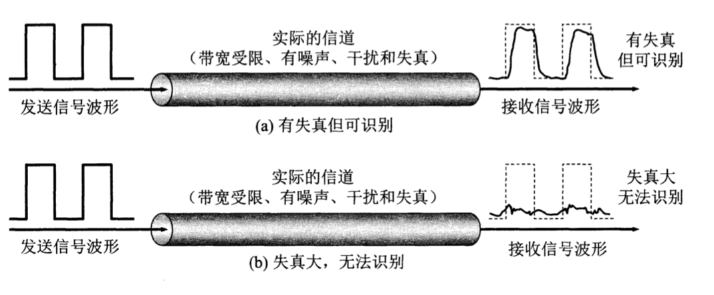
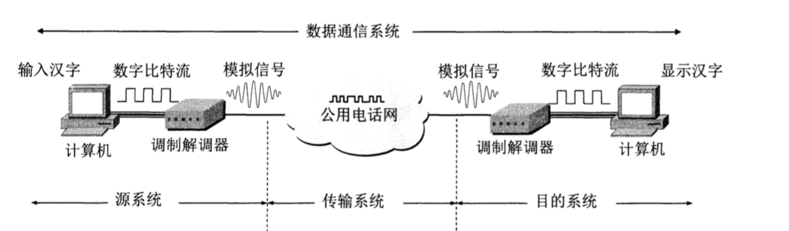
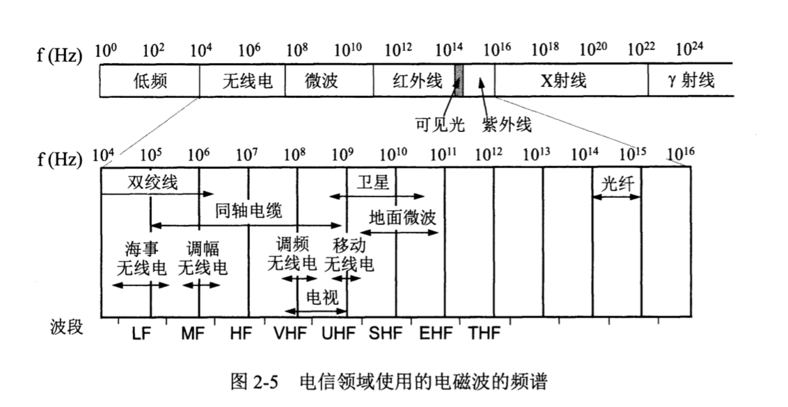
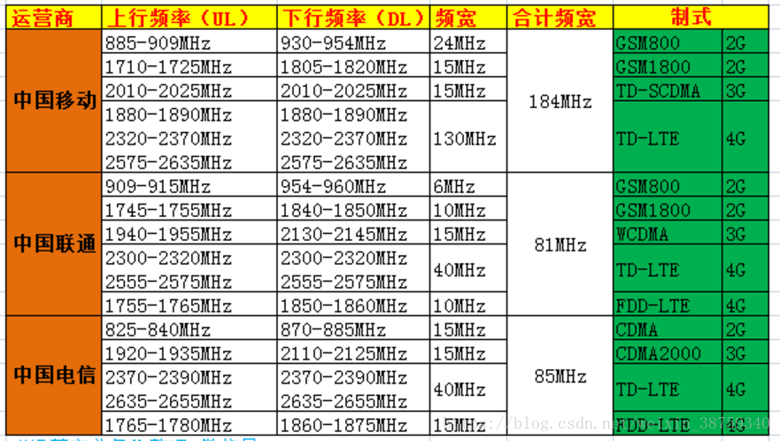
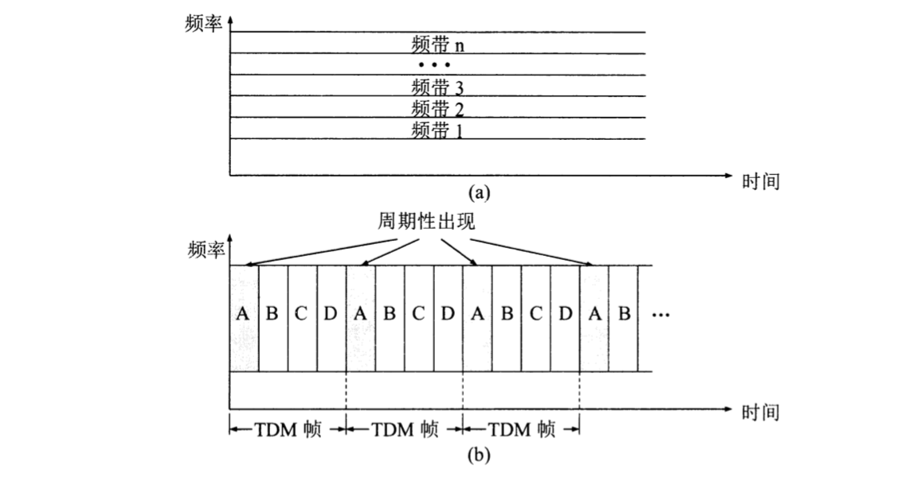
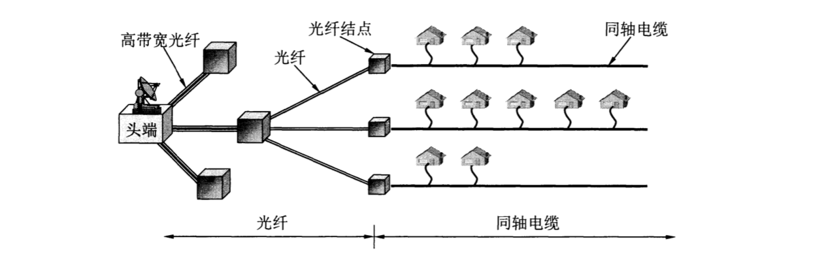

## 座式电话工作原理

电话机设置在电话通信起点和终点的用户侧，是电话网的用户终端设备。

一般包括： 转换、放大、传输、还原 四个过程。
转换是指: **声信号与电信号转化**

**转换**：

1.声音传播需要介质，在空气中传播是340m/s。 从量子力学的角度来说，声音是原子以波的形式进行运动。声音在空气传播是纵波，因为声音在传播过程中是空气（介质）发生膨胀和收缩 是沿着声波传播方向的。声音通过金属等介质传播，则是横波，是上下振动，速度较快。（所以，把耳朵放在铁轨上听，贴地下听是有道理的）

2.因为要进行快速的、远距离的通信，不能直接传送声音。而必须先把声音变成电信号（即以电作为载体），到对方后再把电信号还原成为声音。

3、常见的声音转电信号 是电磁式，通过切割磁感线发产生电信号。正常人发出的声音频率在 20 - 20000 hz 范围内，高于这个叫**超声波**，低于叫**次声波**


4.电话产生的是交流电,其原理也就是导体切割磁力线,产生正弦交流电

5.正弦交流电是指随时间按照正弦函数规律变化的电压和电流。由于交流电的大小和方向都是随时间不断变化的，也就是说，每一瞬间电压（电动势）和电流的数值都不相同。（模拟信号）

6.交流电的频率，是指每秒钟内电流方向改变的次数。电话中的交流电的频率根据人的说话声音的大小不同而变化。

**放大**

放大是指将一个微弱的电信号通过放大电路，得到一个波形与该微弱信号频率与周期相同、但幅值却大很多的信号输出。这个装置就是晶体管放大电路。比如：扩音器。

**传输**

传输介质：电话线。 电话线常见规格有二芯和四，六、八、十芯。家用的一般是 二芯。



两根线一收一发。 材质一般为 铜包钢，或者 全铜线。 单根铜线根据测量波的频率在300-3400hz 范围内，衰减小，噪声较小。超过这个范围信号就会失真。所以大部分传输线都要做绝缘处理，以抗干扰。
材质根据复用方式不同或者制作工艺不同，带宽变化范围很大。比如 同样是铜线，两根具有绝缘保护层的铜导线组成的。把两根绝缘的铜导线按一定密度互相绞在一起，形成双绞线。以下是 双绞线的频宽：




**还原**

还原 是指把电信号转化成声信号的过程。
常见的设备有，耳机，喇叭。 把根据电信号的频率转成声音的振动波


## 信道的几个基本概念

信道 一般都是用来表示向某个方向传送信息的媒体。一个通信电路往往包含一条发送信号和一条接受信道。（通信道路的意思）

- 单向通信，只能一个方向的通信而没有反方向的交互。比如：广播
- 半双工通信，即通信的双方都可以发送信息，但不能双方同时发送（当然也就不能同时接收）。这种通信方式是一方发送另一方接收，过一段时间后再反过来。比如：对讲机
- 全双工通信，即通信的双方同时发送和接收
- 信道带宽，是限定允许通过该信道的信号下限频率和上限频率，也就是限定了一个频率通带。比如一个信道允许的通带为1.5kHz至15kHz，其带宽为13.5kHz，在这个范围内的所有频率能从该信道通过，如果不考虑衰减、时延以及噪声等因素，通过此信道的该信号会毫不失真。**信道带宽：W=f2-f1**

## 电台广播工作原理

人的声频容易被干扰，总不能像电话那样，用线连起来传输电信号来实现广播吧。所以电台广播靠的是无线电波来传递声音， **无线电波**指的是 **电磁波**。它是一种横波（振动方向与传播方向垂直）。高频的**电磁波**它可以把讯号传到很远的地方，咦，那把声音「载」到电磁波上面，靠电磁波传递就好了嘛～这个就是所谓的高频载波技术。 
### 整体流程
广播电台播出节目是首先把声音通过话筒转换成音频电信号，经放大后被高频信号（载波）调制，这时高频载波信号的某一参量随着音频信号作相应的变化，使我们要传送的音频信号包含在高频载波信号之内，高频信号再经放大，然后高频电流流过天线时，形成无线电波向外发射，无线电波传播速度为3×10^8m/s，这种无线电波被收音机天线接收，然后经过放大、解调，还原为音频电信号，送入喇叭音圈中，引起纸盆相应的振动，就可以还原声音，即是声电转换传送——电声转换的过程。

### 调制

来源于源头的信号称为**基带信号**， 比如广播里面的 电信号，计算机输出的数字信号（010101）。为了解决传输问题， 就必须对基带信号进行**调制**。
调制可分为 两大类，一类叫 **基带调制**，把数字信号转成另外一种数字信号。
一类叫**带通调制**，利用**载波**进行调制，把基带信号的频率范围搬移到较高的的频段。





#### 调频(FM)、调幅(AM)、短波(SW)、长波(LW)、中波(MW)


在一般的收音机或收录音机上都有AM及FM波段，相信大家已经熟悉，这两个波段是用来供您收听国内广播的，若收音机上还有SW波段时，那么除了国内短波电台之外，您还可以收听到世界各国的广播电台节目。为了让您对收音机的使用有更进一步的认识，以下就什么是AM、FM、SW、LW作一简单的说明。

**调幅(AM)**：事实上AM及FM指的是无线电学上的二种不同调制方式。AM: Amplitude Modulation称为调幅，而FM: Frequency Modulation称为调频。只是一般中波广播(MW: Medium Wave)采用了调幅(AM)的方式，在不知不觉中，MW及AM之间就划上了等号。实际上MW只是诸多利用AM调制方式的一种广播，像在高频(3-30MHz)中的国际短波广播所使用的调制方式也是AM，甚至比调频广播更高频率的航空导航通讯(116-136MHz)也是采用AM的方式，只是我们日常所说的AM波段指的就是中波广播(MW）。

**调频(FM)**：那FM呢？它也同MW的命运相类似。我们习惯上用FM来指一般的调频广播（76-108MHz，在我国为87.5-108MHz、日本为76-90MHz），事实上FM也是一种调制方式，即使在短波范围内的27-30MHz之间，做为业余电台、太空、人造卫星通讯应用的波段，也有采用调频（FM）方式的。

**调频(SW)**：而SW呢？其实可以说是对短波的一种简单称呼，正确的说法应该是高频(HF:High Frequency)比较贴切。而短波这名称是怎么来的呢？以波长而言，中波(MW)介于200-600米(公尺)之间，而HF的波长却是在10～100米(公尺)之间，与上述的波长相比较，HF的波长的确是短了些，因此就把HF称做短波(SW: Short Wave）。

### 小结

到此应当明确几个概念: **信道**，**信道频宽**，**调制**，**模拟信号**


## 信道的容量
通信领域一直在努力寻找提高数据传输速率的途径。因为任何实际的信道都不是理想的，都不可能以任意高的速率进行传送。先明确几个名词：

**传送速率**: 指描述数据传输系统的重要技术指标之一，指单位时间内信道上所能传输的数据量。 


再比如人的讲话速度，就是一种传送速率。
**噪声**：指那些无用的信号


**码间干扰**：



如上图，接收端收到的信号波形失去了数据之间的清晰界限，这种现象叫码间干扰。严重的码间干扰使得本来分得很清楚的一串数据变得模糊而无法识别，如图二。著名的**奈氏准则**，指出在任何信道中，传输速率是有上限的，传输速率超过此上限就会出现严重的码间干扰，使接收端对数据的识别成为不可能。

限制传送速率有两个因素：

- 信道频宽，也就是信道能够通过的频率范围。  如果信道的频带宽度越宽，也就是能够通过的信号高频分量越多，那么就可以用更高的速率传送也不会出现码间干扰。
- 信噪比，噪声存在于所有的电子设备和通信信道中，由于噪声是随机产生的，它的瞬间值可能很大，因此噪声会使接收端对数据的识别产生错误。如果信号相对较强，那么噪声的影响就相对较小。因此，信噪比就很重要。所谓信噪比就是信号的平均功率和噪声的平均功率之比。著名的**香农定理**指出：```Rmax=W*log2(1+S/N)```。 这是一个极限值。香农公式指出：**信道的带宽或者信噪比越大，信道的极限传输速率就越高**。

所以信道容量受 **信道频宽** 和 **传输速率** 共同影响。


## 计算机通信



上图中的，数字比特流，术语叫**数字信号**。也是上文中提到的**基带信号**。数字信号也叫离散信号。
为了复用电话网进行数据的传输，必须对数字信号进行调制，将数字信号转换成模拟信号。

### 数字信号的调制

调制解调器（猫）：一般由调制器和解调器组成。在发送端，将计算机串行口产生的数字信号调制成可以通过电话线传输的模拟信号;在接收端，调制解调器把输入计算机的模拟信号转换成相应的数字信号，送入计算机接口。

**基带调制**：假设我们的基带信号是 **101011000110111010**
如果直接传送，则每一个码元所携带的信息量是 1bit。可以简单理解， 每个频率的波，每次只能携带1bit 的数据量。比如电话网，宽带是 3100hz，就是说有3100个频率可用，每次可以发送3100个bit。如果每种载波一秒钟变化10次，那么可得到 3100 * 10 = 31000 bit/s的速率。

现将信号中的每3个比特编成一个组，即：101，011，000，110，111，010，001，110，100.  3个比特共有8种不同的排列，用$0 表示 101，$1 表示011 ...  这样，我们可以利用 8 个不同的频率进行调制，这8个频率上数据就表示3个bit。
利用这种编码（基带调制也叫编码），发送方就可以 每次发送 3100 * 3 bit。

**带通调制**：把基带信号编号后，在进行带通调制转成模拟信号。如上文。

## 传输媒体

传输媒体也称为传输介质，分为：导引型传输媒体和非导引型媒体。在导引型传输媒体中，电磁波被导引沿着固体媒体（铜线或光纤）传播，而非导引型媒体传输媒体指自由空间，在非导引型传输媒体中电磁波的传输称为无线传输。



**导引型传输媒体**：

- 双绞线


- 同轴电缆


同轴电缆的带宽取决于电缆的质量，目前高质量的同轴电缆的带宽已接近1GHZ。

- 光缆


利用光的全反射原理，可以让光沿着曲线传播，也就可以按着光纤的布线方向进行传输。现代的生产工艺可以制造出超低损耗的光纤，即做到光线在光纤中传输数公里而基本上没有什么损耗。这一点是光纤通信得到飞速发展的关键因素。

**非导引型传输媒体**：

无线传输：

将5G的频段分成了两个范围：FR1和FR2

FR1：```450 MHz - 6000 MHz```

FR2: ```24250 MHz - 52600 MHz```




## 信道复用

**复用**是通信技术中心基本概念,在计算机网络中的信道广泛地使用各种复用技术。


图A，表示A1,B1,C1,分别使用一个单独的信道和A2,B2,C2进行通信。总共需要3个信道。但如果在发送端使用一个**复用器**，
就可以把大家合起来使用一个共享信道进行通信。在接收端再使用**分用器**，把合起来传输的信息分别送到相应的结点。图b是复用的示例图。当然复用要付出一定的代价（共享信道由于带宽较大因而费用高，再加上复用器，分用器）。但如果复用的信道数量较大。那么在经济上还是合算的。最基本的复用技术是**频分复用**，**时分复用**。

**频分复用**其特点如图A，用户在分配到一定的频带后，在通信过程中自始至终都占用这个频带。可见**频分复用的所有用户在同样的时间占用不同的带宽资源**。

**时分复用**则是讲时间划分成一段段等长的时分复用帧（TDM）帧，每个时分复用的用户在每一个 TDM帧中占有固定序号的时隙。



时分复用更有利于数字信号的传输。


## 数字传输系统

在早期电话网中，从市话局到用户电话机的用户线采用最廉价的双绞线电缆，而长途干线采用的频分复用FDM的模拟传输方式。由于数据通信比模拟通信相比，无论是传输质量上还是经济上都有明显的优势。目前，**长途干线都采用时分复用PCM数字传输方式**。因此，现在的模拟线路都基本上只剩下从用户电话机到市话交换机之间的一段几公里的线路。

### ADSL宽度接入技术

ADSL是用数字技术对现有的模拟电话用户线进行改造，使它能够承载宽度数字业务。虽然标准模拟电话信号的频带被限制在300 - 3400hz的范围内。但用户线本身实际可通过的信号频率超过1Mhz。ADSL技术把0 ~ 4KHz低端频谱留给传统电话使用，而把没有被利用的高端频段给用户上网使用。由于用户上网时主要是从互联网下载各种文档，而向互联网发送的信息量并不大，因此ADSL的下行带宽都远远大于上行带宽。

### 光纤同轴混合网
光纤同轴混合网是在目前覆盖面很广的有限电视网的基础上开发的一种居民宽度接入网。除可传输电视节目外，还能提供电话，数据等服务。为了提高传输的可靠性和电视信号的质量，混合网把原有线电视网中的同轴电缆主干部分改成光纤，如下图。


原来的有线电视网的最高传输频率是 450MHZ，并且仅用于电视信号的下行传输。但现在的混合网具有双向传输功能。要使现在有的模拟电视机能够接入数字电视信号，需要把一个**机顶盒**链接在同轴电缆和用户的电视之间。为了使用户能够利用混合网接入到互联网，以及在上行通道上进行数据的传输，我们还需要为混合网加一个 **调制解调器**，它又称为**电缆调制解调器**。它一般安装在机顶盒内。


### 总结

现在应当明白，网络带宽的含义。 它是指，单位时间内网络中某信道所能通过的“最高数据率”。 如：10Gb/s