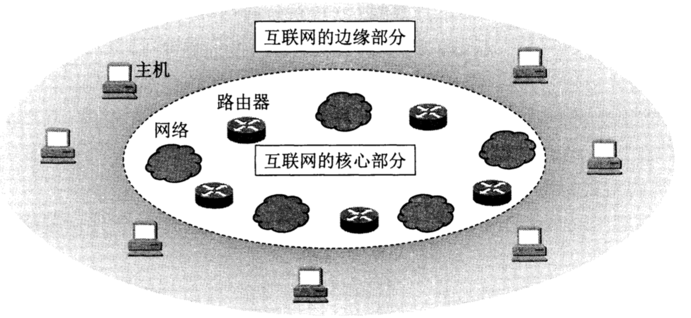
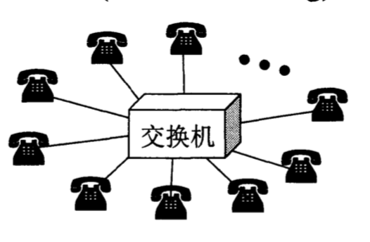
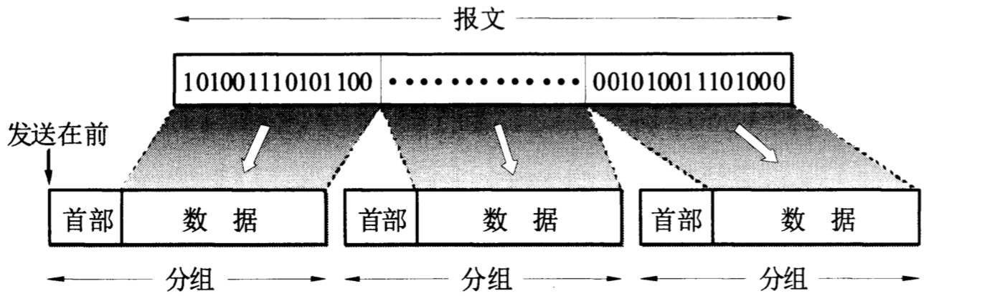
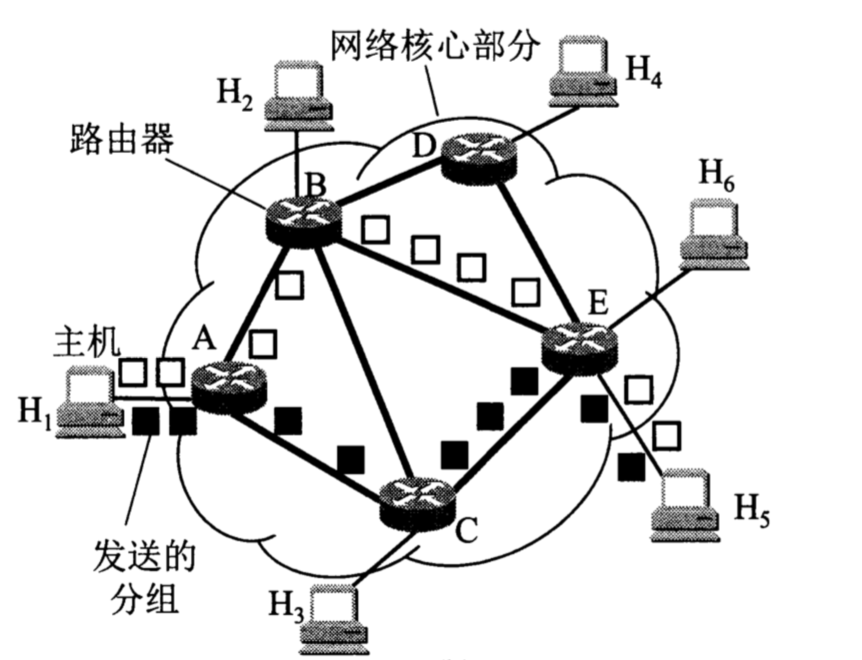
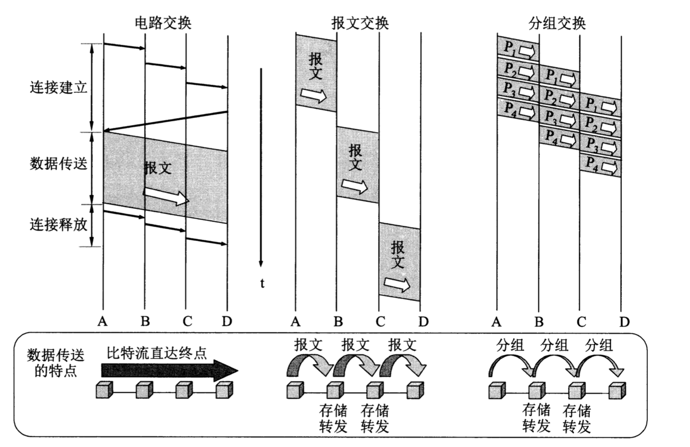

## 计算机网络在信息时代的作用

**21世纪最要特征数字化，网络化，信息化，它是一个以网络为核心的信息时代**

- 电信网络
  - 向用户提供电话，电报，以及传真服务
- 有线电视网络
  - 向用户传输各种电视节目
- 计算机网络
  - 使用户能够在计算机之间传送数据文件

**发展最快，并且具有核心作用的是计算机网络，“三网融合” 至今还没有实现**

**简单来说Internet就是指计算机网络，就是指互联网**

可以说，世界现在已经离不开互联网了。互联网有两个重要基本的特点：
- 连通性
- 资源共享 

互联网是自印刷术以来，人类在存储和交换信息领域中的最大变革。

互联网+，正在进行中。

## 互联网组成
- 边缘部分
  - 由用户直接使用，用来进行通信和资源共享
- 核心部分
  - 由大量网络和链接这些网络的路由器组成，这部分是为了给边缘部分提供服务

### 边缘部分
主机A与主机B，之间的通信 实际是指 主机A上的某个程序与运行在主机B上的另一个程序通信。 进程就是运行着的程序。在端系统（边缘部分的主机）之间的通信方式有两大类：
- 客户端-服务器 C/S
- 对等方式 P2P
  - 实际上，对等连接方式从本质上看仍然是使用 客户端-服务器 的方式，只是对等连接的每一台主机即是客户端 也是服务端。

### 核心部分

网络核心部分是互联网中最复杂的部分。在网络核心部分起特殊作用的**路由器**。路由器是实现**分组交换**的关键，其任务是转发收到的分组，这是网络核心部分最重要的功能，为了弄清分组交换，先介绍**电路交换**的基本概念

## 电路交换
在电话面世不久，人们发现要让所有的电话机两两连接是不现实的。因为连线太大了，于是人们认识到，要使得每一部电话能够很方便和另一部电话通信，就应当使用**电话交换机**讲这些电话链接起来。

当电话机的数量增多，就要使用很多彼此连接起来的交换机来完成全网的交换任务。用这样的方法，就构成了覆盖全世界的 **电信网**

从通信资源的分配角度来看，“交换”就是按照某种方式动态地分配传输线路的资源。
在使用电路交换打电话之前，先拨号建立连接：当拨号的信令通过许多交换机到达被叫用户所连接的交换机时，该交换机就向用户的电话机振铃；在被叫用户摘机且摘机信号传送回到主叫用户所连接的交换机后，呼叫即完成，这时从主叫端到被叫端就建立了一条连接。也就是一条专用的**物理通路**。 通话结束挂机后，挂机信令告诉这些交换机，使交换机释放刚才这条物理通路。这种必须经过“建立连接--通信--释放连接”三个步骤的交换方式称为**电路交换**。 如果用户在拨号时电信网的资源不足以支持这次呼叫，则为听到忙音，得过一会再打。

当使用电路交换来传送计算机数据时，其线路的**传输效率很低**， 这是因为计算机数据是突发式得出现在传输线路上，因此真正用来传送数据的时间往往很小，已被用户占用的通信线路资源在绝大部分时间内是空闲的。例如：当用户阅读屏幕上的信息，或者 计算机正在计算时，宝贵的通信线路资源并未被利用而是白白浪费。

## 分组交换

分组交换则采用**存储转发技术**。 

- 分组
  - 我们把要分送的整块数据叫做“报文message”，在发送前，先把较长的报文划分成一个个更小的等长数据段，例如，每个数据段1024 bit。在每个数据段前面加上一些必要的控制信息（包头），这样就构成了一个分组（packet），分组又称为 **包**
  - 
- 路由器 则是用来转发这个分组的。路由器收到一个分组，先暂时存储一下，检查其首部，查找转发表，按照首部中的目标地址，找到合适的接口转发出去，把分组交给下一个路由器。这样一步一步的，把分组交给目标主机。 各路由器之间必须经常交换彼此掌握的路由信息，以便创建和动态维护路由器中的转发表，使得转发表能够在整个网络发生变化时及时更新。

**应当注意到，分组交换在传送数据之前不必先占用一条端到端的链路的通信资源。分组在哪段链路上传送才占用这段链路的通信资源。分组这样断续的占用通信资源，还省去了建立连接，释放连接的成本，因而传输效率更高**

分组交换，实质上是采用了在数据通信过程中，动态分配传输带宽的策略。其优点如下：
- 高效： 动态分配带宽，对通信链路是逐段占用。
- 灵活：为每一个分组独立地选择最合适的转发路由
- 迅速：以分组为单位，可以在不先建立链接就能向其他主机发送分组
- 可靠：各种通信协议保障

#### 分组交换的问题
- 延迟
  - 排队
  - 无法保证通信时，所需的带宽
- 额外的开销
  - 各个分组的控制信息，使得报文增大
  - 整个分组网络需要专门的管理和控制，比如 解析包头

#### 报文交换

分组交换的概念，并非完全新的概念。自古就有的邮政通信，本质上就是存储转发的方式。只不过延迟太大。

## 三种方式的主要特点

- 电路交换
  - 整个报文的比特流连续地从源点直达终点，好像在一个管道中传送
- 报文交换
  - 整个报文传送到相连节点，全部存储下来后查找转发表，转发到下一个结点
- 分组交换
  - 单个分组（整个报文的一部分）传送到相邻结点，存储下来后查找转发表，转发到下一个结点

