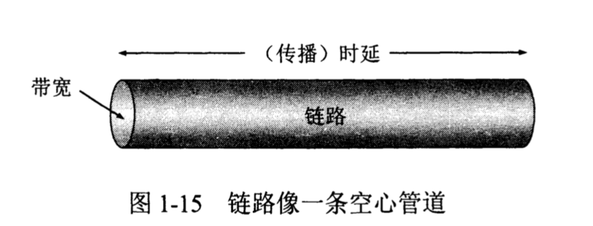
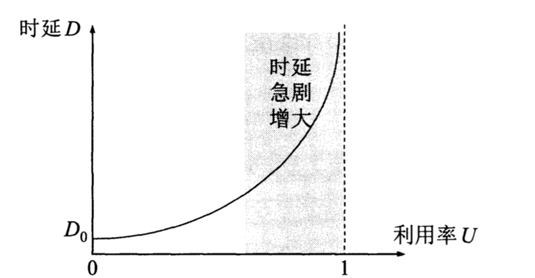

## 性能指标
计算机网络的性能，一般是指几个重要的性能指标

### 速率
数据的传送速率
### 带宽
带宽有2种不同含义
- 1.模拟信号，又称 连续信号，它在一定的时间范围内可以有无限多个不同的取值，如温度、湿度、压力、长度、电流、电压。带宽在这种信号下，是指该信号具有的**频带宽度**。比如在 传统的通信线路上的电话信号是 3.1khz（从300Hz 到 3.4kHz，是话音的主要成分的频率范围）。
- 2.数字信号，取值上是离散的、不连续的信号。在计算机网络中采用数字信号，这时带宽用来表示，网络中某通道传送数据的能力，因而网络带宽表示在单位时间内网络中某信道所能通过的“最高数据率”。

### 吞吐量
表示在单位时间内 通过某个网络的实际数据量。 很显然， 受到 速率 与 带宽的影响
### 时延
是指数据从一端到另外一端的所需的时间，时延是一个重要的指标，由以下几个不同的部分组成
- 发送时延， 是指 发送数据帧的第一个bit算起，到最后一个bit发送完毕所需的时间。 发送时延= 数据帧长度/发送速率。 发生在机器内部，一般在网络适配器
- 传播时延  传播时延是电磁波在信道中传播一定距离需要花费的时间。传播时延=信道长度/电磁波在信道上的传播速率（m/s）. 电磁波在真空中传输是光速，从中国发送电磁波0.9s 能达到美国。在光纤中传播速度是 2.5* 10 5次方。 发生在机器外部，与距离有关。
- 处理时延
- 排队时延
- 总时延 = 发送+传输+处理+排队

### 时延带宽积
传播时延* 带宽 就得到一个很有用的度量，**传播时延带宽积**。

假如：设某段链路的传播时延为20ms，带宽为10mbit/2算出：
传播时延带宽积 = 20* 10(-3) *10 * 10(6) = 2* 10(5) bit;
这就表明，若发送端连续发送数据，则在发送第一个bit即将到达终点时，发送端已经发送了20万个bit，而这20万个bit 正在链路上向前移动。

### 往返时间RTT（Round-Trip Time）
这是因为在许多情况下，互联网的信息不仅仅单方向传送而是双向交互的。因此，我们很需要知道双向交互一次所需的时间。

### 利用率

- 信道利用率
  - 指出某信道有百分之几的时间是被利用（有数据通过）。完全空闲的信道利用率是零。
- 网络利用率
  - 全网络的信道利用率的平均值。

信道利用率并非越高越好，这是因为，根据排队的理论，当某信道的利用率增大，该信道的时延也就迅速增加。这和高速公路的情况有些相似。当高速公路上的车流量很大时，由于在公路上的某些地方出现了堵塞，那就没车道让你切换了。网络也有类似的情况，当网络的通信量很小时，网络产生的时延并不大，但在网络通信量不断加大的情况下，由于分组在网络节点（路由器或者结点交换机）进行处理时，需要排队等候，因此网络引起的时延就会增大。
因此我们必须有这样的概念： **信道或网络的利用率过高会产生非常大的时延**，一般来说，利用率不能超过50%，超过了就要准备扩容，增大线路的带宽。
