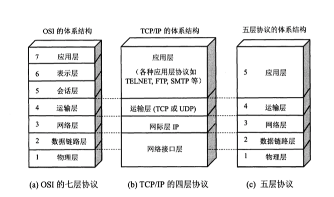
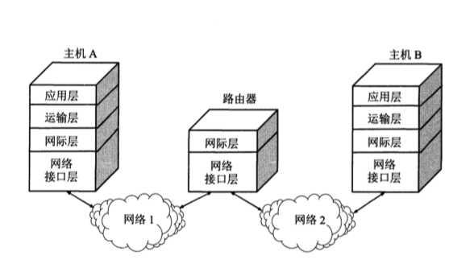
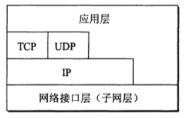
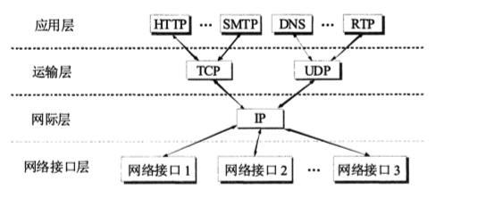

## 计算机网络体系结构

计算机网络是个非常复杂的系统。可以设想一种最简单的情况：连接在网络上的两台计算机互相传送文件
显然，在这两台计算机之间必须有一条传送数据的通路，但这远远不够，至少还有以下几项工作需要去完成：
1. 发起通信的计算机必须将数据通信的通路进行激活，所谓激活就是要发出一些信令，保证要传送的计算机数据能在这条通路上正确发送和接收
2. 要告诉网络如何识别接收数据的计算机
3. 发起通信的计算机必须查明对方计算机是否已开机，并且与网络连接正常
4. 对方计算机中的文件管理程序是否已做好接收文件和存储文件的准备工作
5. 如果计算机的文件格式不兼容，则至少其中一台计算机应完成格式转换功能
6. 对出现的各种差错和以外事故，如：数据传送错误，重复或丢失，网络中某个节点交换机出现故障，应当有可靠的措施保障对方计算机最终能够收到正确的文件。

为了设计这样复杂的计算机网络，早在最初的ARPANET设计时就提出了分层的方法。**分层**可将庞大而复杂的问题，转化为若干较小的局部问题，而这些较小的局部问题就比较易于研究和处理

### 协议与层次划分

在计算机网络中要做到有条不紊的交换数据，就必须遵守一些事先约定好的规则。这些规则明确规定了所交换数据的格式以及有关的同步问题。即，在一定条件下应当发生什么事件，比如：应当发送一个应答信息，因而**同步**含有时序的意思。这些**为进行网络中的数据交换而建立的规则标准或约定称为网络协议，简称协议**。网络协议主要由以下三个要素构成：
1. 语法，即数据与控制信息的结构或格式
2. 语义，即需要发出何种控制信息，完成何种动作已经做出何种响应
3. 同步，即事件实现顺序的详细说明

OSI 七层协议体系结构的概念清楚，理论完整，但复杂又不实用。TCP/IP体系结构则不同，但它现在得到了非常广泛的应用。不过从实质上讲，TCP/IP 最有最上面的三层，因为最下层的网络接口层并没有什么具体的内容。

1. 应用层，应用层的任务是通过应用进程间的交互来完成特定网络应用。如：DNS,HTTP,SMTP
2. 运输层，运输层的任务就是负责向两台主机中进程之间的通信提供用户的数据传输服务。应用进程利用该服务传送应用层报文。主要协议用 TCP/UDP
3. 网络层，网络层负责为分组交换网上不同主机提供通信服务。在发送数据时，网络层把运输层产生的报文段或者用户数据报封装成分组或者包进行传送，主要协议 IP
4. 数据链路层，简称链路层。任务是把网络层的IP数据报文，组装成帧，在两个相邻结点间的链路上传送帧。每一帧包括数据和必要的控制信息。
5. 物理层，物理层要考虑用多大的电压代表1，或 0 。以及接收方如何识别出发送方发送的比特。物理层还要确定链接电缆的插头应当有多少根引脚以及各引脚应如何连接。注意，物理媒体，如 双绞线，同轴电缆，光缆，并不在物理层协议之内，而是在物理层下面，因此也有人把物理层下面的物理媒体挡住第0层。

#### TCP/IP体系

实际上现在的互联网使用TCP/IP体系结构有时已经演变成下图所示，即某些应用程序可以直接使用IP层，或甚至直接使用最下面的网络接口层（PETE11）。

沙漏计时器形状的TCP/IP 协议族表明：TCP/IP协议可以为各式各样的应用提供服务（everythings over IP）,同时TCP/IP协议也允许IP协议在各式各样的网络构成的互联网上运行（IP over everything）

