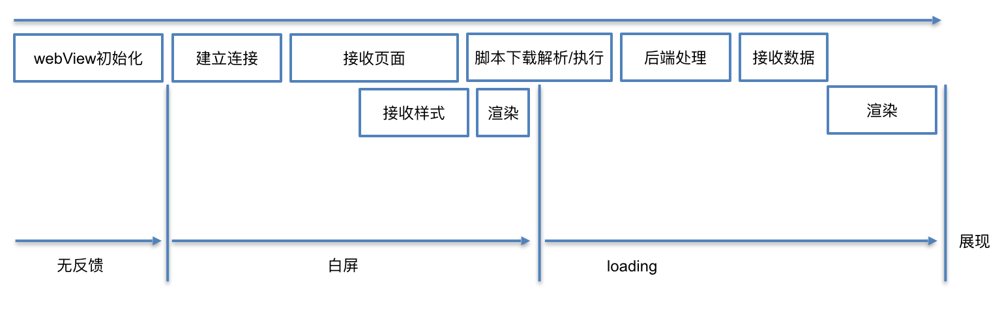
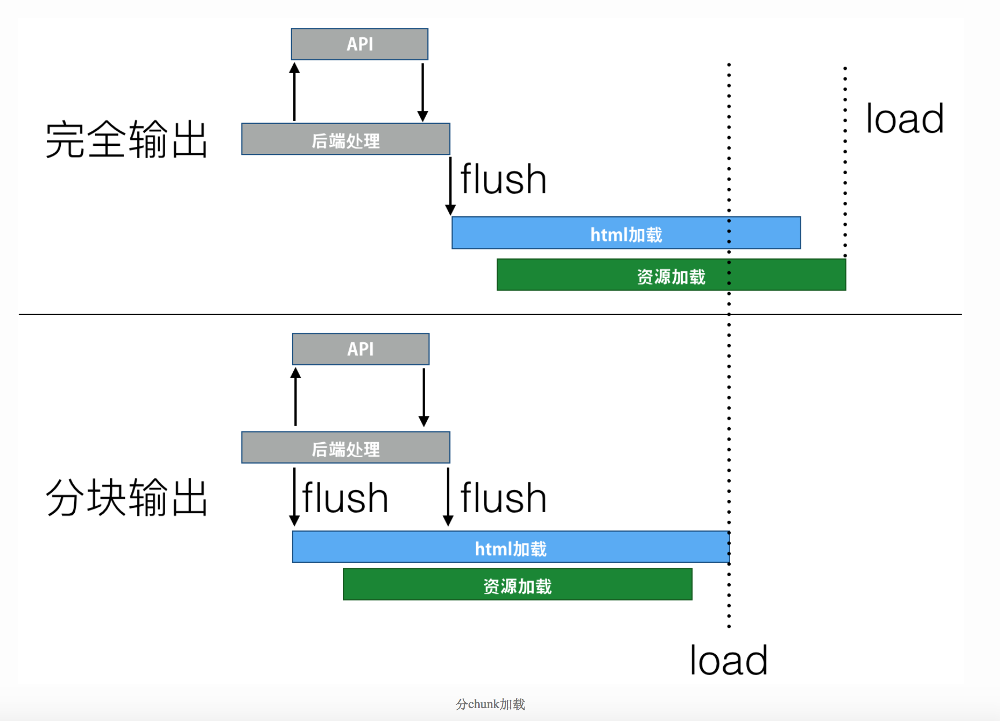

# 业界实践
* [VasSonic](https://github.com/Tencent/VasSonic)
* 预加载：客户端对整个页面静态资源预加载
* [美团性能优化](https://tech.meituan.com/2017/06/09/webviewperf.html)
从

# 一、整体理解

## 可行性
* 人工感知：不同网络条件 & 不同客户端差异。录屏播放。
* 微信小程序的也是webview实现的
* 体验/功能  &  动态能力

## 项目进行原则
* 数据驱动，多维度度量性能指标

# 二、目前流程拆解分析

整体优化方向
* 大量串行过程，尽量变成并行
* 对其中每一步的执行做优化：预执行、进行缓存、各种方式缩短执行时间

## 1. webview初始化
### 参考数据
参考数据(未优化情况)：

### 解决方案

#### 全局WebView

> 通过提前初始化webview，缩短webview初始化时间

方案细节：
* 在合适的时间，提前初始化一个全局的WebView待用，并隐藏（或多个webview，以应付同时打开多个webview的可能性）
* 当用户访问了WebView时，直接使用这个WebView加载对应网页，并展示。

收益：
* 描述：缩短webview初始化时间
* 参考数据：暂无

副作用：
* 额外的内存消耗
* 页面间跳转需要清空上一个页面的痕迹，更容易内存泄露。

#### webview初始化期间做些其他事情

> 在此期间做别的事情，打破阻塞现状

方案细节：
* 静态资源预加载：预下载html文件资源，解析html文本，并预下载其中css/js资源，并加入缓存。
* 动态数据预请求：由native代替web对h5页面需要的动态数据发起网络请求。
* h5打开后，拦截webview发出的网络请求，直接从缓存中读取。

收益：
在此期间做别的事情，打破阻塞现状，形成并行。

副作用：
* 需要额外维护h5页面所依赖的 动态数据的 请求连接

## 2. 建立连接
### DNS
#### 参考数据
美团(内容值： n%分位值（ms）):

乘客端兑换码h5:

#### 解决方案
* DNS采用和客户端API相同的域名，共享DNS缓存
* DNS预解析
* DNS缓存

### TCP
#### 参考数据

#### 解决方案
* 大家讨论下，待深入了解

## 3. html页面阻塞
### html为纯静态的场景
* 资源本身：请求速度主要跟CDN速度、html资源尺寸有关
* 阻塞后面流程
#### 阻塞后续流程的解决方案
* html缓存，需要维护版本、考虑更新机制。
* 版本更新：前端上线阶段 推送给客户端。native实现推拉结合。service worker待深入研究。

### 动态html渲染采用chunk编码

**方案：**
* header: transfer-encoding:chunked
* 同步渲染时如果后端请求时间过长，可以考虑采用chunk编码，将数据放在最后，并优先将静态内容flush。

**收益分析：**
* 如果采用普通方式输出页面，则页面会在服务器请求完所有API并处理完成后开始传输。浏览器要在后端所有API都加载完成后才能开始解析。
* 如果采用chunk-encoding: chunked，并优先将页面的静态部分输出；然后处理API请求，并最终返回页面，可以让后端的API请求和前端的资源加载同时进行。
* 两者的总共后端时间并没有区别，但是可以提升首字节速度，从而让前端加载资源和后端加载API不互相阻塞。

### http 2 主动push
** 方案：**
* 浏览器发送html请求时，服务器基于http 2技术主动推送相关静态资源。
* 注意，若js/css等资源已有本地缓存，主动推送浪费资源。

## 4. 页面渲染
红框内部分都属于 页面渲染 范畴

### 参考数据
**兑换码h5分析参考数据：**
(dom解析时长=timing.domComplete - timing.domInteractive)

* interactive：html解析完成的时间点。The document has finished loading and the document has been parsed but sub-resources such as images, stylesheets and frames are still loading.
* complete：onLoad。The document and all sub-resources have finished loading. The state indicates that the load event is about to fire.
* 备注：兑换码h5的dom解析时长可能因为css/js资源请求耗时过长造成dom

**参考数据：**

**美团某网页数据，我们也应该统计的更细：**

**仅运行框架代码，未执行任何业务代码的情况(这是2年前数据)：

### 数据分析

性能对比：兑换码h5 vs 兑换规则h5
* DNS: 165 vs 7
* TCP: 434 vs 51
* Dom Ready: 2076 vs 810
* Dom解析：1191 vs 268

技术实现对比：
* 页面框架：相同，都是vue
* 页面总传输量：200kb vs 170kb

猜测，核心区别：
* 兑换码h5：一般是首次打开webview
* 兑换规则h5：一般是非首次打webview开，命中了各种webview优化策略。比如dns缓存、tcp缓存(不确定)、静态资源缓存、dom解析速度

### 解决方案

#### 传统前端范畴性能优化
* 资源尺寸优化
* http请求数优化
* 异步加载
* 库、框架的执行时间不可忽略，尤其是低端机。如果要用的话，ssr、构建阶段预渲染是优化选项
* http2/http1.1/缓存利用率几点因素结合，给出最佳打包方案

#### webview
* 可能对第一次打开的h5优化效果明显。
* 效果验证：深度统计首次与非首次打开webview时，h5页面加载的各个过程的耗时
* webview优化：预初始化webview、预解析dns、提前tcp(不确定)等。

## 5. 静态资源缓存

### 参考
* charles发现兑换码页面缓存不稳定
* 微信打开兑换码页面速度稳定，较快

### service worker
兼容性：

注意点：
* 向下兼容
* 降级方案

### 客户端拦截webview发出的请求
利用http协议缓存 或 单独实现，待讨论

# 三、不同优化策略的收益预估

* 目前平均页面加载时间2.2s(不包含客户端webview初始化时间)，兑换码h5也是2.2s。
* ajax请求耗时: 暂无数据，假设消耗 0.7s。dns缓存、tcp握手、服务端返回速度、dom解析
* todo: 每个优化方案图解

***以下优化方案为粗略估算，还需要持续的监控与验证反馈。***

## 优化一：前端常规优化

仅对页面渲染阶段做优化，即：
* 资源尺寸优化
* http请求数优化
* 异步加载
* 框架移除，使用原生开发

页面加载时间估算：
1.5s(不包含客户端webview初始化时间)。

依赖动态数据的页面：
2.2s

## 优化二：缓存优化

在优化一的基础上增加：
稳定的静态资源缓存方案(不包括html)

页面加载时间估算：
1.2s

依赖动态数据的页面：
1.9s

## 优化三：通过ssr

在优化一、优化二的基础上。通过ssr降低动态数据的额外消耗。

静态加载时间估算：
1.2s
依赖动态数据的页面：
1.4s

## 优化四：webview预初始化

优化点：
* webview预初始化

收益：
* webview初始化时间降低，页面打开速度提升。
* 可能会，命中一些webview默认优化。

## 优化五：深度结合native能力(或包括service worker)

优化点：
* html缓存
* dns解析(预解析)
* 预请求页面动态数据
* 其他

静态加载时间估算：
0.5s

依赖动态数据的页面：
<1s

# 四、其他
## DNS/TCP 
这两项优化方案

## 记录
* webview内存参考数据：

* js转webassembly模块打包成一个或多个

# 五、解决方案
## 目标
目标：首屏，一次http连接搞定。 10kb内传输。 剩余分级别进行异步加载

html: 服务端渲染
css： 首屏所需css，多一次外链请求，在弱网下很耗时间，直接放到html里面。
客户端判断cookie设置，可以判断是否首次加载。

若是首次加载：
首屏css(控制在5kb内)直接注入页面。
低优先级的css异步加载，需要写cookie到对应路由的path里面，带上css版本戳

非首次加载：
css作为外链

## preact for TTI
4kb

## ssr
* 服务端日志。
* 参考nextjs，解决了什么问题：
    * css
    * store
    * 首屏，仅服务端渲染，客户端不渲染。
    * 动态数据 获取方式 抹平
* nextjs 为什么不用。 runtime太大。 30kb。

## 网络
* 到底怎么打包。 h2
* 数据调研：从用户数据中获取，h2覆盖率，网络连接(维度：地域、域名、网络环境、操作系统、关键网络数据)

## native webview. 静态资源预加载
主要是 TTI

## 工程化
统一解决方案。研发效率、稳定性、降级

## 其他
* 服务器日志
* 内网调用
