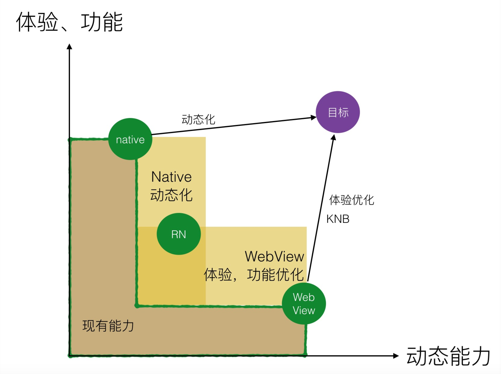

# 概览

## 什么是性能
* [User-centric performance metrics](https://developers.google.com/web/fundamentals/performance/user-centric-performance-metrics)
* [Measure Performance with the RAIL Model](https://developers.google.com/web/fundamentals/performance/rail)

## 解决的问题 & 获取的收益
* 业务指标：用户满意度、用户留存率、转化率、活跃度等。 业界数据统计 / 真实业务数据验证
* 研发成本：研发维护成本要尽量低
* 需要考虑的问题： 业务支持、研发成本 的关系。

* 现实中场景：native化，增大整个研发团队的研发效率压力。

## 度量
### 业务度量
监控机制
### 性能度量
#### 工具本地度量
[链接](https://developers.google.com/web/fundamentals/performance/rail#tools)
* **Chrome DevTools**: network / performance
* **Lighthouse**. Available in Chrome DevTools, as a Chrome Extension, as a Node.js module, and within WebPageTest. You give it a URL, it simulates a mid-range device with a slow 3G connection, runs a series of audits on the page, and then gives you a report on load performance, as well as suggestions on how to improve. Also provides audits to improve accessibility, make the page easier to maintain, qualify as a Progressive Web App, and more.
* **WebPageTest**. Available at webpagetest.org/easy. You give it a URL, it loads the page on a real Moto G4 device with a slow 3G connection, and then gives you a detailed report on the page's load performance. You can also configure it to include a Lighthouse audit.
#### 用户数据监控度量
* [Performance API](https://developer.mozilla.org/en-US/docs/Web/API/Performance)

* 关键指标：
    * FP: First Painting
    * FCP: First Contenful Painting
    * FMP: First Meaningful Painting
    * TTI: Time To Interact
    * long tasks: the time js run

## 广泛的知识
css / js / html / server / network / browser / native / 框架 / 工程化(编译)

## 必读资料
* [develop.google](https://developers.google.com/web/fundamentals/performance)
* [学而思](https://mp.weixin.qq.com/s?__biz=MzU4NDg2MTA4MA==&mid=2247484225&idx=1&sn=5aabc49b7bcbf17ace4c26f525b04dcb&chksm=fd9217b6cae59ea04065a4e74f34a71efc6ebfbd3a1ec2c9d8ee29c48e1d22aff94cd73774b4&mpshare=1&scene=1&srcid=&key=b9ef0817915a9566a0ad7299d75a35e8f99ebb5bc98e5c364e1fdbeea3ea6d2849360d3ad4f1246bcb4343db208fdc7e94f096a402f996d2117827747f521b7ef788625c7d1bd131e491f16e3d186197&ascene=1&uin=Mjg3NDc1NDE1&devicetype=Windows+7&version=62060739&lang=zh_CN&pass_ticket=+OIrjhQ0VXhq7YDnSqDOaIVEZdgN5HJBiWD/CKe4SmAyZ1H8hDiefxUUp+CJ20Oe)

