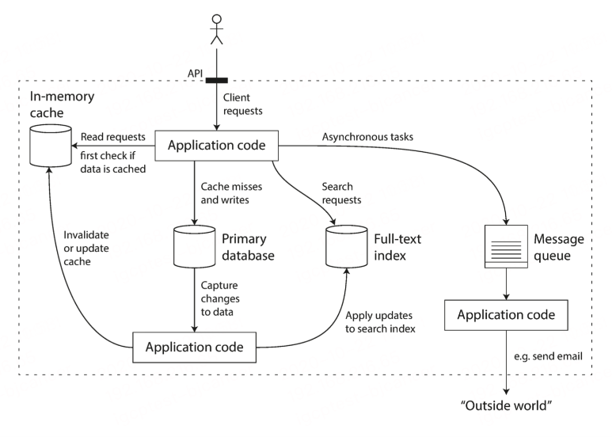

## 可靠，可扩展，可维护的应用系统

当前许多新型应用都属于数据密集型，而不是计算密集型。对于这类应用，cpu的处理能力往往不是第一限制性因素，关键在于数据量，数据的复杂度，以及数据的快速多变形

数据密集型应用同城也是基于标准模块构建而成，每个模块负责单一的常用功能。例如：许多应用系统都包含以下模块

- 数据库
- 高速缓存：缓存那些复杂或操作代价昂贵的结果，以加快下一次访问
- 索引：用于可以按关键字搜索数据并支持各种过滤
- 流式处理：持续发送消息至另一个进程，处理采用异步方式
- 批处理：定期处理大量的累计数据

这些模块也许看上去习以为常，主要是因为这些"数据处理系统"已经做了非常漂亮的抽象，以至于我们已经习惯于拿来即用，而没有进行深入的思考。由于目前业界已有许多数据解决方案可供选择，当需要构建一个新应用时，相信多数开发者不会从头开始，例如写一个全新的数据存储引擎。
但情况并非如此简单。确实已有很多数据库系统，但因为需求和设计目标的差异，个中精妙都不尽相同。缓存和索引方案与之类似。因此在构建某个特定应用时，我们总是需要弄清楚哪些组件，哪些方法最合适自己，并且当单个组件无法满足需求而必须组合使用时，总要面临更多的技术挑战。

我们的核心设计目标是**可靠，可扩展，可维护的数据系统**

### 认识数据系统

我们通常将数据库，队列，高速缓存等视为不同类型的系统。虽然数据库和数据队列存在某些相似性，例如两者都会保存数据（至少一段时间），但他们却有着截然不同的访问模式，这就意味着不同的性能特征和设计实现。
那么为什么将他们归为一大类即"数据系统"呢？
首选，近年来出现了许多用户数据存储和处理的新工具。他们针对各种不同的应用场景进行优化，不合适在归为传统类型。例如Redis既可以用于数据存储也适用于消息队列，Apache Kafka作为消息也具备了持久化存储保证。系统之间的界限变得模糊。
其次，越来越多的应用系统需求广泛，单个组件往往无法满足所有数据处理与存储需求。因而需要将任务分解，每个组件负责高效完成其中一部分。多个组件依靠应用代码驱动有机衔接起来。

举个例子，假定某个应用包含缓存层（Memcached）与全文索引服务器（ElasticSearch或Solr），二者与主数据库保持关联，通常由应用代码负责缓存，索引与主数据库之间的同步。如同：

上面例子中，组合使用了多个组件来提供服务，而对外提供服务的页面或者API会隐藏很多内部实现细节。这样基本上我们基于一个个较小的，通用的组件，构建而成一个全新的，专用的数据系统。
影响数据系统设计的因素有很多，其中包括**相关人员技能和经验水平，遗留系统依赖性，交付周期，对不同风险因素的容忍度，监管合规**等。这些因素往往因时因地而异。现在专注于大多数软件系统都极为重要的三个问题：

**可靠性**

当出现意外情况如硬件，软件故障，人为失误，系统应可以继续正常运转：虽然性能可能有所降低，但确保功能正确。

**可扩展性**

随着规模的增长，例如数据量，流量或复杂性，系统应以合理的方式匹配这种增长。

**可维护性**

随着时间的推移，许多新的人员参与到系统开发和运维，以维护现有功能或适配新场景等，系统都应高效运转。

### 可靠性

每个人脑子里都有一个直观的认识，即什么意味着可靠或者不可靠。对于软件，典型的期望包括：

- 应用程序执行用户所期望的行为
- 可以容忍用户出现错误或者不正确的软件使用方法
- 性能可以应对典型场景，合理负载压力和数据量
- 系统可防止任何未经授权的访问和滥用

如果所有上述目标都要支持才算"正常工作"，那么我们可以认为可靠性大致意味着：即使发生了某些错误，系统仍可以继续正常工作。
系统可应对错误则称为:**容错**。这不意味着系统可以容忍各种可能的故障类型，显然实际上这是不可能的。
举一个夸张一些的例子，如果整个地球都被黑洞吞噬，那么要在这个级别上进行容错就意味着必须在宇宙范围内进行系统冗余。试想，这将是天价的预算，
因此，容错总是指特定类型的故障，这样的系统才是更有实际意义。
注意，故障与失效不完全一致。故障通常被定义为组件偏离其正常规格，而失效意味着系统作为一个整体停止，无法向用户提供所需要的服务。我们不太可能将故障的概率降到零，
因此最好设计容错机制以防止故障而导致失效。

在这类容错系统中，通过故意触发来提高故障率是有意义的，例如：在没有警告的情况下，随机地杀死单个进程。因此我们可以通过故意引发故障来确保容错机制不断运行并接受考验，从而提高故障自然发生时系统能正确处理的信心。
尽管比起阻止错误，我们通常更倾向于容忍错误。但也有预防胜于治疗的情况（比如不存在治疗的方法）。**安全问题**就属于这种情况。例如：如果攻击者破坏了系统，并获取了敏感信息，这种事是避免不了的。

#### 硬件故障

当想到系统失效的原因时，硬件故障总会第一个进入脑海。硬盘崩溃，内存出错，机房断电，有人拔错网线...任何与大型数据中心打过交道的人都会告诉你：一旦你拥有很多机器时，这些事情总会发生。

为了减少系统的故障率，第一反应通常都是增加单个硬件的冗余度，例如：磁盘可以组件RAID，服务器可以有双路电源和热插拔CPU，数据中心可能有电池和柴油机电机作为后备电源，某个组件挂掉时冗余组件可以立即接管。

但是随着数据量和应用计算需求的增加，越来越多的应用开始大量使用机器，这会相应地增加硬件故障率。此外一些云平台中，虚拟机实例不可用没有任何警告也是很常见的。
如果在硬件冗余的基础上进一步引入软件容错机制，那么系统在容忍整个机器故障的道路上就更进一步。

#### 软件错误

我们通常认为硬件故障是随机的，相互独立的：一台机器的磁盘失效并不意味着另一个台机器的磁盘也会失效

另一类错误是内部的系统性错误。这类错误难以预料，所以比起不相关的硬件故障往往可能造成更多的系统失效。比如：
- 接受特定的错误输入，便导致所有应用服务器实例崩溃的Bug。例如：2012年6月30日的闰秒，由于Linux内核中的一个错误，许多应用同时挂掉了。
- 失控进程会占用一些共享资源，包括CPU时间，内存，磁盘空间或网络带宽
- 系统依赖的服务变慢，没有响应，或者开始返回错误的响应。
- 级联故障，一个组件中的小故障触发另一个组件中的故障，进而触发更多的故障

导致这类软件故障的Bug通常会潜伏很长时间，直到被异常情况触发为止。这种情况意味着软件对其环境做出了某种假设--虽然这种假设通常来说是正确的，但由于某种原因最后不再成立了。
虽然软件中的系统性故障没有速效药，但我们还是很多小办法的 如：
- 仔细考虑系统中的假设和交互
- 彻底的测试
- 进程隔离
- 允许进程崩溃并重启
- 测量，监控并分析生产环境中的系统行为。
如果系统能够提供一些保证（例如在一个消息队列中，进入与发出的消息数量相等）那么系统就可以在运行时不断自检，并在出现差异时报警。

#### 人为错误

设计并构建了软件系统的工程师是人类，维持系统运行的运维也是人类。即使他们怀有最大的善意，人类也是不可靠的。举个例子，一项关于大型互联网服务的研究发现，运维配置错误是导致服务中断的首要原因，
而硬件故障（服务器或网络）仅导致了10-25%的服务中断。

尽管人类不可靠，但怎么做才能让系统变得可靠？最好的系统会组合使用以下几种办法：

- 以最小化犯错机会的方式设计系统。例如：精心设计的抽象，APi 和 管理后台使做对事情更容易，搞砸事情更困难。但如果接口限制太多，人们就会忽略它的好处而想办法绕开，很难正确把握这种微妙平衡
- 将人们最容易犯错的地方与可能导致失效的地方**解耦**。特别是提供一个功能齐全的非生产环境沙箱（sandBox）。使人们可以在不影响真实用户的情况下，使用真实数据安全地探索和实验。
- 在各个层次进行彻底的测试，从单元测试，全系统集成测试到手动测试。自动化测试易于理解，已经被广泛使用，特别适合用来覆盖正常情况中少见的边缘场景
- 允许从人为错误中简单快速地恢复，以做大限度地减少失效带来的影响。例如：快速回滚配置变更，分批发布新代码（以便任何意外错误只影响一小部分用户）
- 配置详细和明确的监控，比如性能指标和错误率。在其他工程学科中这指的是**遥测**（一旦火箭离开地面，遥测技术对于跟踪发生的事情和理解失败是至关重要的）监控可以向我们发布预警信号，并允许我们检查是否有任何地方违反了假设和约束。当出现问题时，指标数据对于问题诊断是非常宝贵的。
- 良好的管理实践与充分的培训

### 可扩展性

系统今天能可靠允许，并不意味着未来也能可靠运行。服务降级的一个常见原因是负载增加。例如：系统负载已经从一万个并发用户增长到十万个并发用户，或者从一百万增长到一千万。也许现在处理的数据量级要比过去大得多。

**可扩展性**是用来描述系统应对负载增长能力的术语。讨论可扩展性意味着考虑诸如"如果系统以特定的方式增长，有什么选项可以应对？"和"如何增加计算资源来处理额外的负载？"等问题

#### 描述负载

首先要能简要描述系统当前负载。负载可以用一些称为**负载参数**的数字描述。参数的最佳选择取决于系统架构，它可能是，创建一个项目时同时要创建的文件夹个数，每秒向Web服务器发出的请求，数据库中的读写比率，聊天室中的读写比率，缓存命中比率等。除此之外，也行平均情况对你很重要，也许你的瓶颈是少数极端场景

#### 描述性能

一旦系统的负载被描述好，就可以研究当负载增加会发生什么。我们可以从两个角度来看：
- 增加负载参数并保持系统资源（CPU,内存，网络带宽）不变时，系统性能将受到什么影响
- 增加负载参数并希望保持性能不变时，需要增加多少系统资源

这两个问题都需要性能数据，所以让我们简单看一下如何描述系统性能。

对于在线系统，通常更重要的服务的响应时间，即客户端发送请求到接受响应之间的时间。
即使不断重复发送通用的请求，每次得到的响应时间也都会略有不同。现实世界的系统会处理各式各样的请求，响应时间可能会有很大差异。因此我们需要将响应时间视为一个可以测量的数据分布，而不是单个数值。
随机的附加延迟也会导致结果变化，如：上下文切换到后台进程，网络数据包丢失与Tcp重传，垃圾收集暂停，强制从磁盘读取的页面错误，服务器机架中的震动。

通常报表都会展示服务的**平均响应时间**，然而如果你想知道"典型"响应时间，那么平均值并不是一个非常好的指标，因为他不能告诉你有多少用户实际上经历了这个延迟
通常使用**百分位点**会更好。如果将响应时间列表按最快到最慢排序，那么**中位数**就在正中间，举个例子，如果你的响应时间中位数是200毫秒，这意味着一半请求的返回时间少于200毫秒，另一半比这个要长。
响应时间的高百分位点（**尾部延迟**）非常重要，因为它们直接影响用户的服务体验。另一方面，优化第99.99百分位点（一万个请求中最慢的一个）被认为太昂贵了，不能带来足够好处，减少高百分位点出的响应时间相当困难，因为它很容易受到随机事件的影响。

**排队延迟**通常占了高百分点处响应时间的很大一部分。由于服务器只能并行处理少量的事务（受到CPU的数量限制），所以只要有少量的请求就能阻碍后续请求的处理，这种效应有时被称为**头部阻塞**。即使后续请求在服务器上处理非常迅速，由于需要等待先前请求完成，客户端最终看到的是缓慢的总体响应时间。因为存在这种效应，测量客户端的响应时间非常重要。
为测试系统的可扩展性而人为产生负载时，产生负载的客户端要独立于响应时间不断发送请求。如果客户端在发送下一个请求之前等待先前的请求完成，这种行为会产生人为排队的效果，使得测试的队列比现实情况更短，使测试结果产生偏差。

#### 应对负载的方法

现在我们已经讨论了用于描述负载的参数和用于衡量性能的指标。可以开始认真讨论可扩展性了：当负载参数增加时，如何保持良好的性能？
适应某个级别负载的架构不太可能应付10倍于此的负载。如果你正在开发一个快速增长的服务，那么每次负载发生数量级的增长时，你可能都需要考虑架构。

人们经常讨论**纵向扩展**（垂直扩展，转向更大的机器）和 **横向扩展**（水平扩展，将负载分布到多台小机器上）之间的对立。跨多台机器分配负载也称为**无共享**架构。可以在单台机器上运行的系统通常更简单，但高端机器可能非常贵，所以非常密集的负载通常无法避免地需要横向扩展。
现实世界中的优秀扩展需要将这两种方法务实的结合，因为使用几台足够强大的机器可能比使用大量的小型虚拟机更简单更便宜。
有些系统是**弹性**的这意味着可以在检测到负载增加时自动增加计算资源，而其他系统则是手动扩展（人工分享容量并决定向系统添加更多的机器）。如果负载难以预测，则弹性系统可能很有用，但手动扩展系统更简单，并且意外操作可能更少。
跨多台机器部署**无状态服务**非常简单，但将带状态的数据系统从单节点变为分布式配置则可能引入许多额外复杂度。出于这个原因，常识告诉我们应该将数据库放在单个节点上（纵向扩展），直到扩展成本或可用性需求迫使其改为分布式。
随着分布式系统工具和抽象越来越好，至少对于某些类型的应用而言，这种常识可能会改变。可以预见分布式数据系统将成为未来的默认配置，即使对不处理大量数据或流量的场景如此。

### 可维护性

总所周知，软件的大部分开销并不在最初的开发阶段，而是在持续的维护阶段，包括修复漏洞，保持系统正常运行，调查失效，适配新的平台，为新的场景进行修改，尝还技术欠债，添加新的功能。
不幸的是，许多从事软件系统行业的人不喜欢维护所谓的遗留系统---因为涉及修复其他人的错误，和过时的平台打交道，或者系统被迫适用于一些份外工作。每一个遗留系统都以自己的方式让人不爽，所以很难给出一个通用的建议来和他们打交道。
但是我们可以，也应该以这样一种方式来设计软件：在设计之初就尽量考虑尽可能减少维护期间的痛苦，从而避免自己的软件系统变成遗留系统。为此，我们将特别关注软件系统的三个设计原则：

**可运维性**

便于运维团队保持系统平稳运行

**简单性**

从系统中消除尽可能多的复杂度，使新工程师也能轻松理解系统。（注意这和用户接口的简单性不一样）

**可演化性**

后续工程师能够轻松地对系统进行改进，并根据需求变化将其适配到非典型场景，也称为可延伸性，易修改性或可塑性

和之前提到的可靠性，可扩展性一样，实现这些目标也没有简单的解决方案。不过我们会试着想象具有可操作性，简单行和可演化性的系统会是什么样子。

#### 可运维性：运维更轻松

有人认为："良好的操作性经常可以化解软件的局限性，而再好的软件摊上垃圾运维也没法可靠运行"。尽管运维的某些方面可以，而且应该自动化的，但最终还是需要人来执行配置并确保正常工作。
运营团队对于保持软件系统顺利运行至关重要。一个优秀的运营团队通常至少负载以下内容：

- 监控系统的运行状况，并在服务状态不佳时快速恢复服务
- 跟踪问题的原因，例如系统故障或性能下降
- 及时更新软件和平台，比如安全补丁
- 了解系统间的相互作用，以便在异常变更造成损失前进行规避
- 预测未来的问题，并在问题出现之前加以解决（例如，容量规划）
- 建立部署，配置，管理方面的良好实践，编写相应工具
- 执行复杂的维护任务，例如将应用程序从一个平台迁移至另一个平台
- 当配置变更时，维持系统的安全性
- 定义工作流程，使运维操作可预测，并保持生产环境稳定
- 铁打的营盘流水的兵，保持相关知识的传承

良好的可运维性意味着更轻松的日常工作，进而运维团队能专注于高价值的事情。数据系统可以通过各种方式使日常任务更轻松：

- 通过良好的监控，提供对系统内部状态和运行时行为的可见性
- 为自动化提供良好支持，将系统与标准化工具集成
- 避免依赖单台机器（在整个系统不间断运行的情况下允许机器停机维护）
- 提供良好的文档和易于理解的操作模型（如果做X,会发生Y）
- 提供良好的默认行为，但需要时也允许管理员手动控制系统状态
- 有条件进行自我修复，但需要也允许管理员手动控制系统状态
- 行为可预测，最大限度减少意外

#### 简单性：简化复杂度

小型软件可以使用简单讨喜的，富有表现力的代码，但随着项目越来越大，代码往往变得非常复杂，难以理解。这种复杂度拖慢了所有系统相关人员，进一步增加了维护成本。一个陷入复杂泥潭的软件项目有时被描述为 **烂泥潭**

**复杂度** 有各种可能的症状，例如：状态控件激增，模块间紧密耦合，纠结的依赖关系，不一致的命名和术语，解决性能问题的Hack，需要绕开的特例。

因为复杂度导致维护困难时，预算和时间安排通常会超支。在复杂的软件中进行变更，引入错误的风险也更大：当开发人员难以理解系统时，隐藏的假设，无意的后果和以外的交互更容易被忽略。相反，降低复杂度能极大地提高软件软件的可运维性，因此简单性应该是构建系统的一个关键目标。
简单性并不意味着减少功能；它也意味着消除额外的复杂度，用于消除额外复杂度的最好工具之一是**抽象**。一个好的抽象可以将大量的实现细节隐藏在一个干净，简单易懂的外观下面。一个好的抽象也可以广泛用于各类不同应用。
比如重复造轮子，重用抽象不仅更好效率，而且有助于开发高质量的软件。抽象组件的质量改进将使所有使用它的应用受益。
例如：高级编程语言是一种抽象，异常了机器码，CPU寄存器，系统调用。SQL也是一种抽象，隐藏了复杂的磁盘/内存数据结构，来自客户端的并发请求，崩溃后的不一致性。正是因为编程语言的抽象，我们才不必考虑这些实现细节。

#### 可演化性：拥抱变化

系统的需求永远不变，基本是不可能的，更可能的情况是，它们处于常态的变化中，例如：你了解了新的事实，出现意想不到的应用场景，业务优先级发生变化，用户要求新功能，新平台取代旧平台，法律或监管要求发生变化，系统增长迫使架构变化等。
在组织流程方面，敏捷工作模式为适应变化提供了一个框架。这些敏捷技术的大部分都集中在想当小的规模（同一个应用中的几个代码文件）。我们需要在更大的数据系统层面上提高敏捷性的方法、修改数据系统并适应不断变化需求的容易程度，是与**简单性**和**抽象性**密切相关：简单易懂的系统通常比复杂系统更容易修改。

不幸的是，使应用可靠，可扩展，可维护并不容易。但是某些模式和技术会不断重新出现在不同的应用汇总。接下来，我们将看到一些数据系统的例子，并分析它们如何实现这些目标。
接下来我们将看到一种模式：几个组件协同工作以构成一个完整的系统

