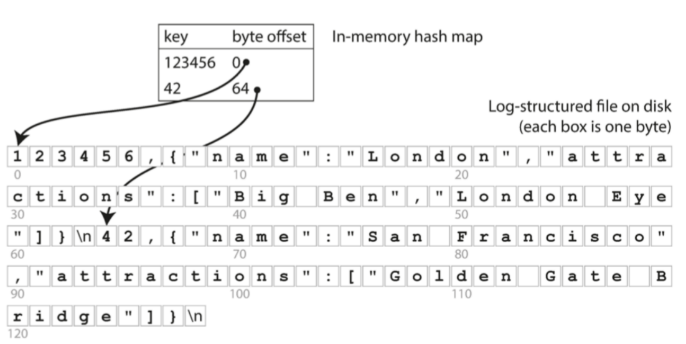
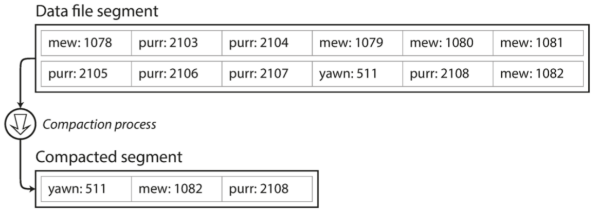
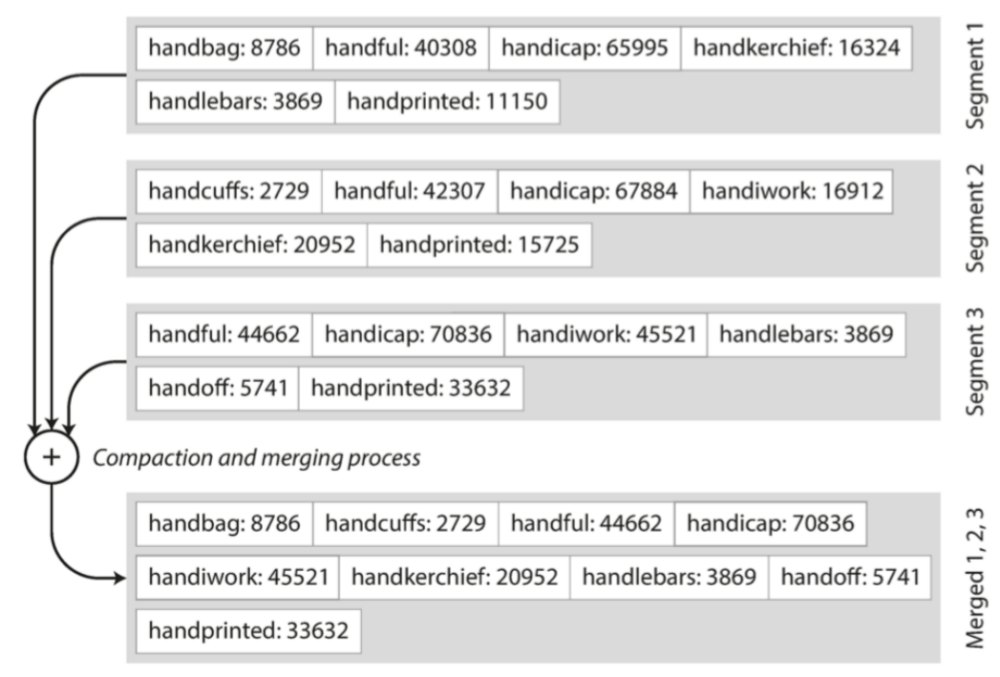
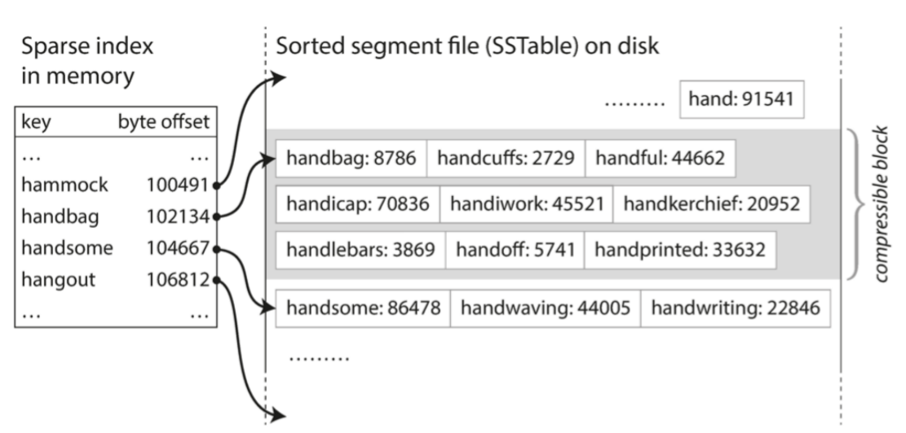
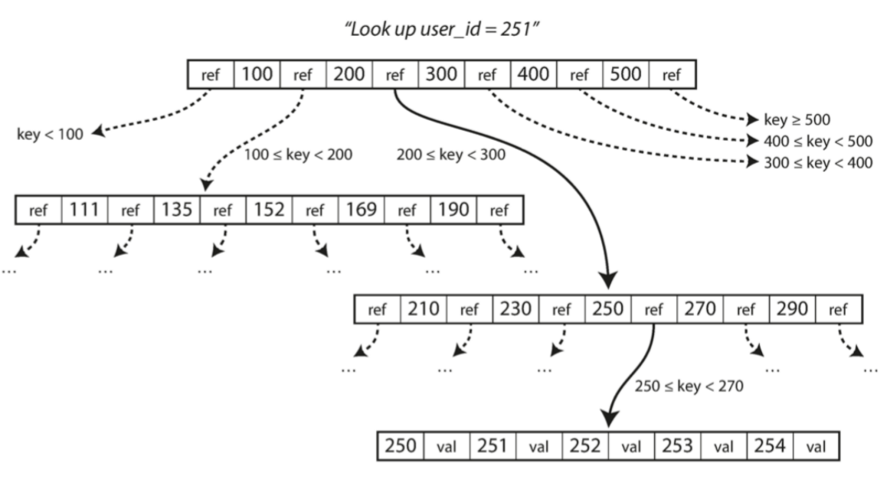
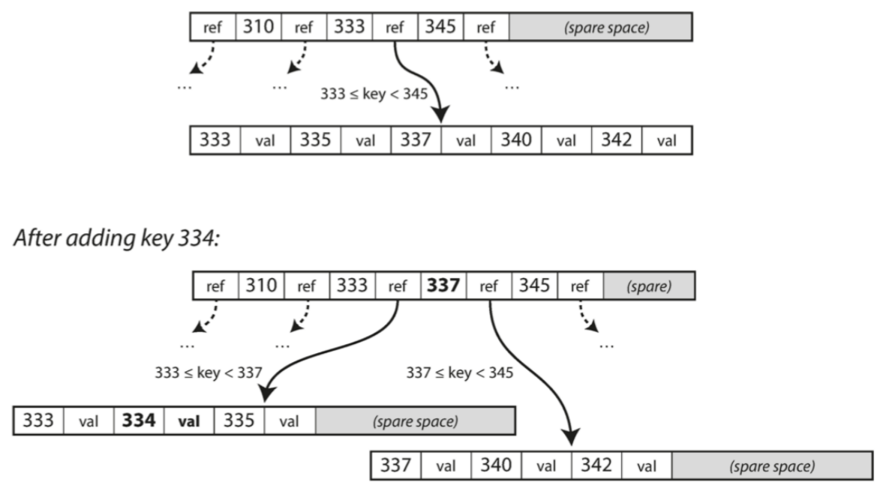

## 数据存储与检索

⼀个数据库在最基础的层次上需要完成两件事情：当你把数据交给数据库时，它应当把数据存储起来；⽽后当你向数据库要数据时，它应当把数据返回给你。

我们已经讨论了数据模型和查询语⾔，即程序员将数据录⼊数据库的格式，以及再次要回数据的机制。在本章中我们会从数据库的视⻆来讨论同样的问题：数据库如何存储我们提供的数据，以及如何在我们需要时重新找到数据。

作为程序员，为什么要关⼼数据库内部存储与检索的机理？你可能不会去从头开始实现⾃⼰的存储引擎，但是你确实需要从许多可⽤的存储引擎中选择⼀个合适的。⽽且为了协调存储引擎以适配应⽤⼯作负载，你也需要⼤致了解存储引擎在底层究竟做什么。

特别需要注意，针对事务性负载和分析性负载优化的存储引擎之间存在巨⼤差异。稍后我们将在 “事务处理还是分析？” ⼀节中探讨这⼀区别，并在 “列存储”中讨论⼀系列针对分析优化存储引擎。
但是，我们将从您最可能熟悉的两⼤类数据库：传统关系型数据库与很多所谓的“NoSQL”数据库开始，
通过介绍它们的存储引擎来开始本章的内容。我们会研究两⼤类存储引擎：**⽇志结构（logstructured）的存储引擎**，以及**⾯向⻚⾯（page-oriented）的存储引擎**（例如B树）。


### 驱动数据库的数据结构

世界上最简单的数据库可以⽤两个Bash函数实现：

```
#!/bin/bash
db_set () {
echo "$1,$2" >> database
}
db_get () {
grep "^$1," database | sed -e "s/^$1,//" | tail -n 1 }

```
这两个函数实现了键值存储的功能。执⾏ **db_set key value** ，会将 键（key）和值（value） 存储在数据库中。键和值（⼏乎）可以是你喜欢的任何东⻄，例如，值可以是JSON⽂档。然后调⽤
db_get key ，查找与该键关联的最新值并将其返回。

```
$ db_set 123456 '{"name":"London","attractions":["Big Ben","London Eye"]}' $
$ db_set 42 '{"name":"San Francisco","attractions":["Golden Gate Bridge"]}'
$ db_get 42
{"name":"San Francisco","attractions":["Golden Gate Bridge"]}

```

底层的存储格式⾮常简单：⼀个⽂本⽂件，每⾏包含⼀条逗号分隔的键值对（忽略转义问题的话，⼤致与CSV⽂件类似）。每次对 db_set 的调⽤都会向⽂件末尾追加记录，所以更新键的时候旧版本的值不会被覆盖 —— 因⽽查找最新值的时候，需要找到⽂件中键最后⼀次出现的位置（因此 db_get 中使⽤了 tail -n 1 。)


db_set 函数对于极其简单的场景其实有⾮常好的性能，因为在⽂件尾部追加写⼊通常是⾮常⾼效的。与 db_set 做的事情类似，许多数据库在内部使⽤了⽇志（log），也就是⼀个仅追加（appendonly）的数据⽂件。真正的数据库有更多的问题需要处理（如并发控制，回收磁盘空间以避免⽇志⽆限增⻓，处理错误与部分写⼊的记录），但基本原理是⼀样的。

另⼀⽅⾯，如果这个数据库中有着⼤量记录，则这个 db_get 函数的性能会⾮常糟糕。每次你想查找⼀个键时， db_get 必须从头到尾扫描整个数据库⽂件来查找键的出现。⽤算法的语⾔来说，查找的开销是 O(n) ：如果数据库记录数量 n 翻了⼀倍，查找时间也要翻⼀倍。这就不好了。

为了⾼效查找数据库中特定键的值，我们需要⼀个数据结构：索引（index）。本章将介绍⼀系列的索引结构，并它们进⾏对⽐。索引背后的⼤致思想是，保存⼀些额外的元数据作为路标，帮助你找到想要的数据。如果您想在同⼀份数据中以⼏种不同的⽅式进⾏搜索，那么你也许需要不同的索引，建在数据的不同部分上。

索引是从主数据衍⽣的附加（additional）结构。许多数据库允许添加与删除索引，这不会影响数据的内容，它只影响查询的性能。维护额外的结构会产⽣开销，特别是在写⼊时。写⼊性能很难超过简单地追加写⼊⽂件，因为追加写⼊是最简单的写⼊操作。任何类型的索引通常都会减慢写⼊速度，因为每次写⼊数据时都需要更新索引。

这是存储系统中⼀个重要的权衡：精⼼选择的索引加快了读查询的速度，但是每个索引都会拖慢写⼊速度。因为这个原因，数据库默认并不会索引所有的内容，⽽需要你（程序员或DBA）通过对应⽤查询模式的了解来⼿动选择索引。你可以选择能为应⽤带来最⼤收益，同时⼜不会引⼊超出必要开销的索引。

### 哈希索引

让我们从**键值数据（key-value Data）**的索引开始。这不是您可以索引的唯⼀数据类型，但键值数据是很常⻅的。对于更复杂的索引来说，这是⼀个有⽤的构建模块。

键值存储与在⼤多数编程语⾔中可以找到的字典（dictionary）类型⾮常相似，通常字典都是⽤散列映射（hash map）（或哈希表（hash table））实现的。
既然我们已经有**内存中**数据结构 —— 哈希映射，为什么不使⽤它来索引在磁盘上的数据呢？

假设我们的数据存储只是⼀个追加写⼊的⽂件，就像前⾯的例⼦⼀样。那么最简单的索引策略就是：保留⼀个内存中的哈希映射，其中每个键都映射到⼀个数据⽂件中的字节偏移量，指明了可以找到对应值的位置，如下图所示。当你将新的键值对追加写⼊⽂件中时，还要更新散列映射，以反映刚刚写⼊的
数据的偏移量（这同时适⽤于插⼊新键与更新现有键）。当你想查找⼀个值时，使⽤哈希映射来查找数据⽂件中的偏移量，寻找（seek）该位置并读取该值。


以类CSV格式存储键值对的⽇志，并使⽤内存哈希映射进⾏索引。

听上去简单，但这是⼀个可⾏的⽅法。现实中，Bitcask实际上就是这么做的（Riak中默认的存储引擎）Bitcask提供⾼性能的读取和写⼊操作，但所有键必须能放⼊可⽤内存中，因为哈希映射完全保留在内存中。这些值可以使⽤⽐可⽤内存更多的空间，因为可以从磁盘上通过⼀次 seek 加载所需部分，如果数据⽂件的那部分已经在⽂件系统缓存中，则读取根本不需要任何磁盘I/O。

直到现在，我们只是追加写⼊⼀个⽂件 —— 所以如何避免最终⽤完磁盘空间？⼀种好的解决⽅案是，将⽇志分为特定⼤⼩的段，当⽇志增⻓到特定尺⼨时关闭当前段⽂件，并开始写⼊⼀个新的段⽂件。然
后，我们就可以对这些段进⾏压缩（compaction），如图3-2所示。压缩意味着在⽇志中丢弃重复的键，只保留每个键的最近更新。


⽽且，由于压缩经常会使得段变得很⼩（假设在⼀个段内键被平均重写了好⼏次），我们也可以在执⾏压缩的同时将多个段合并在⼀起，如图3-3所示。段被写⼊后永远不会被修改，所以合并的段被写⼊⼀个新的⽂件。冻结段的合并和压缩可以在后台线程中完成，在进⾏时，我们仍然可以继续使⽤旧的段⽂件来正常提供读写请求。合并过程完成后，我们将读取请求转换为使⽤新的合并段⽽不是旧段 —— 然
后可以简单地删除旧的段⽂件。

每个段现在都有⾃⼰的内存散列表，将键映射到⽂件偏移量。为了找到⼀个键的值，我们⾸先检查最近段的哈希映射;如果键不存在，我们检查第⼆个最近的段，依此类推。合并过程保持细分的数量，所以查找不需要检查许多哈希映射。 ⼤量的细节进⼊实践这个简单的想法⼯作。简⽽⾔之，⼀些真正实施中重
要的问题是：

**⽂件格式**

CSV不是⽇志的最佳格式。使⽤⼆进制格式更快，更简单，⾸先以字节为单位对字符串的⻓度进⾏编码，然后使⽤原始字符串（不需要转义）。

**删除记录**

如果要删除⼀个键及其关联的值，则必须在数据⽂件（有时称为逻辑删除）中附加⼀个特殊的删除记录。当⽇志段被合并时，逻辑删除告诉合并过程放弃删除键的任何以前的值。

**崩溃恢复**

如果数据库重新启动，则内存散列映射将丢失。原则上，您可以通过从头到尾读取整个段⽂件并在每次按键时注意每个键的最近值的偏移量来恢复每个段的哈希映射。但是，如果段⽂件很⼤，这可能需要很⻓时间，这将使服务器重新启动痛苦。 Bitcask通过存储加速恢复磁盘上每个段的哈希映射的快照，可
以更快地加载到内存中。

**部分写⼊记录**

数据库可能随时崩溃，包括将记录附加到⽇志中途。 Bitcask⽂件包含校验和，允许检测和忽略⽇志的这些损坏部分。

**并发控制**

由于写操作是以严格顺序的顺序附加到⽇志中的，所以常⻅的实现选择是只有⼀个写⼊器线程。数据⽂件段是附加的，否则是不可变的，所以它们可以被多个线程同时读取。
乍⼀看，只有追加⽇志看起来很浪费：为什么不更新⽂件，⽤新值覆盖旧值？但是只能追加设计的原因
有⼏个：
- 追加和分段合并是顺序写⼊操作，通常⽐随机写⼊快得多，尤其是在磁盘旋转硬盘上。在某种程度上，顺序写⼊在基于闪存的固态硬盘（SSD）上也是优选的
- 如果段⽂件是附加的或不可变的，并发和崩溃恢复就简单多了。例如，您不必担⼼在覆盖值时发⽣崩溃的情况，⽽将包含旧值和新值的⼀部分的⽂件保留在⼀起。
- 合并旧段可以避免数据⽂件随着时间的推移⽽分散的问题。

但是，哈希表索引也有局限性：

- 散列表必须能放进内存
  如果你有⾮常多的键，那真是倒霉。原则上可以在磁盘上保留⼀个哈希映射，不幸的是磁盘哈希映射很难表现优秀。它需要⼤量的随机访问I/O，当它变满时增⻓是很昂贵的，并且散列冲突需要很多的逻辑。
- 范围查询效率不⾼。例如，您⽆法轻松扫描kitty00000和kitty99999之间的所有键——您必须在散列映射中单独查找每个键。

### SSTables和LSM树

每个⽇志结构存储段都是⼀系列键值对。这些对按照它们写⼊的顺序出现，⽇志中稍后的值优先于⽇志中较早的相同键的值。除此之外，⽂件中键值对的顺序并不重要。

现在我们可以对段⽂件的格式做⼀个简单的改变：我们要求键值对的序列按键排序。乍⼀看，这个要求似乎打破了我们使⽤顺序写⼊的能⼒，但是我们⻢上就会明⽩这⼀点。

我们把这个格式称为**排序字符串表（Sorted String Table）**，简称SSTable。我们还要求每个键只在每个合并的段⽂件中出现⼀次（压缩过程已经保证）。与使⽤散列索引的⽇志段相⽐，SSTable有⼏个很
⼤的优势：

1.合并段是简单⽽⾼效的，即使⽂件⼤于可⽤内存。这种⽅法就像归并排序算法中使⽤的⽅法⼀样，如图3-4所示：您开始并排读取输⼊⽂件，查看每个⽂件中的第⼀个键，复制最低键（根据排序顺序）到输出⽂件，并重复。这产⽣⼀个新的合并段⽂件，也按键排序。



如果在⼏个输⼊段中出现相同的键，该怎么办？请记住，每个段都包含在⼀段时间内写⼊数据库的所有值。这意味着⼀个输⼊段中的所有值必须⽐另⼀个段中的所有值更新（假设我们总是合并相邻的段）。当多个段包含相同的键时，我们可以保留最近段的值，并丢弃旧段中的值。

2.为了在⽂件中找到⼀个特定的键，你不再需要保存内存中所有键的索引。以图3-5为例：假设你正在内存中寻找键 handiwork ，但是你不知道段⽂件中该关键字的确切偏移量。然⽽，你知道handbag 和 handsome 的偏移，⽽且由于排序特性，你知道 handiwork 必须出现在这两者之间。这意味着您可以跳到 handbag 的偏移位置并从那⾥扫描，直到您找到 handiwork （或没找到，如果该⽂件中没有该键）。



您仍然需要⼀个内存中索引来告诉您⼀些键的偏移量，但它可能很稀疏：每⼏千字节的段⽂件就有⼀个键就⾜够了，因为⼏千字节可以很快被扫描

由于读取请求⽆论如何都需要扫描所请求范围内的多个键值对，因此可以将这些记录分组到块中，并在将其写⼊磁盘之前对其进⾏压缩（如图3-5中的阴影区域所示） 。稀疏内存中索引的每个条⽬都指向压缩块的开始处。除了节省磁盘空间之外，压缩还可以减少IO带宽的使⽤。


### 构建和维护SSTables

到⽬前为⽌，但是如何让你的数据⾸先被按键排序呢？我们的传⼊写⼊可以以任何顺序发⽣。

在磁盘上维护有序结构是可能的（参阅“B树”），但在内存保存则要容易得多。有许多可以使⽤的众所周知的树形数据结构，例如红⿊树或AVL树。使⽤这些数据结构，您可以按任何顺序插⼊键，并按排序顺序读取它们。

现在我们可以使我们的存储引擎⼯作如下：

- 写⼊时，将其添加到内存中的平衡树数据结构（例如，红⿊树）。这个内存树有时被称为内存表（memtable）。
- 当内存表⼤于某个阈值（通常为⼏兆字节）时，将其作为SSTable⽂件写⼊磁盘。这可以⾼效地完成，因为树已经维护了按键排序的键值对。新的SSTable⽂件成为数据库的最新部分。当SSTable被写⼊磁盘时，写⼊可以继续到⼀个新的内存表实例。
- 为了提供读取请求，⾸先尝试在内存表中找到关键字，然后在最近的磁盘段中，然后在下⼀个较旧的段中找到该关键字。
- 有时会在后台运⾏合并和压缩过程以组合段⽂件并丢弃覆盖或删除的值。

这个⽅案效果很好。它只会遇到⼀个问题：如果数据库崩溃，则最近的写⼊（在内存表中，但尚未写⼊磁盘）将丢失。为了避免这个问题，我们可以在磁盘上保存⼀个单独的⽇志，每个写⼊都会⽴即被附加
到磁盘上，就像在前⼀节中⼀样。该⽇志不是按排序顺序，但这并不重要，因为它的唯⼀⽬的是在崩溃后恢复内存表。每当内存表写出到SSTable时，相应的⽇志都可以被丢弃。


### ⽤SSTables制作LSM树

这⾥描述的算法本质上是LevelDB和RocksDB中使⽤的关键值存储引擎库，被设计嵌⼊到其他应⽤程序中。除此之外，LevelDB可以在Riak中⽤作Bitcask的替代品。在Cassandra和HBase中使⽤了类似的存储引擎，这两种引擎都受到了Google的Bigtable⽂档（引⼊了SSTable和memtable）的启发。
最初这种索引结构是由Patrick O'Neil等⼈描述的。在⽇志结构合并树（或LSM树）的基础上，建⽴在以前的⼯作上⽇志结构的⽂件系统。基于这种合并和压缩排序⽂件原理的存储引擎通常被称为LSM存储引擎。
Lucene是Elasticsearch和Solr使⽤的⼀种全⽂搜索的索引引擎，它使⽤类似的⽅法来存储它的词典。全⽂索引⽐键值索引复杂得多，但是基于类似的想法：在搜索查询中给出⼀个单词，找到
提及单词的所有⽂档（⽹⻚，产品描述等）。这是通过键值结构实现的，其中键是单词（关键词（term）），值是包含单词（⽂章列表）的所有⽂档的ID的列表。在Lucene中，从术语到发布列表的这种映射保存在SSTable类的有序⽂件中，根据需要在后台合并


#### 性能优化

与往常⼀样，⼤量的细节使得存储引擎在实践中表现良好。例如，当查找数据库中不存在的键时，LSM树算法可能会很慢：您必须检查内存表，然后将这些段⼀直回到最⽼的（可能必须从磁盘读取每⼀个），然后才能确定键不存在。为了优化这种访问，存储引擎通常使⽤额外的**Bloom过滤器**。
（布隆过滤器是⽤于近似集合内容的内存⾼效数据结构，它可以告诉您数据库中是否出现键，从⽽为不存在的键节省许多不必要的磁盘读取操作。

还有不同的策略来确定SSTables如何被压缩和合并的顺序和时间。最常⻅的选择是⼤⼩分层压实。LevelDB和RocksDB使⽤平坦压缩（LevelDB因此得名），HBase使⽤⼤⼩分层，Cassandra同时⽀持。在规模级别的调整中，更新和更⼩的SSTables先后被合并到更⽼的和更⼤的SSTable中。在⽔
平压实中，关键范围被拆分成更⼩的SSTables，⽽较旧的数据被移动到单独的“⽔平”，这使得压缩能够更加递增地进⾏，并且使⽤更少的磁盘空间。

即使有许多微妙的东⻄，LSM树的基本思想 —— 保存⼀系列在后台合并的SSTables —— 简单⽽有效。即使数据集⽐可⽤内存⼤得多，它仍能继续正常⼯作。由于数据按排序顺序存储，因此可以⾼效地执⾏
范围查询（扫描所有⾼于某些最⼩值和最⾼值的所有键），并且因为磁盘写⼊是连续的，所以LSM树可以⽀持⾮常⾼的写⼊吞吐量。


### B树

刚才讨论的⽇志结构索引正处在逐渐被接受的阶段，但它们并不是最常⻅的索引类型。使⽤最⼴泛的索引结构在1970年被引⼊，不到10年后变得“⽆处不在”，B树经受了时间的考验。在⼏乎所
有的关系数据库中，它们仍然是标准的索引实现，许多⾮关系数据库也使⽤它们。

像SSTables⼀样，B树保持按键排序的键值对，这允许⾼效的键值查找和范围查询。但这就是相似之处的结尾：B树有着⾮常不同的设计理念。
相⽐之下，B树将数据库分解成固定⼤⼩的块或⻚⾯，传统上⼤⼩为4KB（有时会更⼤），并且⼀次只能读取或写⼊⼀个⻚⾯。这种设计更接近于底层硬件，因为磁盘也被安排在固定⼤⼩的块中。

每个⻚⾯都可以使⽤地址或位置来标识，这允许⼀个⻚⾯引⽤另⼀个⻚⾯ —— 类似于指针，但在磁盘⽽不是在内存中。我们可以使⽤这些⻚⾯引⽤来构建⼀个⻚⾯树，



⼀个⻚⾯会被指定为B树的根；在索引中查找⼀个键时，就从这⾥开始。该⻚⾯包含⼏个键和对⼦⻚⾯的引⽤。每个⼦⻚⾯负责⼀段连续范围的键，引⽤之间的键，指明了引⽤⼦⻚⾯的键范围。
在图3-6的例⼦中，我们正在寻找关键字 251 ，所以我们知道我们需要遵循边界 200 和 300 之间的⻚⾯引⽤。这将我们带到⼀个类似的⻚⾯，进⼀步打破了200 - 300到⼦范围。
最后，我们可以看到包含单个键（叶⻚）的⻚⾯，该⻚⾯包含每个键的内联值，或者包含对可以找到值的⻚⾯的引⽤。

在B树的⼀个⻚⾯中对⼦⻚⾯的引⽤的数量称为分⽀因⼦。例如，在图3-6中，分⽀因⼦是 6 。在实践中，分⽀因⼦取决于存储⻚⾯参考和范围边界所需的空间量，但通常是⼏百个。
如果要更新B树中现有键的值，则搜索包含该键的叶⻚，更改该⻚中的值，并将该⻚写回到磁盘（对该
⻚的任何引⽤保持有效） 。如果你想添加⼀个新的键，你需要找到其范围包含新键的⻚⾯，并将其添加
到该⻚⾯。如果⻚⾯中没有⾜够的可⽤空间容纳新键，则将其分成两个半满⻚⾯，并更新⽗⻚⾯以解释
键范围的新分区，如图3-7所示 2 。



该算法确保树保持平衡：具有 n 个键的B树总是具有 $O(log n)$ 的深度。⼤多数数据库可以放⼊⼀个三到四层的B树，所以你不需要遵追踪多⻚⾯引⽤来找到你正在查找的⻚⾯。 （分⽀因⼦为 500 的 4KB⻚⾯的四级树可以存储多达 256TB 。）

#### 让B树更可靠

B树的基本底层写操作是⽤新数据覆盖磁盘上的⻚⾯。假定覆盖不改变⻚⾯的位置;即，当⻚⾯被覆盖时，对该⻚⾯的所有引⽤保持完整。这与⽇志结构索引（如LSM树）形成鲜明对⽐，后者只附加到⽂件（并最终删除过时的⽂件），但从不修改⽂件。

您可以考虑将硬盘上的⻚⾯覆盖为实际的硬件操作。在磁性硬盘驱动器上，这意味着将磁头移动到正确的位置，等待旋转盘上的正确位置出现，然后⽤新的数据覆盖适当的扇区。在固态硬盘上，由于SSD必须⼀次擦除和重写相当⼤的存储芯⽚块，所以会发⽣更复杂的事情。
⽽且，⼀些操作需要覆盖⼏个不同的⻚⾯。例如，如果因为插⼊导致⻚⾯过度⽽拆分⻚⾯，则需要编写已拆分的两个⻚⾯，并覆盖其⽗⻚⾯以更新对两个⼦⻚⾯的引⽤。这是⼀个危险的操作，因为如果数据库在仅有⼀些⻚⾯被写⼊后崩溃，那么最终将导致⼀个损坏的索引（例如，可能有⼀个孤⼉⻚⾯不是任何⽗项的⼦项） 。

为了使数据库对崩溃具有韧性，B树实现通常会带有⼀个额外的磁盘数据结构：预写式⽇志（WAL,write-ahead-log）（也称为重做⽇志（redo log））。这是⼀个仅追加的⽂件，每个B树修改都可以
应⽤到树本身的⻚⾯上。当数据库在崩溃后恢复时，这个⽇志被⽤来使B树恢复到⼀致的状态

更新⻚⾯的⼀个额外的复杂情况是，如果多个线程要同时访问B树，则需要仔细的并发控制 —— 否则线程可能会看到树处于不⼀致的状态。这通常通过使⽤锁存器（latches）（轻量级锁）保护树的数据结构来完成。⽇志结构化的⽅法在这⽅⾯更简单，因为它们在后台进⾏所有的合并，⽽不会⼲扰传⼊的查
询，并且不时地将旧的分段原⼦交换为新的分段。


#### B树优化

由于B树已经存在了这么久，许多优化已经发展了多年，这并不奇怪。仅举⼏例：
- ⼀些数据库（如LMDB）使⽤写时复制⽅案，⽽不是覆盖⻚⾯并维护WAL进⾏崩溃恢复。修改的⻚⾯被写⼊到不同的位置，并且树中的⽗⻚⾯的新版本被创建，指向新的位置。这种⽅法对于并发控制也很有⽤，我们将在“快照隔离和可重复读”中看到。
- 我们可以通过不存储整个键来节省⻚⾯空间，但可以缩⼩它的⼤⼩。特别是在树内部的⻚⾯上，键只需要提供⾜够的信息来充当键范围之间的边界。在⻚⾯中包含更多的键允许树具有更⾼的分⽀因⼦，因此更少的层次
- 通常，⻚⾯可以放置在磁盘上的任何位置；没有什么要求附近的键范围⻚⾯附近的磁盘上。如果查询需要按照排序顺序扫描⼤部分关键字范围，那么每个⻚⾯的布局可能会⾮常不⽅便，因为每个读取的⻚⾯都可能需要磁盘查找。因此，许多B树实现尝试布局树，使得叶⼦⻚⾯按顺序出现在磁盘上。但是，随着树的增⻓，维持这个顺序是很困难的。相⽐之下，由于LSM树在合并过程中⼀次⼜⼀次地重写存储的⼤部分，所以它们更容易使顺序键在磁盘上彼此靠近
-  额外的指针已添加到树中。例如，每个叶⼦⻚⾯可以在左边和右边具有对其兄弟⻚⾯的引⽤，这允许不跳回⽗⻚⾯就能顺序扫描

#### ⽐较B树和LSM树

尽管B树实现通常⽐LSM树实现更成熟，但LSM树由于其性能特点也⾮常有趣。根据经验，通常LSM树的写⼊速度更快，⽽B树的读取速度更快。 LSM树上的读取通常⽐较慢，因为它们必须在压缩的
不同阶段检查⼏个不同的数据结构和SSTables。

然⽽，基准通常对⼯作量的细节不确定和敏感。 您需要测试具有特定⼯作负载的系统，以便进⾏有效的⽐较。 在本节中，我们将简要讨论⼀些在衡量存储引擎性能时值得考虑的事情。


#### LSM树的优点

B树索引必须⾄少两次写⼊每⼀段数据：⼀次写⼊预先写⼊⽇志，⼀次写⼊树⻚⾯本身（也许再次分⻚）。即使在该⻚⾯中只有⼏个字节发⽣了变化，也需要⼀次编写整个⻚⾯的开销。有些存储引擎甚⾄
会覆盖同⼀个⻚⾯两次，以免在电源故障的情况下导致⻚⾯部分更新

由于反复压缩和合并SSTables，⽇志结构索引也会重写数据。这种影响 —— 在数据库的⽣命周期中写⼊数据库导致对磁盘的多次写⼊ —— 被称为写放⼤（write amplification）。需要特别关注的是固态
硬盘，固态硬盘在磨损之前只能覆写⼀段时间。

在写⼊繁重的应⽤程序中，性能瓶颈可能是数据库可以写⼊磁盘的速度。在这种情况下，写放⼤会导致直接的性能代价：存储引擎写⼊磁盘的次数越多，可⽤磁盘带宽内的每秒写⼊次数越少。

⽽且，LSM树通常能够⽐B树⽀持更⾼的写⼊吞吐量，部分原因是它们有时具有较低的写放⼤（尽管这取决于存储引擎配置和⼯作负载），部分是因为它们顺序地写⼊紧凑的SSTable⽂件⽽不是必须覆盖树
中的⼏个⻚⾯。这种差异在磁性硬盘驱动器上尤其重要，顺序写⼊⽐随机写⼊快得多。

LSM树可以被压缩得更好，因此经常⽐B树在磁盘上产⽣更⼩的⽂件。 B树存储引擎会由于分割⽽留下⼀些未使⽤的磁盘空间：当⻚⾯被拆分或某⾏不能放⼊现有⻚⾯时，⻚⾯中的某些空间仍未被使⽤。由
于LSM树不是⾯向⻚⾯的，并且定期重写SSTables以去除碎⽚，所以它们具有较低的存储开销，特别是当使⽤平坦压缩时

在许多固态硬盘上，固件内部使⽤⽇志结构化算法，将随机写⼊转变为顺序写⼊底层存储芯⽚，因此存储引擎写⼊模式的影响不太明显。但是，较低的写⼊放⼤率和减少的碎⽚对SSD仍然有利：更紧
凑地表示数据可在可⽤的I/O带宽内提供更多的读取和写⼊请求。

#### LSM树的缺点

⽇志结构存储的缺点是压缩过程有时会⼲扰正在进⾏的读写操作。尽管存储引擎尝试逐步执⾏压缩⽽不影响并发访问，但是磁盘资源有限，所以很容易发⽣请求需要等待⽽磁盘完成昂贵的压缩操作。对吞吐
量和平均响应时间的影响通常很⼩，但是在更⾼百分⽐的情况下（参阅“描述性能”），对⽇志结构化存储引擎的查询响应时间有时会相当⻓，⽽B树的⾏为则相对更具可预测性。

压缩的另⼀个问题出现在⾼写⼊吞吐量：磁盘的有限写⼊带宽需要在初始写⼊（记录和刷新内存表到磁盘）和在后台运⾏的压缩线程之间共享。写⼊空数据库时，可以使⽤全磁盘带宽进⾏初始写⼊，但数据
库越⼤，压缩所需的磁盘带宽就越多。

如果写⼊吞吐量很⾼，并且压缩没有仔细配置，压缩跟不上写⼊速率。在这种情况下，磁盘上未合并段的数量不断增加，直到磁盘空间⽤完，读取速度也会减慢，因为它们需要检查更多段⽂件。通常情况
下，即使压缩⽆法跟上，基于SSTable的存储引擎也不会限制传⼊写⼊的速率，所以您需要进⾏明确的监控来检测这种情况


B树的⼀个优点是每个键只存在于索引中的⼀个位置，⽽⽇志结构化的存储引擎可能在不同的段中有相同键的多个副本。这个⽅⾯使得B树在想要提供强⼤的事务语义的数据库中很有吸引⼒：在许多关系数据库中，事务隔离是通过在键范围上使⽤锁来实现的，在B树索引中，这些锁可以直接连接到树

B树在数据库体系结构中是⾮常根深蒂固的，为许多⼯作负载提供始终如⼀的良好性能，所以它们不可能很快就会消失。在新的数据存储中，⽇志结构化索引变得越来越流⾏。没有快速和容易的规则来确定
哪种类型的存储引擎对你的场景更好，所以值得进⾏⼀些经验上的测试


### 其他索引结构
