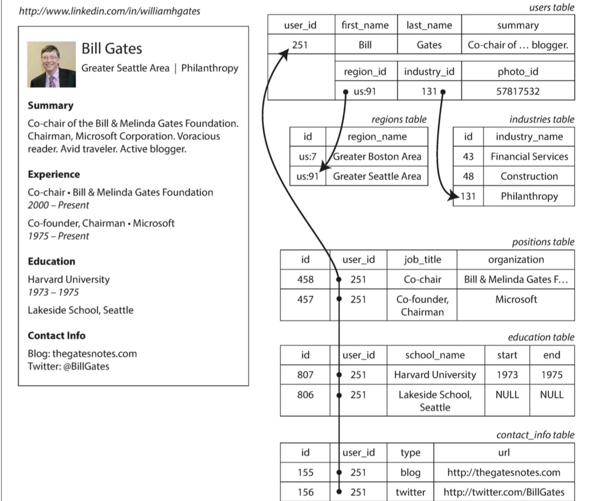

## 数据模型与查询语言

数据模型可能是软件开发中最重要的部分了，因为它们的影响如此深远：不仅仅影响着软件的编写⽅式，⽽且影响着我们的**解题思路**。

多数应⽤使⽤层层叠加的数据模型构建。对于每层数据模型的关键问题是：它是如何⽤低⼀层数据模型来表示的？例如：

- 作为一名应用开发人员，你观察现实世界（里面有人员，组织，货物，行为，资金流向，传感器等），并采用对象或数据结构，以及操控那些数据结构的API来进⾏建模。那些结构通常是特定于应⽤程序的。
- 当要存储那些数据结构时，你可以利⽤通⽤数据模型来表示它们，如JSON或XML⽂档，关系数据库中的表、或图模型。
- 数据库软件的⼯程师选定如何以内存、磁盘或⽹络上的字节来表示JSON/XML/关系/图数据。这类表示形式使数据有可能以各种⽅式来查询，搜索，操纵和处理。
- 在更低的层次上，硬件⼯程师已经想出了使⽤电流，光脉冲，磁场或者其他东⻄来表示字节的⽅法。

⼀个复杂的应⽤程序可能会有更多的中间层次，⽐如基于API的API，不过基本思想仍然是⼀样的：每个层都通过提供⼀个明确的数据模型来隐藏更低层次中的复杂性。这些抽象允许不同的⼈群有效地协作（例如数据库⼚商的⼯程师和使⽤数据库的应⽤程序开发⼈员）。

数据模型种类繁多，每个数据模型都带有如何使⽤的设想。有些⽤法很容易，有些则不⽀持如此；有些操作运⾏很快，有些则表现很差；有些数据转换⾮常⾃然，有些则很麻烦。

掌握⼀个数据模型需要花费很多精⼒（想想关系数据建模有多少本书）。即便只使⽤⼀个数据模型，不⽤操⼼其内部⼯作机制，构建软件也是⾮常困难的。然⽽，因为数据模型对上层软件的功能（能做什么，不能做什么）有着⾄深的影响，所以选择⼀个适合的数据模型是⾮常重要的。

我们将研究⼀系列⽤于数据**存储**和**查询**的通⽤数据模型（前⾯列表中的第2点）。特别地，我们将⽐较关系模型，⽂档模型和少量基于图形的数据模型。我们还将查看各种查询语⾔并⽐较它们的⽤例。在第3章中，我们将讨论存储引擎是如何⼯作的。也就是说，这些数据模型实际上是如何实现的（列表中的第3点）。

### 关系模型与文档模型

现在最著名的数据模型可能是SQL。它基于Edgar Codd在1970年提出的关系模型：数据被组织成关系（SQL中称作表），其中每个关系是**元组**（SQL中称作⾏)的⽆序集合。

关系模型曾是⼀个理论性的提议，当时很多⼈都怀疑是否能够有效实现它。然⽽到了20世纪80年代中期，关系数据库管理系统（RDBMSes）和SQL已成为⼤多数⼈们存储和查询某些常规结构的数据的⾸选⼯具。关系数据库已经持续称霸了⼤约25~30年——这对计算机史来说是极其漫⻓的时间。

关系数据库起源于商业数据处理，在20世纪60年代和70年代⽤⼤型计算机来执⾏。从今天的⻆度来看，那些⽤例显得很平常：典型的事务处理（将销售或银⾏交易，航空公司预订，库存管理信息记录在库）和批处理（客户发票，⼯资单，报告）。

当时的其他数据库迫使应⽤程序开发⼈员必须考虑数据库内部的数据表示形式。关系模型致⼒于将上述实现细节隐藏在更简洁的接⼝之后。

多年来，在数据存储和查询⽅⾯存在着许多相互竞争的⽅法。在20世纪70年代和80年代初，⽹络模型和分层模型曾是主要的选择，但关系模型随后占据了主导地位。对象数据库在20世纪80年代末和90年代初来了⼜去。XML数据库在⼆⼗⼀世纪初出现，但只有⼩众采⽤过。关系模型的每个竞争者都在其时代产⽣了⼤量的炒作，但从来没有持续

### NoSQL的诞生

现在 - 2010年代，NoSQL开始了最新⼀轮尝试，试图推翻关系模型的统治地位。“NoSQL”这个名字让⼈遗憾，因为实际上它并没有涉及到任何特定的技术。最初它只是作为⼀个醒⽬的Twitter标签，⽤在2009年⼀个关于分布式，⾮关系数据库上的开源聚会上。⽆论如何，这个术语触动了某些神经，并迅速在⽹络创业社区内外传播开来。好些有趣的数据库系统现在都与#NoSQL#标签相关联，并且NoSQL被追溯性地重新解释为不仅是SQL（**Not Only SQL**）

采⽤NoSQL数据库的背后有⼏个驱动因素，其中包括：
- 需要⽐关系数据库更好的可扩展性，包括⾮常⼤的数据集或⾮常⾼的写⼊吞吐量
- 相⽐商业数据库产品，免费和开源软件更受偏爱。
- 关系模型不能很好地⽀持⼀些特殊的查询操作
- 受挫于关系模型的限制性，渴望⼀种更具多动态性与表现⼒的数据模型

不同的应⽤程序有不同的需求，⼀个⽤例的最佳技术选择可能不同于另⼀个⽤例的最佳技术选择。因此，在可预⻅的未来，关系数据库似乎可能会继续与各种⾮关系数据库⼀起使⽤ - 这种想法有时也被称
为**混合持久化**（polyglot persistence）


### 对象关系不匹配

⽬前⼤多数应⽤程序开发都使⽤⾯向对象的编程语⾔来开发，这导致了对SQL数据模型的普遍批评：如果数据存储在关系表中，那么需要⼀个笨拙的转换层，处于应⽤程序代码中的对象和表，⾏，列的数据库模型之间。模型之间的不连贯有时被称为**阻抗不匹配**（impedance mismatch）

像ActiveRecord和Hibernate这样的**对象关系映射**（object-relational mapping, ORM）框架可以减少这个转换层所需的样板代码的数量，但是它们不能完全隐藏这两个模型之间的差异。



**使⽤关系型模式来表示领英简介**

- 传统SQL模型（SQL：1999之前）中，最常⻅的规范化表示形式是将职位，教育和联系信息放在单独的表中，对User表提供外键引⽤
- 后续的SQL标准增加了对结构化数据类型和XML数据的⽀持;这允许将多值数据存储在单⾏内，并⽀持在这些⽂档内查询和索引。这些功能在Oracle，IBM DB2，MS SQL Server和PostgreSQL中都有不同程度的⽀持。JSON数据类型也得到多个数据库的⽀持，包括IBM DB2，MySQL和PostgreSQL。
- 第三种选择是将职业，教育和联系信息编码为JSON或XML⽂档，将其存储在数据库的⽂本列中，并让应⽤程序解析其结构和内容。这种配置下，通常不能使⽤数据库来查询该编码列中的值。

对于⼀个像简历这样⾃包含⽂档的数据结构⽽⾔，JSON表示是⾮常合适的。JSON⽐XML更简单。⾯向⽂档的数据库（如MongoDB，RethinkDB，CouchDB和Espresso）⽀持这种数据模型
有⼀些开发⼈员认为JSON模型减少了应⽤程序代码和存储层之间的阻抗不匹配。不过，正如我们将在第 4章中看到的那样，JSON作为数据编码格式也存在问题.我们将在“⽂档模型中的模式灵活性”中讨论这个问题。


### 多对一 和 多对多关系

如果⽤户界⾯⽤⼀个⾃由⽂本字段来输⼊区域和⾏业，那么将他们存储为纯⽂本字符串是合理的。另⼀⽅式是给出地理区域和⾏业的标准化的列表，并让⽤户从下拉列表或⾃动填充器中进⾏选择，其优势如下：

- 各个简介之间样式和拼写统⼀
- 避免歧义（例如，如果有⼏个同名的城市）
- 易于更新——名称只存储在⼀个地⽅，如果需要更改（例如，由于政治事件⽽改变城市名称），很
- 容易进⾏全⾯更新。
- 本地化⽀持——当⽹站翻译成其他语⾔时，标准化的列表可以被本地化，使得地区和⾏业可以使⽤
- ⽤户的语⾔来显示
- 更好的搜索

存储ID还是⽂本字符串，这是个**副本**（duplication）问题。当使⽤ID时，对⼈类有意义的信息（⽐如单词：Philanthropy）只存储在⼀处，所有引⽤它的地⽅使⽤ID（ID只在数据库中有意义）。当直接存储⽂本时，对⼈类有意义的信息会复制在每处使⽤记录中。
使⽤ID的好处是，ID对⼈类没有任何意义，因⽽永远不需要改变：ID可以保持不变，即使它标识的信息发⽣变化。任何对⼈类有意义的东⻄都可能需要在将来某个时候改变——如果这些信息被复制，所有的
冗余副本都需要更新。这会导致写⼊开销，也存在**不⼀致**的⻛险（⼀些副本被更新了，还有些副本没有被更新）。去除此类重复是数据库**规范化**（normalization）的关键思想。

不幸的是，对这些数据进⾏规范化需要多对⼀的关系（许多⼈⽣活在⼀个特定的地区，许多⼈在⼀个特定的⾏业⼯作），这与⽂档模型不太吻合。在关系数据库中，通过ID来引⽤其他表中的⾏是正常的，因为连接很容易。在⽂档数据库中，⼀对多树结构没有必要⽤连接，对连接的⽀持通常很弱
如果数据库本身不⽀持连接，则必须在应⽤程序代码中通过对数据库进⾏多个查询来模拟连接。（在这种情况中，地区和⾏业的列表可能很⼩，改动很少，应⽤程序可以简单地将其保存在内存中。不过，执⾏连接的⼯作从数据库被转移到应⽤程序代码上。此外，即便应⽤程序的最初版本适合⽆连接的⽂档模型，随着功能添加到应⽤程序中，数据会变得更加互联。


### 文档数据库是否在重蹈覆辙

在多对多的关系和连接已常规⽤在关系数据库时，⽂档数据库和NoSQL重启了辩论：如何最好地在数据库中表示多对多关系。那场辩论可⽐NoSQL古⽼得多，事实上，最早可以追溯到计算机化数据库系统。
20世纪70年代最受欢迎的业务数据处理数据库是IBM的信息管理系统（IMS）的设计中使⽤了⼀个相当简单的数据模型，称为层次模型（hierarchical model），它与⽂档数据库使⽤的JSON模型有⼀些惊⼈的相似之处。它将所有数据表示为嵌套在记录中的记录树，这很像JSON结构。
同⽂档数据库⼀样，IMS能良好处理⼀对多的关系，但是很难应对**多对多**的关系，并且不⽀持连接。开发⼈员必须决定是否复制（⾮规范化）数据或⼿动解决从⼀个记录到另⼀个记录的引⽤。这些⼆⼗世纪六七⼗年代的问题与现在开发⼈员遇到的⽂档数据库问题⾮常相似。
那时⼈们提出了各种不同的解决⽅案来解决层次模型的局限性。其中最突出的两个是关系模型（relational model）（它变成了SQL，统治了世界）和⽹络模型（network model）（最初很受关注，但最终变得冷⻔）。这两个阵营之间的“⼤辩论”在70年代持续了很久时间。
那两个模式解决的问题与当前的问题相关。

#### 关系模型

关系模型做的就是将所有的数据放在光天化⽇之下：⼀个关系（表）只是⼀个元组（⾏）的集合，仅此⽽已。如果你想读取数据，它没有迷宫似的嵌套结构，也没有复杂的访问路径。你可以选中符合任意条件的⾏，读取表中的任何或所有⾏。你可以通过指定某些列作为匹配关键字来读取特定⾏。你可以在任何表中插⼊⼀个新的⾏，⽽不必担⼼与其他表的外键关系
在关系数据库中，查询优化器⾃动决定查询的哪些部分以哪个顺序执⾏，以及使⽤哪些索引。这些选择实际上是“访问路径”，但最⼤的区别在于它们是由查询优化器⾃动⽣成的，⽽不是由程序员⽣成，所以我们很少需要考虑它们。

如果想按新的⽅式查询数据，你可以声明⼀个新的索引，查询会⾃动使⽤最合适的那些索引。⽆需更改查询来利⽤新的索引。关系模型因此使添加应⽤程序新功能变得更加容易。
关系数据库的查询优化器是复杂的，已耗费了多年的研究和开发精⼒。关系模型的⼀个关键洞察是：只需构建⼀次查询优化器，随后使⽤该数据库的所有应⽤程序都可以从中受益。如果你没有查询优化器的话，那么为特定查询⼿动编写访问路径⽐编写通⽤优化器更容易——不过从⻓期看通⽤解决⽅案更好。

#### 与文档数据库相比

在⼀个⽅⾯，⽂档数据库还原为层次模型：在其⽗记录中存储嵌套记录（⼀对多关系，如positions ， education 和 contact_info ），⽽不是在单独的表中。
但是，在表示多对⼀和多对多的关系时，关系数据库和⽂档数据库并没有根本的不同：在这两种情况下，相关项⽬都被⼀个唯⼀的标识符引⽤，这个标识符在关系模型中被称为外键，在⽂档模型中称为⽂档引⽤。该标识符在读取时通过连接或后续查询来解析。迄今为⽌，⽂档数据库没有⾛CODASYL的⽼路。


#### 关系型数据库与⽂档数据库在今⽇的对⽐

将关系数据库与⽂档数据库进⾏⽐较时，可以考虑许多⽅⾯的差异，包括它们的容错属性和处理并发性。现在我们只关注数据模型中的差异。
⽀持⽂档数据模型的主要论据是**架构灵活性**，因**局部性**⽽拥有更好的性能，以及对于某些应⽤程序⽽⾔更接近于应⽤程序使⽤的数据结构。关系模型通过为连接提供更好的⽀持以及**⽀持多对⼀和多对多的关系**来反击。

#### 哪个数据模型更⽅便写代码？

如果应⽤程序中的数据具有类似⽂档的结构（即，⼀对多关系树，通常⼀次性加载整个树），那么使⽤⽂档模型可能是⼀个好主意。将类似⽂档的结构分解成多个表的关系技术可能导致繁琐的模式和不必要的复杂的应⽤程序代码。⽂档模型有⼀定的局限性：例如，不能直接引⽤⽂档中的嵌套的项⽬，⽽是需要说“⽤户251的位置列表
中的第⼆项”（很像分层模型中的访问路径）。但是，只要⽂件嵌套不太深，这通常不是问题。
⽂档数据库对连接的糟糕⽀持也许或也许不是⼀个问题，这取决于应⽤程序。例如，分析应⽤程可能永远不需要多对多多的关系，如果它使⽤⽂档数据库来记录何事发⽣于何时。但是，如果你的应⽤程序确实使⽤多对多关系，那么⽂档模型就没有那么吸引⼈了。通过反规范化可以减少对连接的需求，但是应⽤程序代码需要做额外的⼯作来保持数据的⼀致性。通过向数据库发出多个请求，可以在应⽤程序代码中模拟连接，但是这也将复杂性转移到应⽤程序中，并且通常⽐由数据库内的专⽤代码执⾏的连接慢。在这种情况下，使⽤⽂档模型会导致更复杂的应⽤程序代码和更差的性能很难说在⼀般情况下哪个数据模型让应⽤程序代码更简单；它取决于数据项之间存在的关系种类。对于⾼度相联的数据，选⽤⽂档模型是糟糕的，选⽤关系模型是可接受的，⽽选⽤图形模型（参⻅“图数据模型”）是最⾃然的。

#### ⽂档模型中的架构灵活性

⼤多数⽂档数据库以及关系数据库中的JSON⽀持都不会强制⽂档中的数据采⽤何种模式。关系数据库的XML⽀持通常带有可选的模式验证。没有模式意味着可以将任意的键和值添加到⽂档中，并且当读取时，客户端对⽆法保证⽂档可能包含的字段。

⽂档数据库有时称为**⽆模式**（schemaless），但这具有误导性，因为读取数据的代码通常假定某种结构——即存在隐式模式，但不由数据库强制执⾏。⼀个更精确的术语是**读时模式**（schema-onread）（数据的结构是隐含的，只有在数据被读取时才被解释），相应的是**写时模式**（schema-onwrite）（传统的关系数据库⽅法中，模式明确，且数据库确保所有的数据都符合其模式）。

读时模式类似于编程语⾔中的动态（运⾏时）类型检查，⽽写时模式类似于静态（编译时）类型检查。就像静态和动态类型检查的相对优点具有很⼤的争议性⼀样，数据库中模式的强制性是⼀个具有争议的话题，⼀般来说没有正确或错误的答案。

在应⽤程序想要改变其数据格式的情况下，这些⽅法之间的区别尤其明显。例如，假设你把每个⽤户的全名存储在⼀个字段中，⽽现在想分别存储名字和姓⽒。在⽂档数据库中，只需开始写⼊具有新字段的新⽂档，并在应⽤程序中使⽤代码来处理读取旧⽂档的情况，例如：

```
if (user && user.name && !user.first_name) {
    // Documents written before Dec 8, 2013 don't have first_name
    user.first_name = user.name.split(" ")[0];
}

```

另⼀⽅⾯，在“静态类型”数据库模式中，通常会执⾏以下迁移（migration）操作：

```
ALTER TABLE users ADD COLUMN first_name text;
UPDATE users SET first_name = split_part(name, ' ', 1); -- PostgreSQL
UPDATE users SET first_name = substring_index(name, ' ', 1); -- MySQL

```
模式变更的速度很慢，⽽且要求停运。它的这种坏名誉并不是完全应得的：⼤多数关系数据库系统可在⼏毫秒内执⾏ ALTER TABLE 语句。MySQL是⼀个值得注意的例外，它执⾏ ALTER TABLE 时会复制整个
表，这可能意味着在更改⼀个⼤型表时会花费⼏分钟甚⾄⼏个⼩时的停机时间，尽管存在各种⼯具来解决这个限制。⼤型表上运⾏ UPDATE 语句在任何数据库上都可能会很慢，因为每⼀⾏都需要重写。要是不可接受的话，应⽤程序可以将 first_name 设置为默认值 NULL ，并在读取时再填充，就像使⽤⽂档数据库⼀样。
当由于某种原因（例如，数据是异构的）集合中的项⽬并不都具有相同的结构时,读时模式更具优势。例如，如果：
- 存在许多不同类型的对象，将每种类型的对象放在⾃⼰的表中是不现实的。
- 数据的结构由外部系统决定。你⽆法控制外部系统且它随时可能变化。
在上述情况下，模式的坏处远⼤于它的帮助，⽆模式⽂档可能是⼀个更加⾃然的数据模型。但是，要是所有记录都具有相同的结构，那么模式是记录并强制这种结构的有效机制。

**查询的数据局部性**

⽂档通常以单个连续字符串形式进⾏存储，编码为JSON，XML或其⼆进制变体（如MongoDB的BSON）。如果应⽤程序经常需要访问整个⽂档（例如，将其渲染⾄⽹⻚），那么存储局部性会带来性
能优势。如果将数据分割到多个表中，则需要进⾏多次索引查找才能将其全部检索出来，这可能需要更多的磁盘查找并花费更多的时间。
局部性仅仅适⽤于同时需要⽂档绝⼤部分内容的情况。数据库通常需要加载整个⽂档，即使只访问其中的⼀⼩部分，这对于⼤型⽂档来说是很浪费的。更新⽂档时，通常需要整个重写。只有不改变⽂档⼤⼩的修改才可以容易地原地执⾏。因此，通常建议保持相对⼩的⽂档，并避免增加⽂档⼤⼩的写⼊这些性能限制⼤⼤减少了⽂档数据库的实⽤场景。
值得指出的是，为了局部性⽽分组集合相关数据的想法并不局限于⽂档模型。例如，Google的Spanner数据库在关系数据模型中提供了同样的局部性属性，允许模式声明⼀个表的⾏应该交错（嵌套）在⽗表
内。Oracle类似地允许使⽤⼀个称为多表索引集群表（multi-table index cluster tables）的类似特性。Bigtable数据模型（⽤于Cassandra和HBase）中的列族（column-family）概念与
管理局部性的⽬的类似。

**文档与关系数据库的融合**

⾃2000年代中期以来，⼤多数关系数据库系统（MySQL除外）都已⽀持XML。这包括对XML⽂档进⾏本地修改的功能，以及在XML⽂档中进⾏索引和查询的功能。这允许应⽤程序使⽤那种与⽂档数据库应
当使⽤的⾮常类似的数据模型。从9.3版本开始的PostgreSQL 【8】，从5.7版本开始的MySQL以及从版本10.5开始的IBM DB2 [30]也对JSON⽂档提供了类似的⽀持级别。鉴于⽤在Web APIs的JSON流⾏趋势，其他关系数据库很可能会跟随他们的脚步并添加JSON⽀持。
在⽂档数据库中，RethinkDB在其查询语⾔中⽀持类似关系的连接，⼀些MongoDB驱动程序可以⾃动解析数据库引⽤（有效地执⾏客户端连接，尽管这可能⽐在数据库中执⾏的连接慢，需要额外的⽹络往返，并且优化更少）。
随着时间的推移，关系数据库和⽂档数据库似乎变得越来越相似，这是⼀件好事：数据模型相互补充，如果⼀个数据库能够处理类似⽂档的数据，并能够对其执⾏关系查询，那么应⽤程序就可以使⽤最符合其需求的功能组合。

关系模型和⽂档模型的混合是未来数据库⼀条很好的路线。

### 数据查询语言

当引⼊关系模型时，关系模型包含了⼀种查询数据的新⽅法：SQL是⼀种声明式查询语⾔，⽽IMS和CODASYL使⽤命令式代码来查询数据库。那是什么意思？
许多常⽤的编程语⾔是命令式的。例如，给定⼀个动物物种的列表，返回列表中的鲨⻥可以这样写：
```
function getSharks() {
    var sharks = [];
    for (var i = 0; i < animals.length; i++) {
        if (animals[i].family === "Sharks") {
           sharks.push(animals[i]);
        }
     }
    return sharks;
}
```

而声明式语言，例如Sql:
```
SELECT * FROM animals WHERE family ='Sharks';
```
你只需指定所需数据的模式 - 结果必须符合哪些条件，以及如何将数据转换（例如，排序，分组和集合） - 但不是如何实现这⼀⽬标。数据库系统的查询优化器决定使⽤哪些索引和哪些连接⽅法，以及以何种顺序执⾏查询的各个部分。

声明式查询语⾔是迷⼈的，因为它通常⽐命令式API更加简洁和容易。但更重要的是，它还隐藏了数据库引擎的实现细节，这使得数据库系统可以在⽆需对查询做任何更改的情况下进⾏性能提升。
例如，在本节开头所示的命令代码中，动物列表以特定顺序出现。如果数据库想要在后台回收未使⽤的磁盘空间，则可能需要移动记录，这会改变动物出现的顺序。数据库能否安全地执⾏，⽽不会中断查询？
SQL示例不确保任何特定的顺序，因此不在意顺序是否改变。但是如果查询⽤命令式的代码来写的话，那么数据库就永远不可能确定代码是否依赖于排序。SQL相当有限的功能性为数据库提供了更多⾃动优化的空间。
最后，声明式语⾔往往适合并⾏执⾏。现在，CPU的速度通过内核的增加变得更快，⽽不是以⽐以前更⾼的时钟速度运⾏。命令代码很难在多个内核和多个机器之间并⾏化，因为它指定了指令必须以特定顺序执⾏。声明式语⾔更具有并⾏执⾏的潜⼒，因为它们仅指定结果的模式，⽽不指定⽤于确定结果的算法。在适当情况下，数据库可以⾃由使⽤查询语⾔的并⾏实现。

#### Web上的声明式查询

声明式查询语⾔的优势不仅限于数据库。为了说明这⼀点，让我们在⼀个完全不同的环境中⽐较声明式和命令式⽅法：⼀个Web浏览器。
假设你有⼀个关于海洋动物的⽹站。⽤户当前正在查看鲨⻥⻚⾯，因此你将当前所选的导航项⽬“鲨 ⻥”标记为当前选中项⽬。
```
<ul>
    <li class="selected">
        <p>Sharks</p>
        <ul>
            <li>Great White Shark</li>
            <li>Tiger Shark</li>
            <li>Hammerhead Shark</li>
        </ul>
    </li>
    <li>
        <p>Whales</p>
        <ul>
            <li>Blue Whale</li>
            <li>Humpback Whale</li>
            <li>Fin Whale</li>
        </ul>
    </li>
</ul>
```
使⽤CSS实现起来⾮常简单：
```
li.selected > p {
    background-color: blue;
}
```

想象⼀下，必须使⽤命令式⽅法的情况会是如何。在Javascript中，使⽤⽂档对象模型（DOM）API，其结果可能如下所示：

```
var liElements = document.getElementsByTagName("li");
for (var i = 0; i < liElements.length; i++) {
    if (liElements[i].className === "selected") {
        var children = liElements[i].childNodes;
        for (var j = 0; j < children.length; j++) {
            var child = children[j];
            if (child.nodeType === Node.ELEMENT_NODE && child.tagName === "P") {
                child.setAttribute("style", "background-color: blue");
            }
        }
    }
}
```
这段JavaScript代码命令式地将元素设置为蓝⾊背景，但是代码看起来很糟糕。不仅⽐CSS和XSL等价物更⻓，更难理解，⽽且还有⼀些严重的问题：

- 如果选定的类被移除（例如，因为⽤户点击了不同的⻚⾯），即使代码重新运⾏，蓝⾊背景也不会被移除 - 因此该项⽬将保持突出显示，直到整个⻚⾯被重新加载。使⽤CSS，浏览器会⾃动检测 li.selected> p 规则何时不再适⽤，并在选定的类被移除后⽴即移除蓝⾊背景。
- 如果你想要利⽤新的API（例如 document.getElementsBy ClassName（“selected” ）甚⾄document.evaluate() ）来提⾼性能，则必须重写代码。另⼀⽅⾯，浏览器供应商可以在不破坏兼容性的情况下提⾼CSS和XPath的性能

#### MapReduce查询

MapReduce是⼀个由Google推⼴的编程模型，⽤于在多台机器上批量处理⼤规模的数据。⼀些NoSQL数据存储（包括MongoDB和CouchDB）⽀持有限形式的MapReduce，作为在多个⽂档中执⾏只读查询的机制。

MapReduce既不是⼀个声明式的查询语⾔，也不是⼀个完全命令式的查询API，⽽是处于两者之间：查询的逻辑⽤代码⽚断来表示，这些代码⽚段会被处理框架重复性调⽤它基于 map （也称为 collect ）和 reduce （也称为 fold 或 inject ）函数，两个函数存在于许多函数式编程语⾔中。

最好举例来解释MapReduce模型。假设你是⼀名海洋⽣物学家，每当你看到海洋中的动物时，你都会在数据库中添加⼀条观察记录。现在你想⽣成⼀个报告，说明你每⽉看到多少鲨⻥。在PostgreSQL中，你可以像这样表述这个查询：

```
SELECT date_trunc('month', observation_timestamp) AS observation_month, sum(num_animals) AS total_animals
FROM observations
WHERE family = 'Sharks'
GROUP BY observation_month;

```

同样的查询⽤MongoDB的MapReduce功能可以按如下来表述：

```
db.observations.mapReduce(function map() {
        var year = this.observationTimestamp.getFullYear();
        var month = this.observationTimestamp.getMonth() + 1;
        emit(year + "-" + month, this.numAnimals);
    }, function reduce(key, values) {
        return Array.sum(values);
    },
     {
        query: {
            family: "Sharks"
         },
        out: "monthlySharkReport"
    });

```

- 可以声明式地指定只考虑鲨⻥种类的过滤器（这是⼀个针对MapReduce的特定于MongoDB的扩展）。
- 每个匹配查询的⽂档都会调⽤⼀次JavaScript函数 map ，将 this 设置为⽂档对象。
- map 函数发出⼀个键（包括年份和⽉份的字符串，如 "2013-12" 或 "2014-1" ）和⼀个值（该观察记录中的动物数量）。
- map 发出的键值对按键来分组。对于具有相同键（即，相同的⽉份和年份）的所有键值对，调⽤⼀次 reduce 函数。
- reduce 函数将特定⽉份内所有观测记录中的动物数量相加。
- 将最终的输出写⼊到 monthlySharkReport 集合中。

例如，假设 observations 集合包含这两个⽂档：

```
{
    observationTimestamp: Date.parse( "Mon, 25 Dec 1995 12:34:56 GMT"),
    family: "Sharks",
    species: "Carcharodon carcharias",
    numAnimals: 3
}
{
    observationTimestamp: Date.parse("Tue, 12 Dec 1995 16:17:18 GMT"),
    family: "Sharks",
    species: "Carcharias taurus",
    numAnimals: 4
}

```

对每个⽂档都会调⽤⼀次 map 函数，结果将是 emit("1995-12",3) 和 emit("1995-12",4) 。随后，以 reduce("1995-12",[3,4]) 调⽤ reduce 函数，将返回 7 。
map和reduce函数在功能上有所限制：它们必须是纯函数，这意味着它们只使⽤传递给它们的数据作为输⼊，它们不能执⾏额外的数据库查询，也不能有任何副作⽤。这些限制允许数据库以任何顺序运⾏任何功能，并在失败时重新运⾏它们。然⽽，map和reduce函数仍然是强⼤的：它们可以解析字符串，调⽤库函数，执⾏计算等等。

MapReduce是⼀个相当底层的编程模型，⽤于计算机集群上的分布式执⾏。像SQL这样的更⾼级的查询语⾔可以⽤⼀系列的MapReduce操作来实现，但是也有很多不使⽤MapReduce的分布式SQL实现。请注意，SQL中没有任何内容限制它在单个机器上运⾏，⽽MapReduce在分布式查询执⾏上没有垄断权。

能够在查询中使⽤JavaScript代码是⾼级查询的⼀个重要特性，但这不限于MapReduce，⼀些SQL数据库也可以⽤JavaScript函数进⾏扩展

MapReduce的⼀个可⽤性问题是，必须编写两个密切合作的JavaScript函数，这通常⽐编写单个查询更困难。此外，声明式查询语⾔为查询优化器提供了更多机会来提⾼查询的性能。基于这些原因，
MongoDB 2.2添加了⼀种叫做聚合管道的声明式查询语⾔的⽀持。⽤这种语⾔表述鲨⻥计数查询如下所示：
```
db.observations.aggregate([
 { $match: { family: "Sharks" } },
 { $group: {
_id: {
year: { $year: "$observationTimestamp" },
month: { $month: "$observationTimestamp" }
 },
totalAnimals: { $sum: "$numAnimals" } }}
]);

```

聚合管道语⾔与SQL的⼦集具有类似表现⼒，但是它使⽤基于JSON的语法⽽不是SQL的英语句⼦式语法;这种差异也许是⼝味问题。


### 图数据模型

如我们之前所⻅，多对多关系是不同数据模型之间具有区别性的重要特征。如果你的应⽤程序⼤多数的关系是⼀对多关系（树状结构化数据），或者⼤多数记录之间不存在关系，那么使⽤⽂档模型是合适的。

但是，要是多对多关系在你的数据中很常⻅呢？关系模型可以处理多对多关系的简单情况，但是随着数据之间的连接变得更加复杂，将数据建模为图形显得更加⾃然。

⼀个图由两种对象组成：顶点（vertices）（也称为节点（nodes） 或实体（entities）），和边 （edges）（ 也称为关系（relationships）或弧 （arcs） ）。多种数据可以被建模为⼀个图形。典型
的例⼦包括：

**社交图谱** 顶点是⼈，边指示哪些⼈彼此认识。
**⽹络图谱** 顶点是⽹⻚，边缘表示指向其他⻚⾯的HTML链接。
**公路或铁路⽹络** 顶点是交叉路⼝，边线代表它们之间的道路或铁路线。


可以将那些众所周知的算法运⽤到这些图上：例如，汽⻋导航系统搜索道路⽹络中两点之间的最短路径，PageRank可以⽤在⽹络图上来确定⽹⻚的流⾏程度，从⽽确定该⽹⻚在搜索结果中的排名。

#### 属性图

在属性图模型中，每个顶点（vertex）包括：
- 唯⼀的标识符
- ⼀组出边（outgoing edges）
- ⼀组⼊边（ingoing edges）
- ⼀组属性（键值对）
每条边（edge）包括：
- 唯⼀标识符
- 边的起点/尾部顶点（tail vertex）
- 边的终点/头部顶点（head vertex）
- 描述两个顶点之间关系类型的标签
- ⼀组属性（键值对）
可以将图存储看作由两个关系表组成：⼀个存储顶点，另⼀个存储边。头部和尾部顶点⽤来存储每条边；如果你想要⼀组顶点的输⼊或输出边，你可以分别通过 head_vertex 或 tail_vertex 来查询 edges 表。

使⽤关系模式来表示属性图

```
CREATE TABLE vertices (
 vertex_id INTEGER PRIMARY KEY,
 properties JSON
);
CREATE TABLE edges (
 edge_id INTEGER PRIMARY KEY,
 tail_vertex INTEGER REFERENCES vertices (vertex_id),
 head_vertex INTEGER REFERENCES vertices (vertex_id),
 label TEXT,
 properties JSON
);
CREATE INDEX edges_tails ON edges (tail_vertex);
CREATE INDEX edges_heads ON edges (head_vertex);

```

关于这个模型的⼀些重要⽅⾯是：

1. 任何顶点都可以有⼀条边连接到任何其他顶点。没有模式限制哪种事物可不可以关联。
2. 给定任何顶点，可以⾼效地找到它的⼊边和出边，从⽽遍历图，即沿着⼀系列顶点的路径前后移
动。（这就是为什么例2-2在 tail_vertex 和 head_vertex 列上都有索引的原因。）
3. 通过对不同类型的关系使⽤不同的标签，可以在⼀个图中存储⼏种不同的信息，同时仍然保持⼀个
清晰的数据模型。

在关系数据库中表示图数据。但是，如果把图数据放⼊关系结构中，我们是否也可以使⽤SQL查询它？

答案是肯定的，但有些困难。

在SQL中使⽤递归公⽤表表达式表示：

```
WITH RECURSIVE
 -- in_usa 包含所有的美国境内的位置ID
 in_usa(vertex_id) AS (
 SELECT vertex_id FROM vertices WHERE properties ->> 'name' = 'United States'
 UNION
 SELECT edges.tail_vertex FROM edges
 JOIN in_usa ON edges.head_vertex = in_usa.vertex_id
 WHERE edges.label = 'within'
 ),
 -- in_europe 包含所有的欧洲境内的位置ID
 in_europe(vertex_id) AS (
 SELECT vertex_id FROM vertices WHERE properties ->> 'name' = 'Europe'
 UNION
 SELECT edges.tail_vertex FROM edges
 JOIN in_europe ON edges.head_vertex = in_europe.vertex_id
 WHERE edges.label = 'within' ),
 -- born_in_usa 包含了所有类型为Person，且出⽣在美国的顶点
 born_in_usa(vertex_id) AS (
 SELECT edges.tail_vertex FROM edges
 JOIN in_usa ON edges.head_vertex = in_usa.vertex_id
 WHERE edges.label = 'born_in' ),
 -- lives_in_europe 包含了所有类型为Person，且居住在欧洲的顶点。
 lives_in_europe(vertex_id) AS (
 SELECT edges.tail_vertex FROM edges
 JOIN in_europe ON edges.head_vertex = in_europe.vertex_id
 WHERE edges.label = 'lives_in')
 SELECT vertices.properties ->> 'name'
 FROM vertices
 JOIN born_in_usa ON vertices.vertex_id = born_in_usa.vertex_id
 JOIN lives_in_europe ON vertices.vertex_id = lives_in_europe.vertex_id;

```
- ⾸先，查找 name 属性为 United States 的顶点，将其作为 in_use 顶点的集合的第⼀个元素。
- 从 in_use 集合的顶点出发，沿着所有的 with_in ⼊边，将其尾顶点加⼊同⼀集合，不断递归直到所有 with_in ⼊边都被访问完毕。
- 同理，从 name 属性为 Europe 的顶点出发，建⽴ in_europe 顶点的集合。
- 对于 in_usa 集合中的每个顶点，根据 born_in ⼊边来查找出⽣在美国某个地⽅的⼈。
- 同样，对于 in_europe 集合中的每个顶点，根据 lives_in ⼊边来查找居住在欧洲的⼈。
- 最后，把在美国出⽣的⼈的集合与在欧洲居住的⼈的集合相交。

同⼀个查询，⽤某⼀个查询语⾔（针对图数据库的查询语言比如 Cypher是属性图的声明式查询语⾔，为Neo4j图形数据库⽽发明 ）可以写成4⾏，⽽⽤另⼀个查询语⾔需要29⾏，这恰恰说明了不同的数
据模型是为不同的应⽤场景⽽设计的。选择适合应⽤程序的数据模型⾮常重要。


#### 三元组存储和SPARQL

三元组存储模式⼤体上与属性图模型相同，⽤不同的词来描述相同的想法。


在历史上，数据最开始被表示为⼀棵⼤树（层次数据模型），但是这不利于表示多对多的关系，所以发明了关系模型来解决这个问题。最近，开发⼈员发现⼀些应⽤程序也不适合采⽤关系模型。新的⾮关系
型“NoSQL”数据存储在两个主要⽅向上存在分歧：

- **⽂档数据库**的应⽤场景是：数据通常是⾃我包含的，⽽且⽂档之间的关系⾮常稀少。
- 图形数据库⽤于相反的场景：任意事物都可能与任何事物相关联。

这三种模型（⽂档，关系和图形）在今天都被⼴泛使⽤，并且在各⾃的领域都发挥很好。⼀个模型可以⽤另⼀个模型来模拟 — 例如，图数据可以在关系数据库中表示 — 但结果往往是糟糕的。这就是为什么
我们有着针对不同⽬的的不同系统，⽽不是⼀个单⼀的万能解决⽅案。

⽂档数据库和图数据库有⼀个共同点，那就是它们通常不会为存储的数据强制⼀个模式，这可以使应⽤程序更容易适应不断变化的需求。但是应⽤程序很可能仍会假定数据具有⼀定的结构；这只是模式是明
确的（写⼊时强制）还是隐含的（读取时处理）的问题。

每个数据模型都具有各⾃的查询语⾔或框架，我们讨论了⼏个例⼦：SQL，MapReduce，MongoDB的聚合管道，Cypher。我们也谈到了CSS和XSL/XPath，它们不是数据库查询语⾔，⽽包含有趣的相似之处。

虽然我们已经覆盖了很多层⾯，但仍然有许多数据模型没有提到。举⼏个简单的例⼦：

- 使⽤基因组数据的研究⼈员通常需要执⾏序列相似性搜索，这意味着需要⼀个很⻓的字符串（代表⼀个DNA分⼦），并在⼀个拥有类似但不完全相同的字符串的⼤型数据库中寻找匹配。这⾥所描述的数据库都不能处理这种⽤法，这就是为什么研究⼈员编写了像GenBank这样的专⻔的基因组数据库软件的原因。
- 粒⼦物理学家数⼗年来⼀直在进⾏⼤数据类型的⼤规模数据分析，像⼤型强⼦对撞机（LHC）这样的项⽬现在可以⼯作在数百亿兆字节的范围内！在这样的规模下，需要定制解决⽅案来阻住硬件成本的失控。
- 全⽂搜索可以说是⼀种经常与数据库⼀起使⽤的数据模型。信息检索是⼀个很⼤的专业课题
