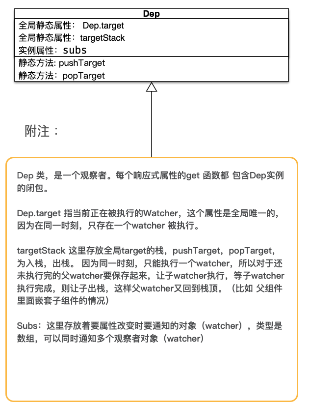
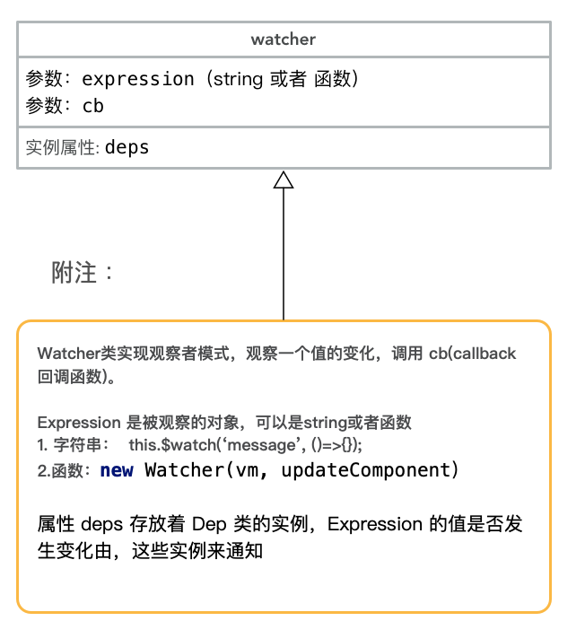
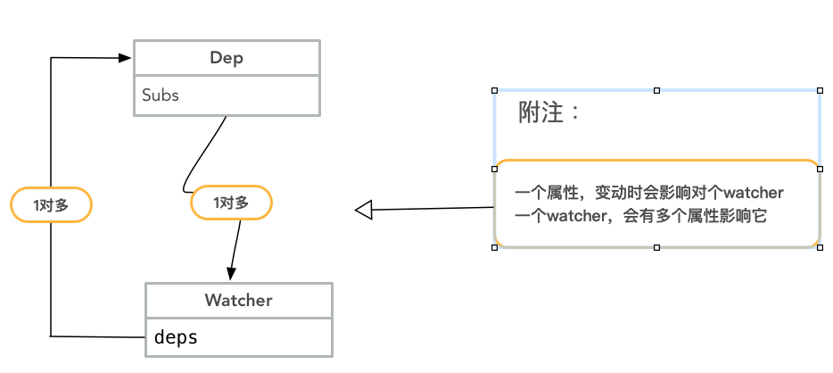
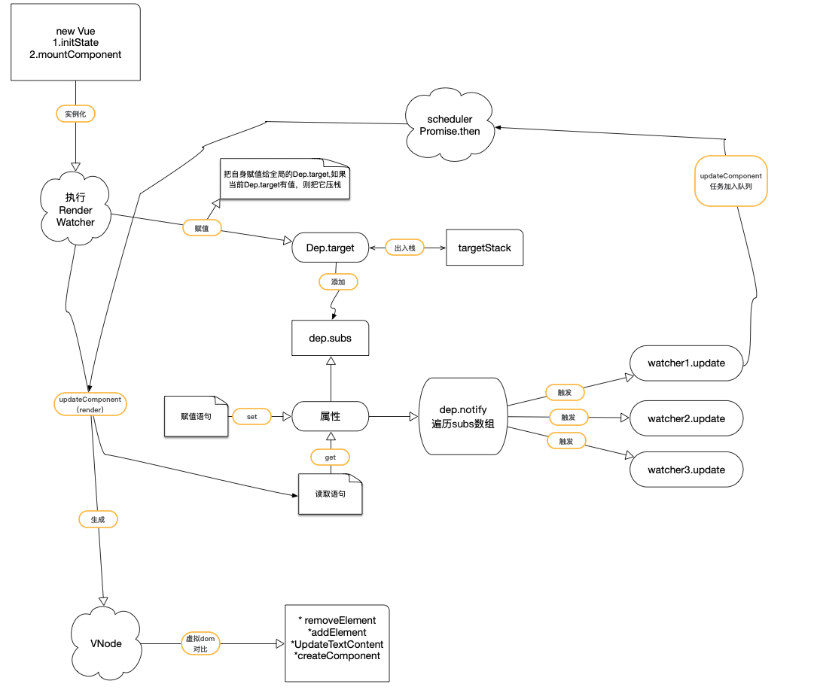

## Vue 是什么
用于构建响应式的组件化系统的js 框架

## 响应式
观察者模式： wathcer
发布订阅模式： get 订阅，set 发布

## 核心步骤
```
new Vue({
    data(){
        return {
            message: 'hello world'
        }
    },
    render(h){
        return h('div', {},[
            h('span', {
                on:{
                    click:()=>{
                        this.message = "start update 循环"
                    }
                }
            }, this.message)
            h('child_component',{
                props:{
                    word: this.message
                }
            },[])
        ])
    }
})
```
- 挂载 Vue.prototype 相关方法, _update, $watch, 等
- 完成中，开始创意一个新的实例
- 初始化私有属性， 如： _wather ,_envents, $createElement 等
- callHook(vm, 'beforeCreate')
- 初始化props， data 使其变成响应式属性 （get set 访问器）
- callHook(vm, 'created')
- 执行$mount 方法
  - 执行 mountComponent 方法
  - callHook(vm, 'beforeMount')
  - 创建 wather 对象，并赋值给  vm._wather ， 次watcher 为renderWathcer
  - Wather对象 源码 https://github.com/vuejs/vue/blob/dev/src/core/observer/watcher.js
  - wather 构造函数会立即执行，其getter 方法，该方法会把 自己(wather 对象) 赋值给全局的 Dep.target 对象， 并压入target 栈中。然后开始执行
  需要观察的 updateComponent 函数
  ```
    updateComponent = () => {
      vm._update(vm._render(), hydrating)
    }
    
  ```
  - vm._render 函数立即执行 
    - 执行过程中凡是访问响应式属性(执行属性的get方法) 该属性set使就会触发 上一步骤 赋值给全局的 wather对象的更新。
    - (提问：render方法中设置响应式属性的值吗）
    - （回答：可能会造成无限循环）
    - 如上: render 方法, 生成一颗vnode 树
    - (提问：如果一个响应性属性，没有出现在render函数中，比如在mounted 方法里 访问了这个属性，那么组件会执行update 循环吗?)
    - （回答：不会，因为在代码hook钩子或者method方法里，全局的Dep.target 总是为空， 即不会进行依赖收集）
    - render 方法执行完成时，getter 把上一步骤的 全局target wather对象出栈。关闭依赖搜集
    -（提问：此时会执行 child_component的render方法吗？）
    - (回答: 不会，此时不会去实例化组件，只会生成一个tag： `vue-component-${Ctor.cid}${name ? `-${name}` : ''}`,并保存相关的options，和构造函数)
  - vm._update 函数会拿着 新生成的vnode 树 与 vm_oldVnode ，调用 __patch__ 方法
  - __patch__ 会复制 realElement 或 实例化 VNode： callHook(vm, 'mounted')
- 点击span 标签，触发器click 事件
- 由于第一次执行render 时，已设定 如： 执行属性的set 操作，则立马会执行 wather 对象的 update 方法
- wather 的 update 方法， 把自己入队： queueWatcher（this）. 
- (提问: this.message = 'x';this.message = 'xx'; 两次执行set 会引起两次update 循环码 )
- (回答，确实会执行两次 queueWatcher（this）， 不过在该方法在内部通过id 去重，保证了一个eventloop 周期内一个watcher 只会入队一次)
- scheduler 总会在necktick 时，清空 queue，执行 wather 的run方法。 此时，会再次执行 render 方法。再次进行依赖收集
- (提问：wtf  不是刚才收集过么，再次收集不是重复了吗？)
- (回答：去重机制。 如果有新的响应式属于加入呢。  那被第二次从render函数中被移除的响应式属性，set 执行时还会 触发wather的update 吗？ 不会的，依赖更新机制)
- 组件更新原理
  - 每次父组件更新 都会触发 prePatch 方法，该方法中会执行 updateChildComponent 方法
  - （提问：wtf， 不是说只有react 才这么傻乎乎的更新整个子树么，这是干嘛呢）
  - （回答： 这里的updateChildComponent 只是给 子组件的更新数据，如果没必须更新是不会执行子组件的 render 方法的。 ）
  - （提问：只更新数据就行了？）
  - （回答，子组件的props 属性也是响应式的）
  - （https://github.com/vuejs/vue/blob/dev/src/core/instance/lifecycle.js）
  - (注意，　如果父组件给子组件　传了slot 那么子组件会执行强制更新　forceUpdate )
- 组件的消亡

## 类图,流程图







## 文档中需要留意的点
- 组件的生命周期
- 组件间通信
- data 必须是个函数
- Object.freeze()
- 计算属性的实现
- key 就地复用
- 对象的 v-for
- removeEventListner 的必要性
- slot编译作用域：父级模板里的所有内容都是在父级作用域中编译的；子模板里的所有内容都是在子作用域中编译的。
- provide 和 inject 依赖注入
- v-once 尽量别用
## 计算属性的实现
1. 为每个属性创建一个 watcher 对象, 
2. 本身挂载到 vm 上
3. 计算属性 缓存特性
4. 计算属性是如何影响 视图的？
5. https://github.com/vuejs/vue/blob/dev/src/core/instance/state.js

## todo
-  模板表达式都被放在沙盒中，只能访问全局变量的一个白名单，如 Math 和 Date 。你不应该在模板表达式中试图访问用户定义的全局变量。
