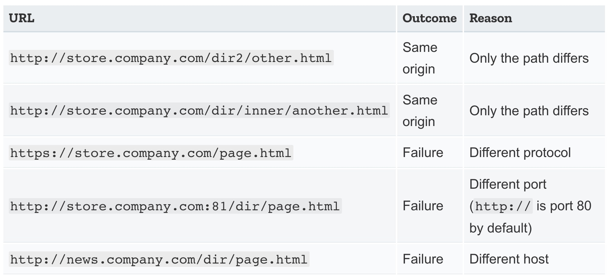
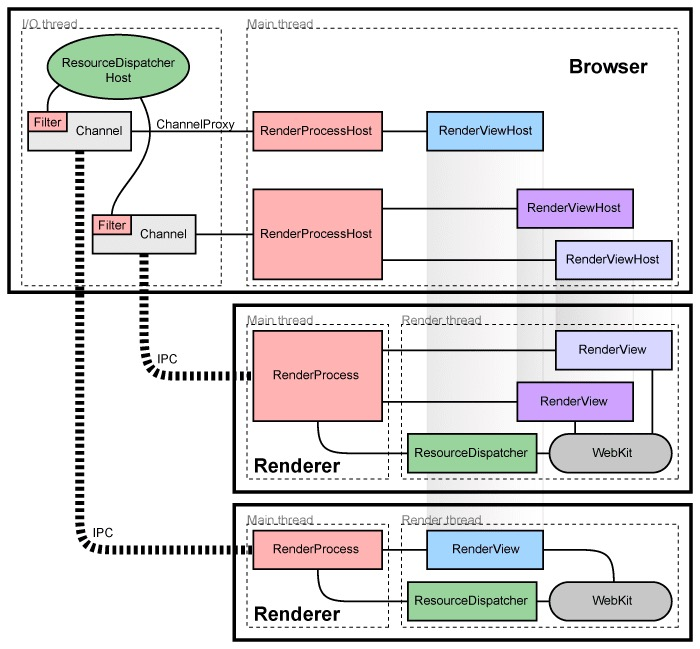

## 浏览器安全

浏览器作为互联网用户接入互联网最主要的用户代理，其本身的安全性对 Web 安全来说至关重要。Web 安全问题以及安全攻击，不管攻击的来源是否来自哪里，绝大部分最终攻击生效的环节都是在浏览器上实现的。   

比如，用户点击邮件钓鱼链接打开到浏览器完成了后续“钓鱼”过程。一个存储型 xss 攻击，最终也必须是用户通过浏览器查看了对应的网页才能最终实施攻击。   

随着，浏览器不断发展各个浏览器之间也存在这个竞争，安全也成为其重要的技术竞争力之一。故而，现代浏览器都具备了一些基本而有效的安全策略和安全功能。

### 1.同源策略

两个 URL 如果是同源必须是：协议、端口、host。   

比如：http://store.company.com/dir/page.html 一下列表中同源策略的对比结果：

#### 脚本执行的环境决定源

比如，a.com 网站通过 ``. Error details for syntax errors are only available for same-origin scripts.
+ CSS applied with `<link rel="stylesheet" href="…">`. Due to the relaxed syntax rules of CSS, cross-origin CSS requires a correct Content-Type header. Restrictions vary by browser: IE, Firefox, Chrome, Safari (scroll down to CVE-2010-0051) and Opera.
+ Images displayed by ``.
Media played by `<video>` and `<audio>`.
+ Plugins embedded with `<object>`, `<embed>`, and `<applet>`.
+ Fonts applied with @font-face. Some browsers allow cross-origin fonts, others require same-origin.
+ Anything embedded by `<frame>` and `<iframe>`. Sites can use the X-Frame-Options header to prevent cross-origin framing.

#### Cross-Origin Resource Sharing (CORS)

跨域资源共享。浏览器的同源策略，对DOM、XMLHTTPRequest(ajax)、Cookie以及浏览器的一些常见插件(Flash, Google Gears)等都有效。

那么，如果有需求想跨站提供接口服务，怎么办呢？

除了我们常用的 Jsonp 那么最早呢其实浏览器提供了这种标准 —— CORS。

在 XMLHTTPRequest 或者 Fetch Api 请求目标域时，由目标域通过设置 Access-Control-Allow-Origin 来控制请求方是否可以请求数据。

控制跨域的其他头部字段：
> Access-Control-Allow-Methods
> Access-Control-Allow-Headers
> Access-Control-Max-Age

CORS 安全的前提是客户端脚本控制请求头 HTTP_ORIGIN，如果某些特殊情况下这个前提被打破这将是一个严重的安全漏洞。

### 2.浏览器沙箱

让网页内容运行在一个资源隔离的沙箱中，在网页内部Js脚本可以随意执行，但是网页代码要想与浏览器内核、操作系统通信都必须通过 IPC Channel，浏览器会在这里进行严格的安全检查。

同时现代浏览器基本都实现了多进程框架，比如 Chrome 和 IE 每一个 tab 页对应一个进程。每个进程都被装在一个沙箱中。

Chrome 多进程架构

### 3.恶意网址拦截

浏览器通过建立模型进行分析识别一些恶意网址，挂马、钓鱼建立一个黑名单，然后基于这个黑名单给用户在访问前进行提示。

包括现在浏览器在打开 http 协议网址时都会有不安全的提示。

### Refs
+ https://en.wikipedia.org/wiki/User_agent
+ https://www.w3.org/WAI/UA/work/wiki/Definition_of_User_Agent
+ https://deviceatlas.com/blog/list-of-user-agent-strings#bots
+ https://developer.mozilla.org/en-US/docs/Web/Security/Same-origin_policy
+ https://developer.mozilla.org/en-US/docs/Web/HTTP/CORS
+ https://www.ibm.com/developerworks/cn/education/web/wa-googlegears/index.html
+ https://developer.mozilla.org/zh-CN/docs/Web/HTTP/Server-Side_Access_Control
+ http://www.chromium.org/developers/design-documents/multi-process-architecture