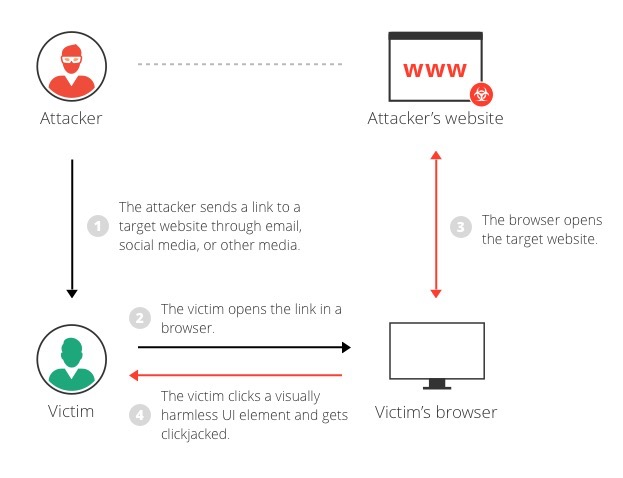
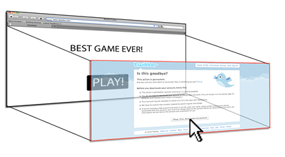
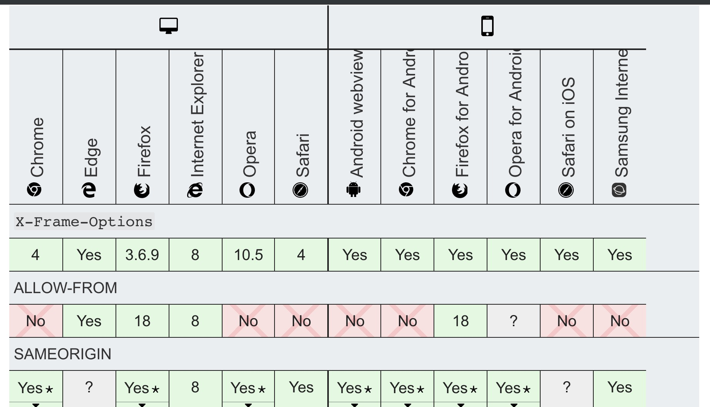
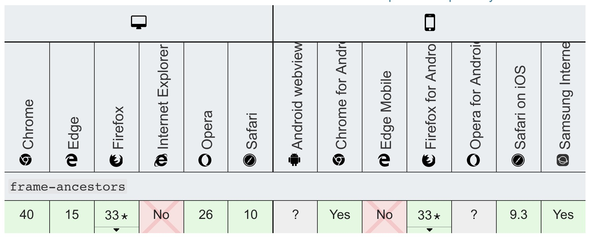

## 点击劫持(ClickJacking)

### 1. 简介

点击劫持性对好理解。攻击者通过在一个恶意网站上覆盖一层透明的 iframe 来加载目标网站。然后，在恶意网站上显示按钮，输入框或者以游戏的形式引导用户点击操作透明目标网站上相同位置“真实”元素，完成攻击。

由于，iframe 打开网站时目标网站通常已经授权登陆，所以这类攻击原理简单效果显著。

### 2. 防御

**通过Js代码检测(frame busting)**
在页面内通过判断 top、parent、self 等全局变量检查当前页面环境。这种方式被绕过的概率非常大。

例子参见：[Insecure Non-Working Scripts DO NOT USE](https://github.com/OWASP/CheatSheetSeries/blob/master/cheatsheets/Clickjacking_Defense_Cheat_Sheet.md)

[**X-Frame-Options Response Headers**](https://developer.mozilla.org/en-US/docs/Web/HTTP/Headers/X-Frame-Options)

作为响应头，告知浏览器是否允许当前网站在 ` <frame>, <iframe>, <embed> 或者 <object> ` 标签中显示。

使用格式：

> X-Frame-Options: deny
> X-Frame-Options: sameorigin
> X-Frame-Options: allow-from https://example.com/

兼容性

[**CSP:frame-ancestors**](https://developer.mozilla.org/en-US/docs/Web/HTTP/Headers/Content-Security-Policy/frame-ancestors)

Content-Security-Policy 头里 frame-ancestors 指令。最新特新，支持程度不高。与 X-Frame-Options 区别在于可以配置多个源并支持通配符操作。

使用格式

>Content-Security-Policy: frame-ancestors `<source>`;
>Content-Security-Policy: frame-ancestors `<source> <source>`;

`<source>` 取值  
+ 'none' 
+ 'self'
+ `'self' '\*.somesite.com' 'https://myfriend.site.com'`

兼容性

### Refs
+ https://www.owasp.org/index.php/Clickjacking
+ https://github.com/OWASP/CheatSheetSeries/blob/master/cheatsheets/Clickjacking_Defense_Cheat_Sheet.md