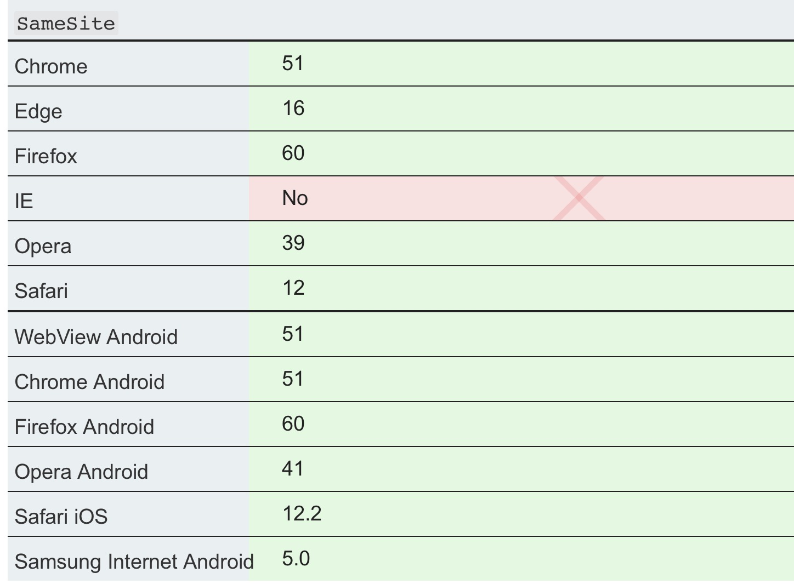

## 跨站点请求伪造(CSRF)

CSRF 全称 Cross Site Request Forgery `[fɔrdʒəri]`。

### 1. CSRF简介

CSRF 攻击，通常指攻击者在用户**已经经授权登陆**的情况下，通过构造请求执行用户不想执行的状态变更操作的请求，来完成攻击。

攻击者如果攻击成功，可以完成修改用户数据，引发转账等操作。

### 2. 攻击原理

**前提：**  

用户已经在攻击的目标网站授权登陆。

> Set-Cookie: cookie=value;
> 用户登录后，cookie 就已经授权，其后续请求在没有设置 cookie 的 samesite 标志位时都会带上所有cookie。浏览器甚至提供了 [Session Restore](https://support.mozilla.org/en-US/kb/restore-previous-session) 功能， 可以让 Session cookie 一直有效。

**攻击方式**    

+ 外链：通过社交工具，email、聊天软件、短信等将连接发送给受害者，通过诱导用户点击完成攻击。
+ 网站内部请求：通过在网站的输入比如 结合存储型xss 攻击，将伪造的请求通过展示的图片，连接等展示在线上。这种方式，因为直接在目标网站内发起请求，几乎绕过所有请求限制。 

**举例**

2007 年 Gmail CSRF 漏洞。
步骤：
1. 首先用户登录 Gmail 使得 Session Cookie 生效。
2. 然后，诱导用户访问一个第三方连接。
3. 连接打开一个空白页面，里面是一个隐藏的 iframe。内部生成了一个自动提交的form表单。
4. 攻击的接口使用的是 Session Cookie，所以在跨域打开 iframe 时仍然有效。这个接口创建了一条规则，将所有的带附件的邮件都转发给攻击者。

另外一个修改用户密码的 CSRF 漏洞介绍
https://securiteam.com/securitynews/5ZP010UQKK/

### 3. CSRF 攻击测试

[OWSAP 安全测试](https://www.owasp.org/index.php/Testing_for_CSRF_\(OTG-SESS-005\)
)

### 4. CSRF 防御

**验证码**

最常见的方式，验证码每次都是随机的，切需要进行图片识别。需要用户进行交互，就不能通过一次点击来完成攻击了。

验证码的缺陷很明显，体验比较糟糕。所以，一般只在关键的步骤中添加。

**Referer Check**

通过页面请求的 HTTP_REFERER 头，来做一些安全限制操作。比如，只有从首页忘记密码到重置密码的检查。发帖必须从主页跳转。

Referer Check 缺点在于这个 referer [本身并不可靠](https://www.lifewire.com/how-to-use-http-referer-3471200)，用户可以通过浏览器配置或者[Referrer-Policy](https://developer.mozilla.org/en-US/docs/Web/HTTP/Headers/Referrer-Policy)
关闭 referer 的发送。

Referrer-Policy 可以在页面模板中设置：

> Referrer-Policy: no-referrer  
> Referrer-Policy: no-referrer-when-downgrade   
> Referrer-Policy: origin   
> Referrer-Policy: origin-when-cross-origin 
> Referrer-Policy: same-origin  
> Referrer-Policy: strict-origin    
> Referrer-Policy: strict-origin-when-cross-origin  
> Referrer-Policy: unsafe-url   

**使用 Token**

OWSAP 在 [Github 仓库](https://github.com/OWASP/CheatSheetSeries/blob/master/cheatsheets/Cross-Site_Request_Forgery_Prevention_Cheat_Sheet.md) 里也详细介绍了 Token 的使用。

**SameSite cookies**

在种植 Cookie 时设置 [SameSite cookies](https://developer.mozilla.org/en-US/docs/Web/HTTP/Cookies#SameSite_cookies) 标志位。

> Set-Cookie: key=value; SameSite=Strict

这个标志位是一个新功能，新对浏览器要求版本较高。值设置为 Strict 时，浏览器将不允许跨域携带改 cookie。https://www.owasp.org/index.php/SameSite

浏览器的如果不支持这个标志位或者这个标志位未设置，那么所有请求都会带上，包括跨域请求。参见：[SameSite cookies](https://developer.mozilla.org/en-US/docs/Web/HTTP/Cookies#SameSite_cookies)

### 问题

**验证 csrf 第三方 cookie 在 iframe 是否可以携带?**

已验证，Chrome  75.0.3770.100 和 Safari 12.1.1 都默认在`iframe, img, a` 标签携带了第三方 cookie。

根据[这里](https://developer.mozilla.org/en-US/docs/Web/HTTP/Cookies#SameSite_cookies) 描述：

> SameSite cookies: The default behavior if the flag is not set, or not supported by the browser, is to include the cookies in any request, including cross-origin requests.

### Refs
+ [CSRF OWASP](https://www.owasp.org/index.php/Cross-Site_Request_Forgery_\(CSRF\))
+ https://developer.mozilla.org/en-US/docs/Web/HTTP/Cookies
+ https://github.com/OWASP/CheatSheetSeries/blob/master/cheatsheets/Cross-Site_Request_Forgery_Prevention_Cheat_Sheet.md
+ [Referer Check 防图片倒链](https://zhuanlan.zhihu.com/p/33359713)