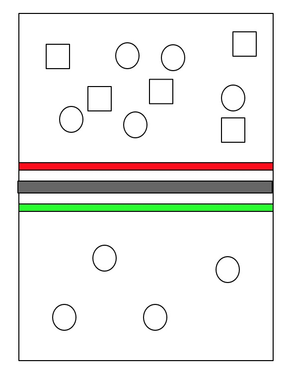

## Web 安全简介
** “互联网本来是安全的，自从有了研究安全的人之后，互联网就变得不安全了” **  
** — 《白帽子讲 Web安全》**

#### 黑客的由来
最开始 “Hacker” 这个词出自 1960s 年代麻神理工。当时一些有着顶级技术的人用 FORTRAN 和其他“古代”编写程序，玩一些最新的计算机技术并且热爱研究计算机网络等最新技术，知识面广对技术痴迷。随着 C 语言 UNIX 操作系统等关键技术的诞生，网络及软件的普及黑客能够获取的资源和权限越来越多，对他们来说也就获得了“限制”外的更多的自由。

#### Web 安全兴起
互联网刚兴起时，浏览器功能弱基本就是浏览静态网页。没有网购，没有电商，交互能力也就是点击链接跳转。

当时，Web 应用并非主流，大多数用户就是用电脑软件，邮件等服务。所以，这些服务和软件以及操作系统是黑客的重点目标，获取权限盗取信息。

随着，浏览器技术发展，Web 技术兴起，用户可以在浏览器应用上完成登陆、注册这些携带重要信息的操作。用户可以在 web 应用上完成购物付款等和金钱相关的活动。特别是之后移动互联网的兴起，web 应用上集聚了越来越多的用户信息、支付信息、信息流、转账付款等操作，使得 web 应用成为继计算机系统、软件之外价值最大的黑客攻击目标。

#### 安全问题的本质
** 安全问题的本质是信任的问题 **
** —— 《白帽子讲 Web安全》**

#### 安全的三要素（CIA）
1. 机密性 Confidentiality
    + 要求保护数据内容不能泄露，加密实现机密性的常见手段。比如我们常见存储密码的方式，是放一个 md5 值到数据库里。即使泄露了数据还是在一定程度上是保密的。
2. 完整性 Integrity
    + 要求数据是内容是完整的、没有被篡改的。常见的方式是数据签名。
3. 可用性 Availability
    + 要求保护资源是 “随需而得”。意思就是数据在被保护的同时要满足正常查询和获取需求，任何时候都可用。

### Refs:
+ https://www.helpnetsecurity.com/2002/04/08/the-history-of-hacking/