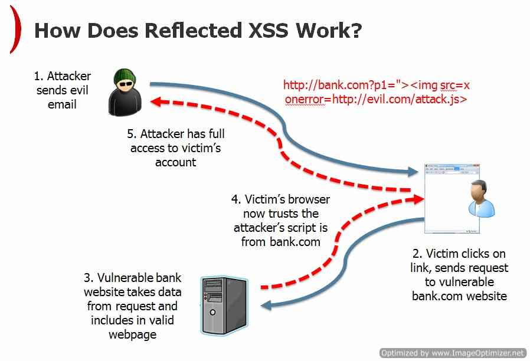
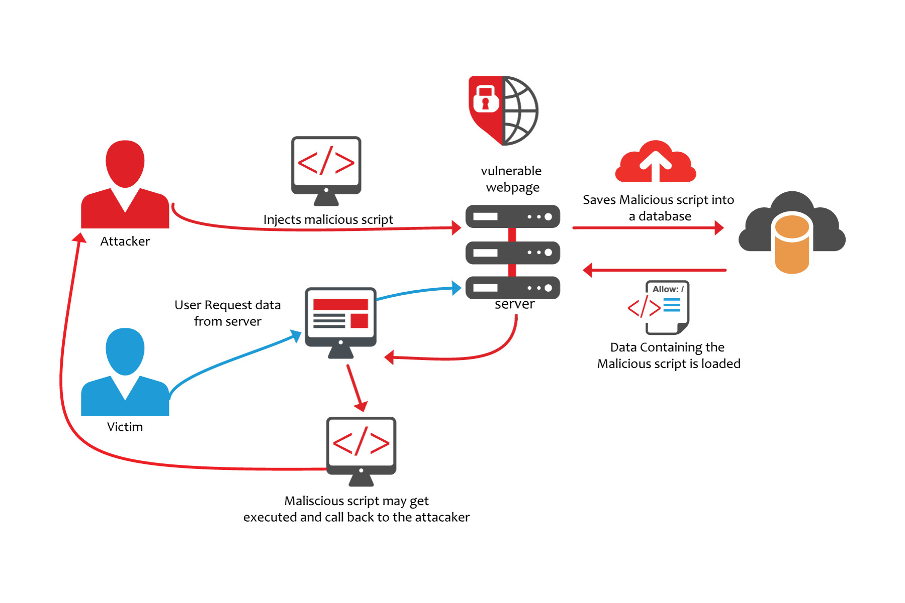

## XSS 跨站脚本攻击

XSS (Cross Site Script)，为了和 CSS 区分就把 C 改成了 X。

### 1.特征和原理

XSS 通常发生在黑客通过向用户的浏览网页中注入一些恶意 Js 片段、HTML、Flash 或者任意浏览器可能执行的内容或者代码片段，已达到窃取用户隐私数据，盗用cookie、session 信息或者将用户引流到钓鱼网站来实施攻击。

#### XSS 常见的几种类型

**第一种：反射型 XSS**   

反射型 XSS 通过将执行的恶意代码通过输入作为链接或者请求的参数，服务器将携带恶意代码参数的用于构造后续其他页面的链接，从而实现通过服务器将代码“反射”给浏览器。

通常攻坚者通过一个可以提交用户输入的的页面将代码提交到服务器，然后在另外一个路由下攻击生效。 

常见传播途径：1.通过点击邮件发送的一个连接引导用户点击。2.直接一个恶意网址，这个网站随后直接跳转到一个正常的目标网站并将恶意代码携带到连接上。

这种类型的攻击，需要诱导用户“点击”一个连接实施攻击，攻击者还需要负责自己将连接撒布出去，自动化程度低传播和持续时间相对较短。也叫“非持久型 XSS”。



**第二种：存储型 XSS**

黑客通过用户的输入把代码提交并存储在服务器上。比如，黑客通过写一篇文章或者一个评论然后，恶意代码被存储到服务器。其他用户浏览器博客或者有恶意代码的评论的页面时，浏览器执行了相应的代码攻击生效。

由于代码被存储到了服务器，所以这种攻击也称为“存储型XSS”，攻击存在的时间相比可持续时间也更为长久也被叫做“持久型XSS”。





**第三种：DOM Based XSS**

攻击者通过恶意代码修改用户访问网页的 DOM 节点来实施攻击。效果上类似反射型 XSS，通过提交输入将代码注入到返回的页面中。

**原理举例：**

假如页面模板如下

```
Select your language:

<select><script>

document.write("<OPTION value=1>"+document.location.href.substring(document.location.href.indexOf("default=")+8)+"</OPTION>");

document.write("<OPTION value=2>English</OPTION>");

</script></select>

```

其中 default 是从连接参数获取的，如果我们向 default 参数植入恶意代码：

`http://www.some.site/page.html?default=<script>alert(document.cookie)</script>`

用户加载也面时，代码就被执行了。

`http://www.some.site/page.html#default=<script>alert(document.cookie)</script>`

上面的变体，将 default 放到 hash 后，然后 `default=<script>alert(document.cookie)</script>` 片段甚至不会发动到服务器（待验证）。

### 2.实施攻击

一个概念，攻击者构造的各种攻击脚本被称为“XSS Payload”。

#### 2.1 步骤
**1.寻找一个漏洞**
实施攻击首先要满足的条件：
1. 浏览器及其插件或者服务端存在**可以注入代码**漏洞。
2. 代码最终可以在**正常用户**的浏览器上得到执行。   

[反射型XSS测试](https://www.owasp.org/index.php/Testing_for_Reflected_Cross_site_scripting_\(OTG-INPVAL-001\)#Example_6:_Including_external_script)

**2.构造一个 XSS Payload**

**3.寻找传播途径**


#### 2.2 XSS Payload 构造技巧

通过测试应用和研究浏览器的安全漏洞，结合一些特定场景构造能够通过浏览器和应用服务的检查过滤的代码。

##### 2.2.1 利用编码

利用一些特殊的编码在特定场景(特定浏览器，特定编码，特定字符组合)下将本来独立的字符组合成一个整体，结合构造脚本的技巧跳过检查或者闭合属性标签等实施攻击。

**举例：**

例子来源《白帽子讲 Web 安全》[“百度搜索”](https://baike.baidu.com/item/%E7%99%BE%E5%BA%A6%E6%90%9C%E8%97%8F/10811184?fr=aladdin) 里的一个 XSS 漏洞

在首页里用到了一个变量，这个变量对双引号其实做过转义了

`var redirectUrl="\";alert(/xss/);"`

这个 ui 参数是请求时带上的

`http://cang.baidu.com/do/add?it=xxx&iu=%c1";alert(2);//&fr=sp`

首页的返回是 GBK/GB2313 编码的，“%c1\” 这个字符在 Firefox 下被解析为一个 Unicode 字符假设是 ❓

那么上面的连接里的ui参数进行双引号转义`%c1\";alert(2)'//`最后返回首页到 redirectUrl 变量就变成

```
...
var redirectUrl="❓";alert(2);//
...
```

##### 2.2.2 绕过长度限制

每个应用每个场景下长度限制的逻辑都不一样，所以这里就举个简单的例子。

在长度受限的地方插入一个执行代码的语句，执行代码本身放在其他地方。

比如可以将代码放到 URL hash 片段中，假设一个 HTML 片段如下

`<input type="text" value="$var"></input>`

那么假设 $var 这个变量已经被限制到 80 个字节，我们可以在接受$var 变量提交的地方注入

`" onclick="eval(location.hash.substr(1))`

那么，HTML最后输出

`<input type="text" value="" onclick="eval(location.hash.substr(1))"></input>`

`some.com#alert(/xss/)`

或者将代码通过异步加载到页面中，然后执行。

这里常用的还可以利用 HTML 注释来闭合标签，跳过限制。使用 window.name 携带攻击代码等。更多可查看链接：<https://www.owasp.org/index.php/XSS_Filter_Evasion_Cheat_Sheet#DIV_background-image>


##### 2.2.3 使用 `<base>` 标签

##### 2.2.4 利用 Web 服务器配置漏洞

##### 2.2.4 利用浏览器插件漏洞

##### 一个 XSS Worm 举例分析

[Samy worm](https://samy.pl/myspace/)，号称 Web 安全史第一个重量级 XSS Worm。实施攻击绕过的 [xss filter](https://samy.pl/myspace/tech.html) 

### 3.XSS 防御(我们能做些什么)

攻防是一个相互促进，相互迭代的过程。我们会有一些通用的思路和方法去防御，但是特定的场景下还是要具体情况具体分析。OWSAP 的一个 [CheatSheetSeries GitHub](https://github.com/OWASP/CheatSheetSeries) 项目里面列举了一些常见的防御建议可以看一下。

安全防御没有统一的法则，做自己能做的一切。剩下的兵来将挡水来土掩。

#### 3.1 Cookie 防护

通过在 Cookie 中增加一个 [HttpOnly](https://www.owasp.org/index.php/HttpOnly) 属性限制被标记的 cookie 禁止被 JavaScript 访问。

```
Set-Cookie  --><name>=<value>[; <Max-Age>=<age>]
[; expires=<date>][; domain=<domain_name>]
[; path=<some_path>][; secure][; HttpOnly]
```
[支持的浏览器列表](https://www.owasp.org/index.php/HttpOnly#Who_developed_HttpOnly.3F_When.3F)


> 存在的问题：部分浏览器 XMLHTTPResponse 中可以读取到返回的 header 设置的带有 httponly 标志的 set-cookie 头部从而取到对应的值。[《更多》](https://bugzilla.mozilla.org/show_bug.cgi?id=380418)


#### 3.2 输入检查

个人认为可以两个类别：  

第一种：全局通用型的。包括但不限于：    
+ 关键词过滤 `<script>, javascript, eval, etc`
+ 对输入的富文本做白名单过滤，比如只允许 `<a>, ,<div>` 等比较安全的标签出现。或者直接嵌入可靠的编辑器获取富文本。

全局过滤存在问题也是很明显的，它不知道特定场景下的特定语义后者说上下问。所以，对一些过滤并不能做到普试。比如，不能够所有地方都过滤 `<, >, "` 这种字符。

例子：

`$name='You are "my hero"'`

如果，统一对所有的双引号转义，那么直接在模板输出的时候就可能是：

`<span>You are \"my hero\"</span>`

所以还需要第二种检查类型：结合特定语境处理。根据实际的业务逻辑，在客户端和服务器两端进行严格检查。

比如：

+ 格式校验：电话号码、邮件、连接等。
+ 字符集校验：注册昵称只允许特定字符集，字母数字组合。个人描述，只能使用中文、字母和特定标点符号。


#### 3.3 输出检查

##### 3.3.1 使用安全编码函数

对于非富文本输出的场景，对输出到页面的字符进行编码或者转义过滤。

**HTMLEncode**

将输出的数据通过[HTML 编码](https://www.owasp.org/index.php/Reviewing_Code_for_Cross-site_scripting)转为[HTMLEntites](https://www.w3schools.com/html/html_entities.asp)，对一些特殊的字符编码后浏览器将以字符的形式显示出来而不是作为标签执行。

```
From	To
<	&lt;
>	&gt;
(	&#40;
)	&#41;
#	&#35;
&	&amp;
"	&quot;
```    

比如，`<script>` 会被编码为 `&lt;script&gt;` 最终显示为 '`<script>`' 字符而不是脚本标签。

**JavascriptEncode**

Javascript Encode 的通用处理：  

+ 对特殊字符进行 `\` 转义。

```
from '\n'   -->to "\\n";    
from '\r'   -->to "\\r";  
from '\''   -->to "\\'";   
from '"'    -->to "\\\"";   
from '\&'   -->to "\\&";   
from '\\'   -->to "\\\\";   
from '\t'   -->to "\\t";   
from '\b'   -->to "\\b";   
from '\f'   -->to "\\f";   
from '/'    -->to "\\x2F";   
from '<'    -->to "\\x3C";   
from '>'    -->to "\\x3E";   
```
+ 对小于 ASSII 小于 256 的用 `\\xHH` 16进制的方式显示
+ 其他的用 `\\uHHHH` Unicode 显示

在输出变量内容的地方，用双引号包起来。

##### 3.3.2 防御 DOM Based XSS
前面说的编码过滤，都是指在服务器端直接输出模板的时发生的攻击。

而 DOM Based XSS 通常是通过客户端 Js 脚本运行时改变的 DOM 结构。因此，这里攻击有其特有[防御方式](https://github.com/OWASP/CheatSheetSeries/blob/master/cheatsheets/DOM_based_XSS_Prevention_Cheat_Sheet.md)。

OWSAP 这篇 [DOM_based_XSS_Prevention_Cheat_Sheet](https://github.com/OWASP/CheatSheetSeries/blob/master/cheatsheets/DOM_based_XSS_Prevention_Cheat_Sheet.md) 介绍了子执行环境中往不同子执行环境（Subcontexts: HTML, HTML attribute, URL, and CSS）嵌入代码时，应该遵循的操作规范。

ToDo：详细阅读这篇文章，然后将内部补充到这里。

前端Js输出到页面的途径：

直接输出
```
document.write
domEle.innerHTML
domEle.outerHTML
innerHTML.replace
document.attachEvent
....
```

数据携带（待验证）     
+ input 输入框
+ `window.name`
+ `document.referrer`
+ localStroage
+ XMLHttpRequest 返回

##### 3.3.3 其他特殊场景 XSS 防御
XSS 攻击，很多时候都是在特定场景，甚至于严苛的环境下才能发起攻击。这些地方，都需要具体问题具体分析然后各个击破。


### 待查问题
+ 为什么还需要保留 eval , javascript: 这种执行方式？

### Refs
+ https://www.owasp.org/index.php/Types_of_Cross-Site_Scripting#DOM_Based_XSS_.28AKA_Type-0.29
+ https://www.owasp.org/index.php/Cross-site_Scripting_(XSS)
+ [https://www.owasp.org/index.php/Testing_for_Reflected_Cross_site_scripting_\(OTG-INPVAL-001\)](https://www.owasp.org/index.php/Testing_for_Reflected_Cross_site_scripting_\(OTG-INPVAL-001\))
+ https://www.owasp.org/index.php/DOM_Based_XSS
+ http://www.webappsec.org/projects/articles/071105.shtml
+ https://samy.pl/myspace/tech.html
+ [token vs session](https://segmentfault.com/a/1190000017831088)
+ [JWT](https://huanqiang.wang/2017/12/28/JWT%20%E4%BB%8B%E7%BB%8D/)
+ [HTML Entity List](https://www.freeformatter.com/html-entities.html)