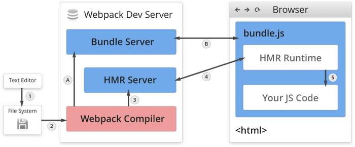

## 热更新


### 使用

1. webpack-dev-server
    * 不刷新浏览器
    * 不输入文件，内存存储
    * 使用 HotModuleReplacementPlugin 插件

    ```javascript
    plugins: [
        new webpack.HotModuleReplacementPlugin()
    ],
    devServer: {
        contentBase: './dist',
        hot: true
    }
    ```

2. webpack-dev-middleware

    WDM 将 webpack 输出的文件传输给服务器，适用于灵活的定制场景

    ```javascript
    const express = require('express')
    const webpack = require('webpack')
    const webpackDevMiddleware = require('webpack-dev-middleware')

    const app = express()
    const config = require('./webpack.config.js')
    const compiler = webpack(config)

    app.use(webpackDevMiddleware(compiler, {
        publicPath: config.output.publicPath
    }))

    app.listen(3000, function() {
        console.log('app listening on port 3000!\n')
    })
    ```

### 原理分析

*refs:*  
    * [Understanding Webpack HMR](https://www.javascriptstuff.com/understanding-hmr/)

 
